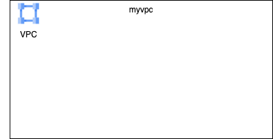
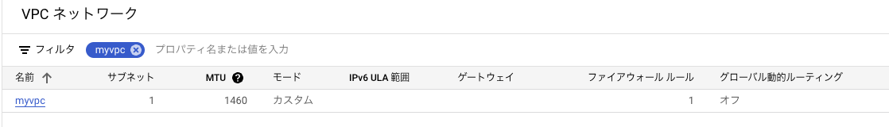

# First Terraform

### 1. 前提条件
GCPアカウントを保有していること。<br>
コードの実行はローカルでもCloudShellでもお好みで。

### 2. 今回の構成図
初回はVPCだけ作成する。<br>



### 3. 簡単な例
初めてのTerraformとして、下記のコードを作成する。<br>
```
[provider.tf]
provider "google" {
  project     = [YOUR_PROJECT_NAME]
  region      = [YOUR_REGION]
}

[main.tf]
resource "google_compute_network" "myvpc" {
  name                    = "myvpc"
  auto_create_subnetworks = false
}
```
下記のようにコマンドを実行する。
```
% terraform init
% terraform plan
% terraform apply --auto-approve
```
下記のような表示がされていれば成功。
```
・・・
Apply complete! Resources: 1 added, 0 changed, 0 destroyed.
```
指定したVPCができたことを画面でも確認する。

