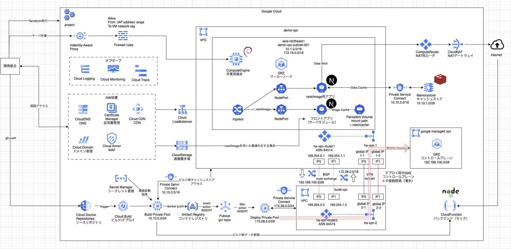

# myterraform

### ゴール感、1つの方向性
例えば、データサイエンティストなど非インフラ構成要員が、下記のようなWebの標準的な構成を１ポチで立ち上げられるようになる。 
即日、即時仮説検証を遂行できると素敵。

### フォルダ構成
|フォルダ|内容|その他|
|--|--|--|
|docs|各種説明など|mdファイル内にソースコードを記載していますが、全体構成などはあえて記載していません。適宜sampleをご確認ください。|
|sample|説明に出てくるコードのサンプル|毎回のサンプルを作るのはきついので、全体で１通り|

### docs目次
|分類|フォルダ|内容|備考|
|--|--|--|--|
|基礎編|01_first_terraform|はじめてTerraform実行、簡単なVPCを作る||
|基礎編|02_first_vm|VMを作る、サブネット、ファイルアウォールルール、サービスアカウントを作成する||
|基礎編|03_first_nat|作ったVMが外部アウトバウンド通信できるようにNATを設置する||
|基礎編|04_variables|変数を外部ファイルに定義する||
|基礎編|05_modules|再利用部品をモジュールとして定義する||
|基礎編|06_gke|GKEクラスタを立ち上げる、サービスアカウント、ロール、ノードプールなどを作成する||
|基礎編|07_cicd|CICDパイプラインを作成する、Git、コンテナレジストリ、トリガー、ビルダーノードなどを作成する||
|基礎編|08_cicd_app|サンプルPodをデプロイして、CICDパイプラインの動作確認を行う||
|基礎編|09_test|はじめてのterraform test、ネットワークモジュールのテストを実装する||
|基礎編|10_test_2|はじめてのterraform test、インスタンスモジュールのテストを実装する||
|基礎編|11_test_3|はじめてのterraform test、GKEモジュールのテストを実装する||
|基礎編|12_test_4|はじめてのterraform test、CICDモジュールのテストを実装する||
|基礎編|13_tfstate|tfstateの仕組み、内容を確認する||
|基礎編|14_import|terraform importの仕組み、内容を確認する||
|基礎編|15_data_source|data sourceの仕組み、内容を確認する||
|基礎編|16_docker|はじめてのFast apiコンテナを作成する||
|基礎編|17_docker_2|Next.jsを題材にマルチステージビルドを行う||
|基礎編|18_kubernetes|主要なk8sリソースについて確認する||
|基礎編|19_kubernetes_2|自作API PodをGKE上で稼働させる||
|基礎編|20_kubernetes_3|自作API PodをCICDパイプラインに乗せて運用する||
|基礎編|21_kubernetes|Linux Foundationの実技資格CKADの教材を紹介、操作訓練として使えます||
|基礎編|22_network_basis1|推移的ピアリングでルートが伝播されない話の簡単な例、問題把握編||
|基礎編|23_network_basis2|推移的ピアリングでルートが伝播されない話の簡単な例、問題解決編||
|基礎編|24_network_basis3|宝暦より続く東海道53msの他、リージョン間のレイテンシも計測する||
|基礎編|25_network_basis4|private service connect 1（アドレスとフォワードルールの作成）||
|基礎編|26_network_basis5|private service connect 2（Cloud DNSの設定）||
|基礎編|27_network_basis6|private service access 1（CloudSQLへの接続）|準備中|
|ネタ帳|||準備中|
|ネタ帳|cloud loadbalancer|バックエンドにVMを配置するところから基本事項を取り上げる|準備中|
|ネタ帳|cloud armor|loadbalancerの延長で取り上げる|準備中|
|ネタ帳|cloud run|前段にLBの設置、後続でVPCに接続するケースを取り上げる|準備中|
|ネタ帳|gke cluster private|ここまでで一巡するはずなのでGKEのプライベート化を行う|準備中|
|ネタ帳|cicd private|GKEのプライベート版にCICDを合わせる、既出のcloud router/vpnでBGPが出てくる|準備中|
|ネタ帳|kubernetes|secrets, persistent volumeなど、まだ出てきていない基本リソースを取り上げる|準備中|
|ネタ帳|application|実践編用のアプリケーションの開発|準備中|
|ネタ帳|基礎編は50ぐらいの予定、以下実践編へ|増えてきたらフォルダを分けますw|準備中|
