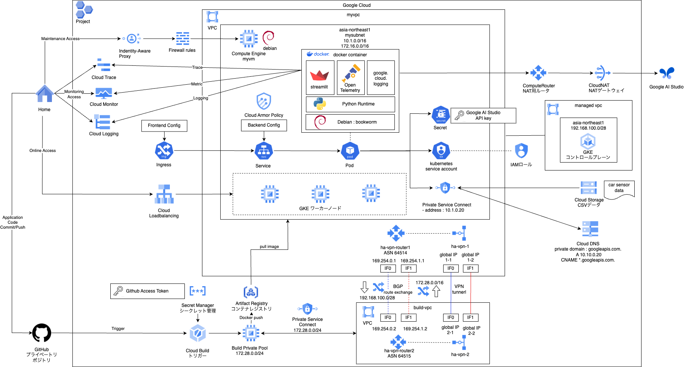

# myterraform
### お知らせ：実践編１が終わったら、一度全体のフォルダ構成の見直しやコードのリファクタを行います。（2024/7/23）  

### 実践編１のゴール
下記のようなWebの標準的な構成を１ポチで立ち上げられるようになることを目指す。 

### フォルダ構成
|フォルダ|内容|その他|
|--|--|--|
|docs|各種説明など|mdファイル内にソースコードを記載していますが、全体構成などはあえて記載していません。適宜sampleをご確認ください。|
|sample|説明に出てくるコードのサンプル|毎回のサンプルを作るのはきついので、全体で１通り|

### docs目次
|大分類|分類|フォルダ|内容|備考|
|--|--|--|--|--|
|1.Webの基本形|1-1.基礎編|01_first_terraform|はじめてTerraform実行、簡単なVPCを作る||
|1.Webの基本形|1-1.基礎編|02_first_vm|VMを作る、サブネット、ファイルアウォールルール、サービスアカウントを作成する||
|1.Webの基本形|1-1.基礎編|03_first_nat|作ったVMが外部アウトバウンド通信できるようにNATを設置する||
|1.Webの基本形|1-1.基礎編|04_variables|変数を外部ファイルに定義する||
|1.Webの基本形|1-1.基礎編|05_modules|再利用部品をモジュールとして定義する||
|1.Webの基本形|1-1.基礎編|06_gke|GKEクラスタを立ち上げる、サービスアカウント、ロール、ノードプールなどを作成する||
|1.Webの基本形|1-1.基礎編|07_cicd|CICDパイプラインを作成する、Git、コンテナレジストリ、トリガー、ビルダーノードなどを作成する||
|1.Webの基本形|1-1.基礎編|08_cicd_app|サンプルPodをデプロイして、CICDパイプラインの動作確認を行う||
|1.Webの基本形|1-1.基礎編|09_test|はじめてのterraform test、ネットワークモジュールのテストを実装する||
|1.Webの基本形|1-1.基礎編|10_test_2|はじめてのterraform test、インスタンスモジュールのテストを実装する||
|1.Webの基本形|1-1.基礎編|11_test_3|はじめてのterraform test、GKEモジュールのテストを実装する||
|1.Webの基本形|1-1.基礎編|12_test_4|はじめてのterraform test、CICDモジュールのテストを実装する||
|1.Webの基本形|1-1.基礎編|13_tfstate|tfstateの仕組み、内容を確認する||
|1.Webの基本形|1-1.基礎編|14_import|terraform importの仕組み、内容を確認する||
|1.Webの基本形|1-1.基礎編|15_data_source|data sourceの仕組み、内容を確認する||
|1.Webの基本形|1-1.基礎編|16_docker|はじめてのFast apiコンテナを作成する||
|1.Webの基本形|1-1.基礎編|17_docker_2|Next.jsを題材にマルチステージビルドを行う||
|1.Webの基本形|1-1.基礎編|18_kubernetes|主要なk8sリソースについて確認する||
|1.Webの基本形|1-1.基礎編|19_kubernetes_2|自作API PodをGKE上で稼働させる||
|1.Webの基本形|1-1.基礎編|20_kubernetes_3|自作API PodをCICDパイプラインに乗せて運用する||
|1.Webの基本形|1-1.基礎編|21_kubernetes|Linux Foundationの実技資格CKADの教材を紹介、操作訓練として使えます||
|1.Webの基本形|1-1.基礎編|22_network_basis1|推移的ピアリングでルートが伝播されない話の簡単な例、問題把握編||
|1.Webの基本形|1-1.基礎編|23_network_basis2|推移的ピアリングでルートが伝播されない話の簡単な例、問題解決編||
|1.Webの基本形|1-1.基礎編|24_network_basis3|宝暦より続く東海道53msの他、リージョン間のレイテンシも計測する||
|1.Webの基本形|1-1.基礎編|25_network_basis4|private service connect 1（アドレスとフォワードルールの作成）||
|1.Webの基本形|1-1.基礎編|26_network_basis5|private service connect 2（Cloud DNSの設定）||
|1.Webの基本形|1-1.基礎編|27_network_basis6|private service access 1（CloudSQLへの接続）||
|1.Webの基本形|1-1.基礎編|28_network_basis7|private service connect 3（CloudSQLへの接続）||
|1.Webの基本形|1-1.基礎編|29_lb_basis1|Load Balancerの基本 1（初めてのMIG）||
|1.Webの基本形|1-1.基礎編|30_lb_basis2|Load Balancerの基本 2（VM2台の負荷分散）||
|1.Webの基本形|1-1.基礎編|31_lb_basis3|Load Balancerの基本 3（Cloud Armorによるエンドポイントの保護）||
|1.Webの基本形|1-1.基礎編|32_serverless_basis1|Serverlessの基本 1（Cloud Runを起動する）||
|1.Webの基本形|1-1.基礎編|33_serverless_basis2|Serverlessの基本 2（Cloud Functionsを起動する）||
|1.Webの基本形|1-1.基礎編|34_gke_private|private gke clusterを作成する||
|1.Webの基本形|1-1.基礎編|35_workload_identity|private gke clusterにworkload identityを設定する||
|1.Webの基本形|1-1.基礎編|36_myapp|実践編用のアプリケーションを試作する（Streamlit, Gemini）||
|1.Webの基本形|1-1.基礎編|37_gke_private_myapp|実践編用のアプリケーションをGKEで稼働させる||
|1.Webの基本形|1-1.基礎編|38_gke_private_ingress|実践編用のアプリケーション向けにIngressを整備する||
|1.Webの基本形|1-1.基礎編|39_gke_private_cicd_1|実践編用のアプリケーションをCICDに乗せる、Githubとの連結/プライベートプール作成まで||
|1.Webの基本形|1-1.基礎編|40_gke_private_cicd_2|実践編用のアプリケーションをCICDに乗せる、HAVPN作成/GKEにデプロイするまで||
|1.Webの基本形|1-2.実践編|41_overall_architecture|実践編用の全体アーキテクチャ||
|1.Webの基本形|1-2.実践編|42_application|実践編用のアプリケーション開発||
|1.Webの基本形|以降、実践編準備中||||
|1.Webの基本形|1-2.実践編|43_base_module|実践編用のBASEモジュールの開発|準備中|
|1.Webの基本形|1-2.実践編|44_cicd_module|実践編用のCICDモジュールの開発|準備中|
|1.Webの基本形|1-2.実践編|45_datasource_module|実践編用のDATASOURCEモジュールの開発|準備中|
|1.Webの基本形|1-2.実践編|46_kubernetes|実践編用のKubernetes定義の開発|準備中|
|1.Webの基本形|1-2.実践編|47_test|実践編の動作確認|準備中|
|1.Webの基本形|1-2.実践編|48_final|実践編の動作確認|準備中|
