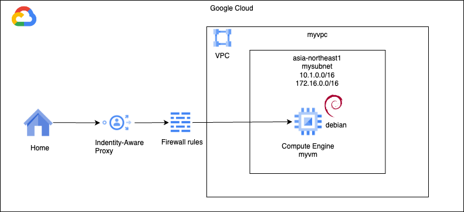
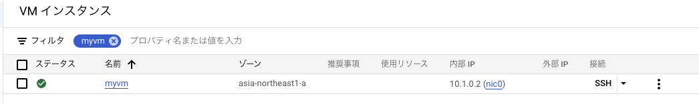

# First VM

### 1. 前提条件
01_first_terraformが完了していること。

### 2. 今回の構成図
初めてのVMを作成する。サブネットやサービスアカウント、ファイアウォールルールも合わせて作成する。<br>


### 3. 今回のコード
main.tfを下記のように作成する。
```
#### 02_first_vm add start ####
locals {
  ip_cidr_range = "10.1.0.0/16"
  ip_cidr_range_secondary = "172.16.0.0/16"
  region = "asia-northeast1"
  zone = "asia-northeast1-a"
  range_name = "mysecondaryrange"
  vm_tags = "operation"
  machine_type = "e2-medium"
  boot_disk_image = "projects/debian-cloud/global/images/debian-12-bookworm-v20240312"
  boot_disk_size = 10
  boot_disk_type = "pd-balanced"
}
#### 02_first_vm add end ####

resource "google_compute_network" "myvpc" {
  name                    = "myvpc"
  auto_create_subnetworks = false
}

#### 02_first_vm add start ####
resource "google_compute_subnetwork" "mysubnet" {
  name          = "mysubnet"
  ip_cidr_range = local.ip_cidr_range
  region        = local.region
  network       = google_compute_network.myvpc.id
  secondary_ip_range {
    range_name    = local.range_name
    ip_cidr_range = local.ip_cidr_range_secondary
  }
  depends_on = [ google_compute_network.myvpc ]
}

# VM用のサービスアカウントを作成する
resource "google_service_account" "myvmsa" {
  account_id   = "myvmsa"
  display_name = "Custom SA for VM Instance"
}

# 作成したサービスアカウントにIAMロールを付与する。
# count構文を使う題材として、後ほど実施する。

# VM本体を作成する
resource "google_compute_instance" "myvm" {
  name         = "myvm"
  machine_type = local.machine_type
  zone         = local.zone
  tags         = [local.vm_tags]

  boot_disk {
    mode = "READ_WRITE"
    initialize_params {
      image = local.boot_disk_image
      size  = local.boot_disk_size
      type  = local.boot_disk_type
    }
  }

  network_interface {
    subnetwork = google_compute_subnetwork.mysubnet.self_link
  }

  service_account {
    # Google recommends custom service accounts that have cloud-platform scope and permissions granted via IAM Roles.
    email  = google_service_account.myvmsa.email
    scopes = ["https://www.googleapis.com/auth/cloud-platform"]
  }

}

# IAP用のファイアウォールルールを作成する
# ソースIPアドレスは、GoogleのIAPのIPアドレス範囲を指定する。
# ターゲットは、VMに付与するタグを指定する。
resource "google_compute_firewall" "myvmfirewall" {
  name    = "myvmfirewall"
  network = google_compute_network.myvpc.self_link

  allow {
    protocol = "tcp"
    ports    = ["22"]

  }
  # source ranges for Identity-Aware Proxy
  source_ranges = ["35.235.240.0/20"]
  target_tags = [local.vm_tags]
}
#### 02_first_vm add end ####
```
前回と同じように下記のようにコマンドを実行する。
```
% terraform init
% terraform plan
% terraform apply --auto-approve
```

### 4. 動作確認
VMが作成されたことを確認する。このとき外部IPアドレスが設定されていないことを確認しておく。<br>

右側の「SSH」ボタンを押下する。SSH接続のウインドウが立ち上がり、キー転送などが行われる。<br>
完了すると、下記のようなプロンプトが表示されるので、左の「Authorize」を押す。<br>


Linuxのプロンプトが表示されることを確認する。

### 5. 次回予告
NATGWを取り付けて、VMから外部への通信ができるようにします。
