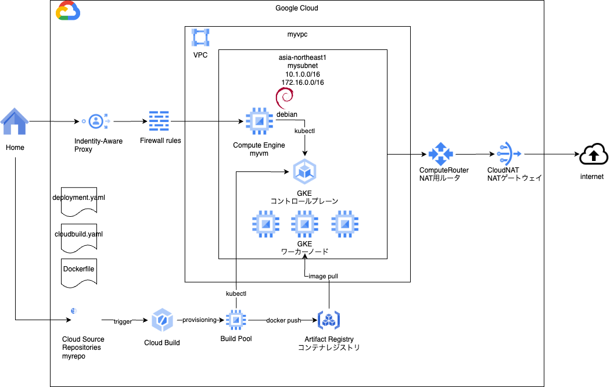

# CICD

### 1. 前提条件
06_gkeが完了していること。

### 2. 今回の構成図
CICDパイプラインを構築する。<br>


### 3. 今回のコード
#### 3-1. フォルダ構成
cicdモジュールを作成する。<br>
```
07_cicd/
  main.tf
  variables.tf
  provider.tf
    modules/
      network/
        main.tf
        variables.tf
        output.tf
      instance/
        main.tf
        variables.tf
        output.tf
      gke/
        main.tf
        variables.tf
        output.tf  
      cicd/
        main.tf
        variables.tf
        output.tf  
```
#### 3-2. cicdモジュール
CICDパイプラインを構成する下記の要素を作成していきます。<br>

|要素|役割|
|--|--|
|Cloud Source Repositories|アプリケーションのソースコードを格納するGitリポジトリ|
|Cloud Build Trriger|Source Repositoriesへのpushにより発火するトリガー|
|Cloud Build Pool|アプリケーションのビルドを行うコンピュートリソース|
|Artifact Registry|ビルドされたコンテナを格納するレジストリ|

modules/cicd/フォルダ配下に、下記の内容を記載します。<br>
```
[main.tf]
# Service account for cloudbuild
resource "google_service_account" "mybuildsa" {
  account_id   = "mybuildsa"
  display_name = "CloudBuild service account"
}

# add roles
resource "google_project_iam_member" "mybuildsauser" {
  count   = "${length(var.mybuildsaroles)}"
  project = var.project_id
  role    = "${element(var.mybuildsaroles, count.index)}"
  member  = "serviceAccount:${google_service_account.mybuildsa.email}"
  depends_on = [google_service_account.mybuildsa]
}

# create source repository
resource "google_sourcerepo_repository" "myrepo" {
  name = "myrepo"
}

# create artifact registry repository
resource "google_artifact_registry_repository" "myreg" {
  location      = var.region
  repository_id = "myreg"
  description   = "my docker repository"
  format        = "DOCKER"
}

# create bucket name for cloudbuild 
resource "random_string" "bucketname" {
  length = 16
  lower  = true
  upper = false
  special = false
}

# create bucket for cloudbuild
resource "google_storage_bucket" "cloudbuild_log_bucket" {
  name          = "cloudbuildlog${random_string.bucketname.result}"
  location      = var.region
  force_destroy = true

  public_access_prevention = "enforced"
}

# create cloudbuild trigger
resource "google_cloudbuild_trigger" "filename-trigger" {
  location = var.region
  service_account = google_service_account.mybuildsa.id
  trigger_template {
    branch_name = "master"
    repo_name   = "myrepo"
  }

  substitutions = {
  }

  filename = "cloudbuild.yaml"

  depends_on = [ google_service_account.mybuildsa, google_project_iam_member.mybuildsauser ]
}

# create cloudbuild worker pool
resource "google_cloudbuild_worker_pool" "mybuildpool" {
  name = "mybuildpool"
  location = var.region
  worker_config {
    disk_size_gb = 100
    machine_type = "e2-medium"
    no_external_ip = false
  }
}

[variables.tf]
variable "project_id" {
  type    = string
  description = "Project ID"
}

variable "region" {
  type    = string
  description = "The region for the VPC."
}

variable "mybuildsaroles" {
  default = [
    "roles/cloudbuild.builds.builder",
    "roles/container.developer",
    "roles/secretmanager.secretAccessor",
  ]
  type = list(string)
}
```
#### 3-3. gkeモジュール
ArtifactRegistry他、GKE稼働に必要なロールをサービスアカウントに追加します。<br>
modules/gkeフォルダ配下に下記を追加する。<br>
```
[main.tf](追記)
# add roles
resource "google_project_iam_member" "mybuildsauser" {
  count   = "${length(var.mybuildsaroles)}"
  project = var.project_id
  role    = "${element(var.mybuildsaroles, count.index)}"
  member  = "serviceAccount:${google_service_account.mybuildsa.email}"
  depends_on = [google_service_account.mybuildsa]
}

[variables.tf](追記)
variable "project_id" {
  type    = string
  description = "Project ID"
}

variable "mysagkeroles" {
  type = list(string)
  default = [
    "roles/secretmanager.viewer",
    "roles/logging.logWriter",
    "roles/monitoring.metricWriter",
    "roles/monitoring.viewer",
    "roles/stackdriver.resourceMetadata.writer",
    "roles/artifactregistry.reader",
    "roles/storage.objectViewer",
    "roles/iam.serviceAccountTokenCreator"
  ]
}

```
#### 3-4. ルートモジュール
ルートのmain.tfに下記を追加する。
```
module "gke" {

  source = "./modules/gke"

  region = var.region
  zone = var.zone
  myvpc_self_link = module.network.myvpc_selflink
##### 07_cicd add start #####
  project_id = var.project_id
##### 07_cicd add end #####
  mysubnet_self_link = module.network.mysubnet_selflink
}

##### 07_cicd add start #####
module "cicd" {

  source = "./modules/cicd"

  region = var.region
  project_id = var.project_id
}
##### 07_cicd add end #####
```

### 4. 動作確認
エラーなく実行できればOK。

#### 無料枠を利用している場合
もしかすると、CICDのワーカプールを作ったタイミングでクォータ上限エラーが出るかもしれません。<br>
その場合は、下記のようにワーカプールを作らず、クラウドで自動調達されているものを利用する形で、今回と同じことができます。<br>
ただし、機能制限やセキュリティの問題があるので、実務上は利用が難しいかもしれませんが、ひとまず練習のためこの内容で進めてもらえればと思います。<br>
以後は、２パターン作っていくのは難しいので、CICDに関するところは、できそうならやる、無料枠で怒られたらスキップする形で進めてください。<br>
基礎編のうちは、小さなテーマが小出しになっているので、1つ2つ飛ばしても影響ないかと思います。<br>
```
[変更点]
[modules/cicd/main.tf]
# 無料枠だと東京リージョンだとマルチテナントビルドプールが利用できないことが多々ある。
resource "google_cloudbuild_trigger" "filename-trigger"のlocationを"asia-east1"に変更

# 無料枠だとクォータ上限にかかる可能性があるので、プールを作らないようにする。
resource "google_cloudbuild_worker_pool" "mybuildpool"をコメントアウト

[myrepo/cloudbuild.yaml]
# ファイル末尾のoptionsからpoolを削除する（poolとname）
options:
  logging: GCS_ONLY
  automapSubstitutions: true
#  pool:
#    name: 'projects/YOUR_PROJECT_ID/locations/asia-northeast1/workerPools/mybuildpool'
```

### 5. 次回予告
今回作ったパイプラインを利用してアプリケーションのデプロイを試行します。


