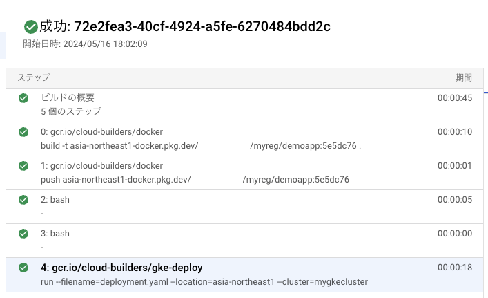
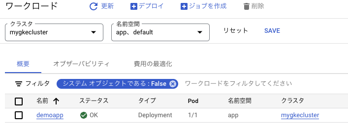

# CICD APP

### 1. 前提条件
07_cicdが完了していること。

### 2. 今回の構成図
前回から変更なし。

### 3. 今回のコード
今回はTerraformは使わずに、07_cicdのリソースが立ち上がっている前提で、アプリケーションデプロイを実施します。

#### 3-1. ファイル作成
07_cicdで作成したmyrepoリポジトリをクローンして、下記のようにファイルを3つ作成する。
```
  myrepo/
   deployment.yaml
   cloudbuild.yaml
   Dockerfile
```
cloudbuild.yamlは、CloudBuildで実行するCICDの処理を記載します。<br>
logsBucketには、07_cicdで作成したcloudbuild_log_bucketを指定します。<br>
```
[cloudbuild.yaml]
steps:

  # Docker Build
  - name: 'gcr.io/cloud-builders/docker'
    args: ['build', '-t',
           'asia-northeast1-docker.pkg.dev/[projectid]/myreg/demoapp:$SHORT_SHA',
           '.']

  # Docker Push
  - name: 'gcr.io/cloud-builders/docker'
    args: ['push',
           'asia-northeast1-docker.pkg.dev/[projectid]/myreg/demoapp:$SHORT_SHA']

  # set :version to :$SHORT_SHA in deployment.yaml
  - name: 'bash'
    script: |
      #!/usr/bin/env bash
      sed -i s/:version/:$SHORT_SHA/g deployment.yaml

  # check deployment.yaml
  - name: 'bash'
    script: |
      #!/usr/bin/env bash
      cat deployment.yaml

  # deploy container image to GKE
  - name: "gcr.io/cloud-builders/gke-deploy"
    args:
    - run
    - --filename=deployment.yaml
    - --location=asia-northeast1
    - --cluster=mygkecluster

logsBucket: 'gs://cloudbuildlogcr1x96ttqptpnfuh'

options:
  logging: GCS_ONLY
  automapSubstitutions: true
  pool:
    name: 'projects/[projectid]/locations/asia-northeast1/workerPools/mybuildpool'
```
Dockerfileには、サンプルとしてnginxのイメージだけ記載してあります。
```
[Dockerfile]
FROM nginx:latest
```
deployment.yamlは、k8s名前空間、k8sサービスアカウント、サービス、デプロイメントを記載しています。
```
apiVersion: v1
kind: Namespace
metadata:
  name: app
---
apiVersion: v1
kind: ServiceAccount
metadata:
  name: mypodsa
  namespace: app
---
apiVersion: v1
kind: Service
metadata:
  name: myservice
  namespace: app
spec:
  type: NodePort
  selector:
    app: demoapp
  ports:
  - protocol: TCP
    port: 80
    targetPort: 80
---
apiVersion: apps/v1
kind: Deployment
metadata:
  name: demoapp
  namespace: app
  labels:
    app: demoapp
spec:
  replicas: 1
  selector:
    matchLabels:
      app: demoapp
  template:
    metadata:
      labels:
        app: demoapp
    spec:
      serviceAccountName: mypodsa
      containers:
      - name: demoapp
        image: asia-northeast1-docker.pkg.dev/[projectid]/myreg/demoapp:version
        ports:
        - containerPort: 80
```
ファイルが作成できたらgitにpushします。

#### 3-2. push後の確認
CloudBuildが発火し正常に動作することを確認します。<br>
CloudBuild > 履歴から辿ることができます。<br>


GKEにアプリケーションがデプロイされていることを確認します。<br>
まずは、GCPの画面から確認します。



次に、踏み台VM内からサービス経由でnginxアプリケーションへの疎通を確認します。<br>
```
```

### 5. 次回予告
ここまでで超基本的なコンテナ基盤とCICDパイプラインが完成しましたが、立ち上げることに注力しておりテストが行われていません。<br>
次回は、ここまでのソースコードを元にTerraform testを実装していきます。


