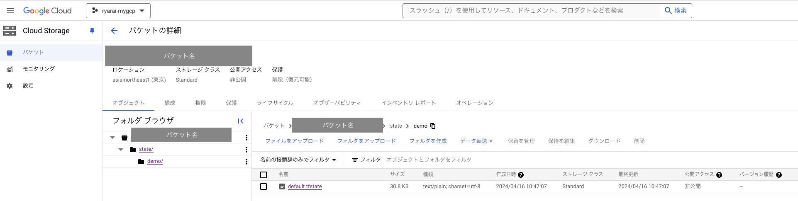

# tfstate

### 1. 前提条件
13_tfstateが完了していること。

### 2. 今回の構成図
前回から変更なし。

### 3. tfstateとは
今回は、Terraformの状態管理について記載します。<br>
Terraformを実行してリソースを作成すると、.tfstateというファイルに、リソースの状態が書き込まれます。<br>
中身はJSONファイルになっており、下記ようになっています。<br>
instancesの中を見ると、何やらTerraformで指定している内容とほぼ同じような感じであることが見て取れるかと思います。
```
[tfstateの例]
    {
      "module": "module.network",
      "mode": "managed",
      "type": "google_compute_firewall",
      "name": "myvmfirewall",
      "provider": "provider[\"registry.terraform.io/hashicorp/google\"]",
      "instances": [
        {
          "schema_version": 1,
          "attributes": {
            "allow": [
              {
                "ports": [
                  "22"
                ],
                "protocol": "tcp"
              }
            ],
            "creation_timestamp": "2024-05-15T21:25:19.256-07:00",
            "deny": [],
            "description": "",
            "destination_ranges": [],
            "direction": "INGRESS",
            "disabled": false,
            "enable_logging": null,
            "id": "projects/YOUR_PROJECT_ID/global/firewalls/myvmfirewall",
            "log_config": [],
            "name": "myvmfirewall",
            "network": "https://www.googleapis.com/compute/v1/projects/YOUR_PROJECT_ID/global/networks/myvpc",
            "priority": 1000,
            "project": "YOUR_PROJECT_ID",
            "self_link": "https://www.googleapis.com/compute/v1/projects/YOUR_PROJECT_ID/global/firewalls/myvmfirewall",
            "source_ranges": [
              "35.235.240.0/20"
            ],
            "source_service_accounts": [],
            "source_tags": [],
            "target_service_accounts": [],
            "target_tags": [
              "operation"
            ],
            "timeouts": null
          },
          "sensitive_attributes": [],
          "private": "eyJlMmJmYjczM////",
          "dependencies": [
            "module.network.google_compute_network.myvpc"
          ]
        }
      ]
    },
・・・
```

### 4. tfstateの運用
実行端末のローカルに保存せず、可用性の高いクラウドのオブジェクトストレージを利用することができます。<br>
GCPの場合は、下記のterraformブロックのように指定することで実現できます。<br>
```
[provider.tf]
provider "google" {
  project     = "[YOUR_PROJECT_ID]"
  region      = "[YOUR_REGION]"
}

terraform {
  backend "gcs" {
    bucket  = "[YOUR_GCS_BUCKET_NAME]"
    prefix  = "[YOUR_PREFIX]"
  }
}
```
（このGCSはTerraformで作るのですか？となると、無限ループに陥ると思うので、利用する場合は手動で作成する方が良いかと思います。）<br>
実際に設定すると下記ようにGCS上にstateファイルが配置されていることを確認することができます。<br>
ただし、tfstateはその性質上かなり機密な情報を扱うため、オブジェクトストレージのアクセス権はしっかりと制御、管理をお願いします。<br>
（今回に限っては、セキュリティ的な問題もあるので、できることを確認したら封印しておくことを推奨します。）<br>


### 5. 次回予告
実際にTerraform管理外のリソースを作成して、terraform import、tfstateからの逆引きコード作成の例を示します。
