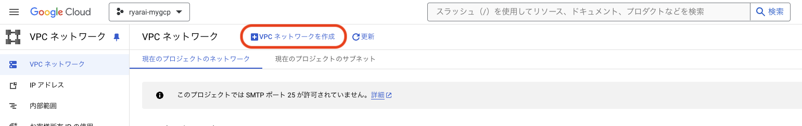
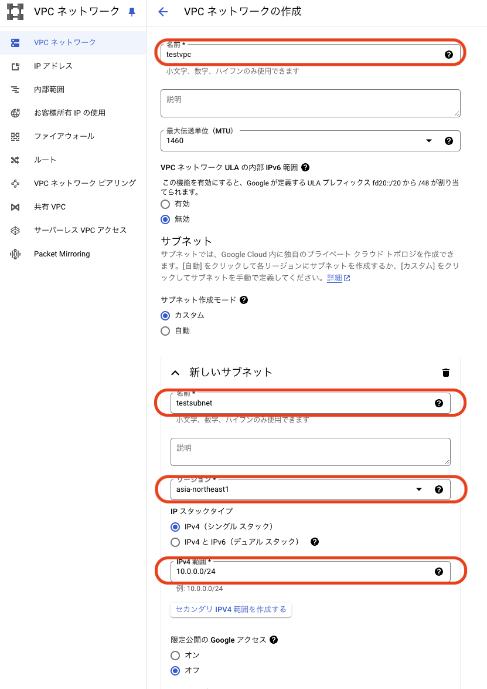

# terraform import

### 1. 前提条件
13_tfstateが完了していること。

### 2. 今回の構成図
前回から変更なし。

### 3. 事前準備
下記を参考に、VPCネットワークのメニューから手動でVPCとサブネットを作成します。赤枠だけ入力して、残りは初期値で良いです。




### 4. import実行
下記のようにmain.tfを作成し、applyします。そうするとtfstateにvpcが取り込まれます。
```
[main.tf]
import {
  id = "projects/YOUR_PROJECT_ID/global/networks/testvpc"
  to = google_compute_network.testvpc
}

resource "google_compute_network" "testvpc" {
  name = "testvpc"
  auto_create_subnetworks = false
}
```
今回の例では、下記のようにtfstateが作成されます。（一部省略）
```
{
  "version": 4,
  "terraform_version": "1.7.5",
  "serial": 1,
  "lineage": "",
  "outputs": {},
  "resources": [
    {
      "mode": "managed",
      "type": "google_compute_network",
      "name": "testvpc",
      "provider": "provider[\"registry.terraform.io/hashicorp/google\"]",
      "instances": [
        {
          "schema_version": 0,
          "attributes": {
            "auto_create_subnetworks": false,
            "delete_default_routes_on_create": false,
            "description": "",
            "enable_ula_internal_ipv6": false,
            "gateway_ipv4": "",
            "id": "projects/YOUR_PROJECT_ID/global/networks/testvpc",
            "internal_ipv6_range": "",
            "mtu": 1460,
            "name": "testvpc",
            "network_firewall_policy_enforcement_order": "AFTER_CLASSIC_FIREWALL",
            "numeric_id": "0000",
            "project": "YOUR_PROJECT_ID",
            "routing_mode": "REGIONAL",
            "self_link": "https://www.googleapis.com/compute/v1/projects/YOUR_PROJECT_ID/global/networks/testvpc",
            "timeouts": null
          },
          "sensitive_attributes": [],
          "private": 
        }
      ]
    }
  ],
  "check_results": null
}
```
この状態で、planを実行すると、差分なしと判定されると思います。

### 5. tfstateからの逆引きコード生成
planで差分が出てないので一見すると良さげな気がしますが、vpcのパラメータとして指定しているのは、nameだけです。<br>
下記にもあるとおり、VPCには他にも色々なパラメータがありますが、今回はたまたま全部デフォルト値のために、差分が出ていないだけです。<br>
https://registry.terraform.io/providers/hashicorp/google/latest/docs/resources/compute_network<br>
実際には、これらのパラメータを指定するように、tfstateから逆引きしてコードを生成することになると思います。<br>
公式ドキュメントとtfstateを見比べながら作成することもできますが、github copilotのチャット機能に投げつけるとある程度の精度で作成してくれます。<br>
これを活用すると効率的にコードを作成することができるかと思います。（下記が、github copilotのチャットから得られた回答ままになります。）
```
resource "google_compute_network" "testvpc" {
  name                    = "testvpc"
  auto_create_subnetworks = false
  delete_default_routes_on_create = false
  mtu = 1460
  routing_mode = "REGIONAL"
  // 他の属性も必要に応じてここに追加します
}
```

### 6. 次回予告
次回は、data sourceについて取り上げます。<br>
概念的には似ていますが、importのようにTerraform管理外のリソースを管理下に置く、のではなく、参照だけします。<br>
例えば、他チーム（例：お客様やインフラチーム）がネットワークだけ作って渡してきた時に、それらのリソースを操作することなく、参照だけして自分たちのTerraformで利用する際に利用します。<br>