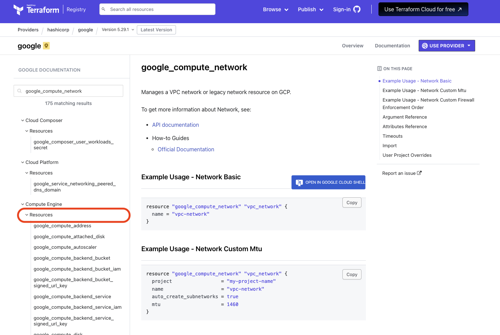
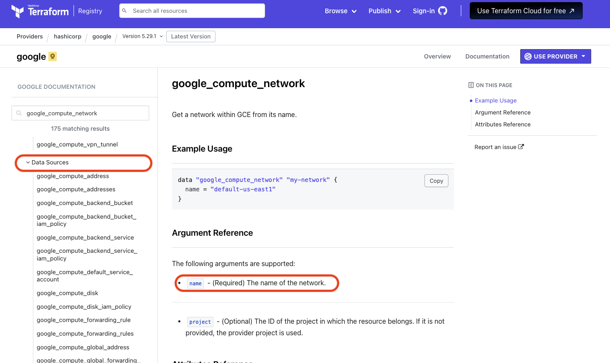
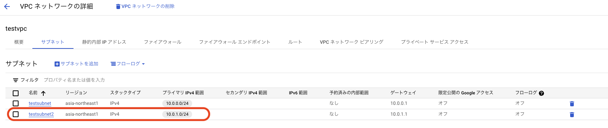

# data source

### 1. 前提条件
14_importが完了していること。

### 2. 今回の構成図
前回から変更なし。

### 3. 事前準備
14_importで作成したVPCをそのまま利用します。

### 4. import実行
今回は先に作ったVPCが与えられたものとして、その上にサブネットを作成します。<br>
サブネットを作成する際には、VPCのIDが必要なので、その情報をdata sourcesとして取得します。<br>
import.tfというファイルを作成し、下記のように記載します。<br>
Data Sources はリソース毎にプロバイダ側から提供されており、公式ドキュメントでもリソースを作成する際に利用する「Resources」と「Data Sources」が双方定義されています。<br>





Data Sourcesの定義に合わせて、項目を指定して利用します。<br>

```
[import.tf]
data "google_compute_network" "testvpc" {
  name = "testvpc"
}
```
main.tfの中では、data sourceの変数を、data.google_compute_network.testvpc.self_linkの形で参照します。
```
[main.tf]
resource "google_compute_subnetwork" "testsubnet2" {
  name = "testsubnet2"
  region = "asia-northeast1"
  ip_cidr_range = "10.0.1.0/24"
  network = data.google_compute_network.testvpc.self_link
}
```
この状態で、applyすると、testsubnet2が作成されます。


現実には、VPC、サブネットなどネットワークリソースが全て与えられるケースが多いかと思いますが、やることは同じです。<br>
import.tfでdata resourcesを参照して、VMやGKEで利用する形になるかと思います。

### 5. 次回予告
次回からは複数回に分けて、GKE上のアプリケーションコンテナを題材に、Docker、kubernetesの基礎事項を身につけていきます。<br>
