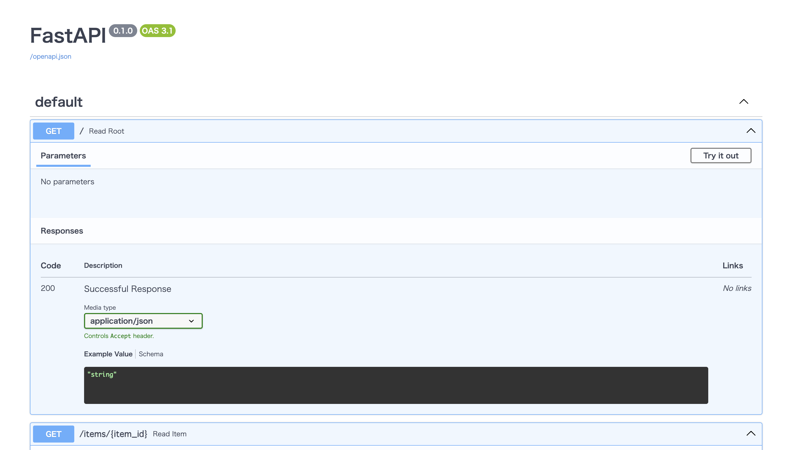

# docker

### 1. 前提条件
15_data_sourceが完了していること。

### 2. 今回の構成図
前回から変更なし。

### 3. 事前準備
ローカル環境に、Python環境とDocker環境を用意してください。<br>
Docker環境：https://docs.docker.jp/desktop/index.html#<br>
また、Pythonのライブラリは下記のものをインストールします。<br>
```
pip install fastapi uvicorn
```
### 4. はじめてのFast API
Fast APIとは、Pythonのモダンでw高速なWebフレームワークです。<br>
https://fastapi.tiangolo.com/ja/

まずは、簡単なapiを作成して動作確認を行います。
```
[main.py]
from fastapi import FastAPI

app = FastAPI()


@app.get("/")
def read_root():
    return {"Hello": "World"}


@app.get("/items/{item_id}")
def read_item(item_id: int, q: str = None):
    return {"item_id": item_id, "q": q}
```
下記のように実行して、書いた通りに応答することを確認する。
```
[APIを起動するシェル]
$ uvicorn main:app --reload
INFO:     Will watch for changes in these directories: ['/Users/xxxx/Desktop/mywork/myrepo']
INFO:     Uvicorn running on http://127.0.0.1:8000 (Press CTRL+C to quit)
INFO:     Started reloader process [55390] using WatchFiles
INFO:     Started server process [55392]
INFO:     Waiting for application startup.
INFO:     Application startup complete.
（確認が終わったらCntl+Cでシャットダウンする）

[APIを呼び出すシェル]
% curl http://127.0.0.1:8000/
{"Hello":"World"}
% curl http://127.0.0.1:8000/items/1234
{"item_id":1234,"q":null}
```
また、この状態でブラウザからhttp://127.0.0.1:8000/docs にアクセスすると、下記のようにAPI定義のドキュメントを見ることができます。<br>



### 5. コンテナ化
ここまでに作成したアプリケーションをコンテナ化していきます。<br>
https://fastapi.tiangolo.com/ja/deployment/docker/?h=docker

以前作ったmyrepoのフォルダを下記のように構成してください。
```
myrepo/             <-- ここまでに作成したSourceRepositoryのリポジトリ
  cloudbuild.yaml   <-- CloudBuild(CICDパイプライン)の定義、追って最新化します。
  deployment.yaml   <-- kubernetesの定義、追って最新化します。
  Dockerfile        <-- コンテナの定義、このあと最新化します。
  app/              <-- アプリケーション用のフォルダ
    __init.py__     <-- pythonパッケージの目印、初期化ファイル、今回は空ファイルにする。
    main.py         <-- 上記で作成したmain.pyファイル
  requirements.txt  <-- インストールするライブラリを記載する、fastapi
```

Dcokerfileは下記のように修正します。#（コメント）は公式ドキュメントにあるものをそのまま転記しているので、参考にご確認ください。この通りに書かなくて良いです。
```
# 公式のPythonベースイメージから始めます
FROM python:3.9

# 現在の作業ディレクトリを /code に設定します
# ここに requirements.txt ファイルと app ディレクトリを置きます。
WORKDIR /code

# 要件が書かれたファイルを /code ディレクトリにコピーします
# 残りのコードではなく、最初に必要なファイルだけをコピーしてください。
COPY ./requirements.txt /code/requirements.txt

# 要件ファイルにあるパッケージの依存関係をインストールします --no-cache-dir オプションはダウンロードしたパッケージをローカルに保存しないように pip に指示します。
# これは、同じパッケージをインストールするために pip を再度実行する場合にのみ有効ですが、コンテナで作業する場合はそうではないです。
RUN pip install --no-cache-dir --upgrade -r /code/requirements.txt

# /appディレクトリを/code` ディレクトリの中にコピーする。
COPY ./app /code/app

# uvicornサーバーを実行するためのコマンドを設定します
# CMD は文字列のリストを取り、それぞれの文字列はスペースで区切られたコマンドラインに入力するものです。
# このコマンドは 現在の作業ディレクトリから実行され、上記の WORKDIR /code にて設定した /code ディレクトリと同じです。
# そのためプログラムは /code で開始しその中にあなたのコードがある ./app ディレクトリがあるので、Uvicorn は app.main から app を参照し、インポート することができます。
CMD ["uvicorn", "app.main:app", "--host", "0.0.0.0", "--port", "80"]
```
コンテナのビルドを行います。<br>
buildの背後の.(ドット)はカレントディレクトリにあるDockerfileを読みにいくことを指します。ファイル名を変更している場合は、-fオプションで指定ができます。<br>
また、-tオプションはタグをつけることを意味しており、myapiの部分は今回はローカル実行なのでこのようにしていますが、CICDパイプラインなどで動かす場合は、[コンテナレジストリのリポジトリ名]/[イメージ名]:[バージョン番号]といった形になります。<br>
バージョン番号はv001としていますが、これだと人手でバージョン番号を管理しないといけないので、CICDパイプラインに載せたあとは、git hash（のショートバージョン）をつけたりして、人手の管理対象とはしない形にします。<br>
AWSのCodeBuildやGCPのCloudBuildなど、クラウドのビルドツールでは、デフォルトの仕様でソースgitのコミットハッシュを取得できるようになっていますので、それらを利用します。
```
$ docker build . -t myapi:v001
```
ビルド後は下記のコマンドでコンテナを実行します。
```
$ docker run -d --name mycontainer -p 80:80 myapi:v001
```
-dオプションはバックエンド実行、--nameオプションは実行したコンテナに名称をつけるためにつけています。<br>
-pオプションは、[コンテナが外（PCなど）に公開するポート番号]:[コンテナ内のアプリが公開しているポート番号]でポート番号を指定します。<br>
最後に指定しているのは、ビルド時に指定したイメージ名とバージョン番号です。<br>
この状態でcurlやブラウザから、4.で実施した確認と同じ確認を行い、実装した通りに動作することを確認します。（前回の例では8000番ポートでしたが、こちらの例では80番ポートを公開しているので注意）<br>
```
$curl http://127.0.0.1/
{"Hello":"World"}
```
API定義のドキュメントも4.と同じように確認できると思います。

### 6. 宿題
ここまで実施するとコンテナが稼働したままになっていると思いますので、ネットで調べたり、AIに聞いたりして停止しておいてください。

### 7. 次回予告
コンテナの練習として、Next.jsコンテナを取り上げます。マルチステージビルドを行います。