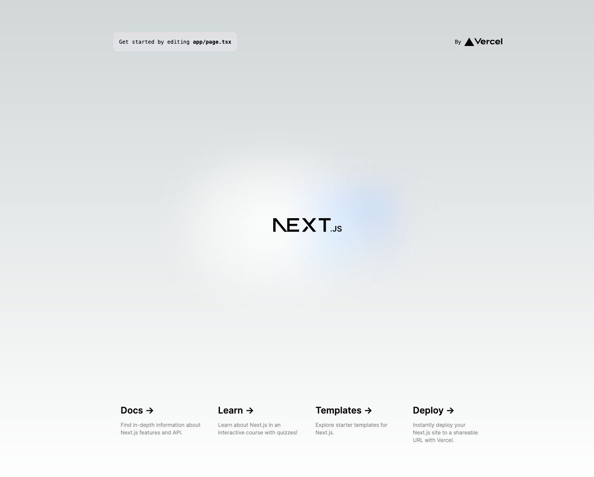

# kubernetes

### 1. 前提条件
17_docker_2が完了していること。

### 2. 今回の構成図
前回から変更なし。

### 3. kubernetesの基本要素
下記を参考にして、Next.jsをインストールします。<br>
https://nextjs.org/docs/getting-started/installation<br>
Node.jsのインストールと、npx create-next-app@latestを実行します。<br>
create-next-appの選択肢は全てデフォルトで良いです。
```
% npx create-next-app@latest
Need to install the following packages:
create-next-app@14.2.3
Ok to proceed? (y) y
✔ What is your project named? … my-app
✔ Would you like to use TypeScript? … No / Yes
✔ Would you like to use ESLint? … No / Yes
✔ Would you like to use Tailwind CSS? … No / Yes
✔ Would you like to use `src/` directory? … No / Yes
✔ Would you like to use App Router? (recommended) … No / Yes
✔ Would you like to customize the default import alias (@/*)? … No / Yes

・・・

npm notice 
npm notice New minor version of npm available! 10.2.3 -> 10.8.0
npm notice Changelog: https://github.com/npm/cli/releases/tag/v10.8.0
npm notice Run npm install -g npm@10.8.0 to update!
npm notice 
```
この手順で、my-appというフォルダができていることを確認します。

### 4. マルチステージビルド
my-appフォルダの直下に下記のDockerfileを配置します。<br>
参考）https://github.com/vercel/next.js/blob/canary/examples/with-docker/Dockerfile<br>
このファイルでは、いくつものステージ（FROM句が複数行ある）でビルドが行われています。<br>
画面系のフレームワークでは、構成要素や依存するモジュールが単純なAPIなどと比較すると多くなるため、コンテナサイズを最小限にするために、このようなビルドをします。<br>
実施しないと動かないわけではないので、PoCなどでは後回しになるかもしれませんが、本番系になるとモジュールの容量や脆弱性対応などで不必要なものは入れないように制御する必要が出てくるので、このような対応をすることになります。<br>
他の方法としては、別のビルド端末でビルドして、コンテナはビルドされたモジュールをコピーして、実行コマンド打つだけ、みたいな形のプロジェクトもあります。
```
FROM node:18-alpine AS base

# Install dependencies only when needed
FROM base AS deps
# Check https://github.com/nodejs/docker-node/tree/b4117f9333da4138b03a546ec926ef50a31506c3#nodealpine to understand why libc6-compat might be needed.
RUN apk add --no-cache libc6-compat
WORKDIR /app

# Install dependencies based on the preferred package manager
COPY package.json yarn.lock* package-lock.json* pnpm-lock.yaml* ./
RUN \
  if [ -f yarn.lock ]; then yarn --frozen-lockfile; \
  elif [ -f package-lock.json ]; then npm ci; \
  elif [ -f pnpm-lock.yaml ]; then corepack enable pnpm && pnpm i --frozen-lockfile; \
  else echo "Lockfile not found." && exit 1; \
  fi


# Rebuild the source code only when needed
FROM base AS builder
WORKDIR /app
COPY --from=deps /app/node_modules ./node_modules
COPY . .

# Next.js collects completely anonymous telemetry data about general usage.
# Learn more here: https://nextjs.org/telemetry
# Uncomment the following line in case you want to disable telemetry during the build.
# ENV NEXT_TELEMETRY_DISABLED 1

RUN \
  if [ -f yarn.lock ]; then yarn run build; \
  elif [ -f package-lock.json ]; then npm run build; \
  elif [ -f pnpm-lock.yaml ]; then corepack enable pnpm && pnpm run build; \
  else echo "Lockfile not found." && exit 1; \
  fi

# Production image, copy all the files and run next
FROM base AS runner
WORKDIR /app

ENV NODE_ENV production
# Uncomment the following line in case you want to disable telemetry during runtime.
# ENV NEXT_TELEMETRY_DISABLED 1

RUN addgroup --system --gid 1001 nodejs
RUN adduser --system --uid 1001 nextjs

COPY --from=builder /app/public ./public

# Set the correct permission for prerender cache
RUN mkdir .next
RUN chown nextjs:nodejs .next

# Automatically leverage output traces to reduce image size
# https://nextjs.org/docs/advanced-features/output-file-tracing
COPY --from=builder --chown=nextjs:nodejs /app/.next/standalone ./
COPY --from=builder --chown=nextjs:nodejs /app/.next/static ./.next/static

USER nextjs

EXPOSE 3000

ENV PORT 3000

# server.js is created by next build from the standalone output
# https://nextjs.org/docs/pages/api-reference/next-config-js/output
CMD HOSTNAME="0.0.0.0" node server.js
```
いくつものFROM句があることを確認できると思います。<br>
最初のFROM句はベースイメージを作成しています。見ての通り、nodejsがインストールされているalpineのイメージです。<br>
これがビルドをしていく上でのベースになるイメージになります。
```
FROM node:18-alpine AS base
```
次に、depsイメージを作成しています。その後、このdepsにpackage.json（Pythonのrequirement.txt）に記載のパッケージをインストールしています。
```
# Install dependencies only when needed
FROM base AS deps
```
次に、builderイメージを作成しています。このイメージでは、depsイメージからパッケージを、ローカルからソースコードを仕入れてNext.jsアプリケーションのビルドを行っています。
```
# Rebuild the source code only when needed
FROM base AS builder
・・・
COPY --from=deps /app/node_modules ./node_modules
COPY . .
```
最後に、runnerイメージを作成していますが、このイメージが最終的に実行されるイメージになります。<br>
これまでのイメージは捨てるのでどうでも良かったりしますがw、このイメージはこだわらないといけません。<br>
baseイメージをベースとして、builderイメージで生成されたビルドされたアプリケーションのうち、稼働に必要なもののみを収集して作られています。<br>
また、実行ユーザやグループの設定、ポートの公開などが行われており、最後にCMD命令でアプリケーションが稼働しています。
```
FROM base AS runner

（略）

COPY --from=builder --chown=nextjs:nodejs /app/.next/standalone ./
COPY --from=builder --chown=nextjs:nodejs /app/.next/static ./.next/static

USER nextjs

EXPOSE 3000

ENV PORT 3000
# server.js is created by next build from the standalone output
# https://nextjs.org/docs/pages/api-reference/next-config-js/output
CMD HOSTNAME="0.0.0.0" node server.js
```
### 5. 実行してみる
一通りマルチステージビルドを見てきたところで、実際にビルドして動作確認を行います。<br>
Next.jsは初期状態では、ローカル開発者向けにビルドされてしまうため、サーバサイドで動作するように設定ファイルを修正する必要があります。<br>
next.config.mjsというファイルを下記のように修正します。
```
[next.config.mjs]
/** @type {import('next').NextConfig} */
const nextConfig = {
    output: "standalone",
};

export default nextConfig;
```
修正後、my-appフォルダ内にDockerfileがあることを確認して、my-appフォルダの直下でビルドコマンドを実行します。
```
$ docker build -t nextjs-docker:v001 .
```
エラーなく完了することを確認します。自身の環境では下記のようになりました。
```
[+] Building 37.9s (21/21) FINISHED 
```
コンテナを実行します。
```
docker run -p 3000:3000 nextjs-docker:v001
```
ブラウザで、http://localhost:3000 にアクセスして下記ようなNext.jsのデモ画面が確認できればOKです。



今回は、create-next-appしたままになっていますが、コードを拡充していけば任意のNext.jsサイトをコンテナで稼働させることができます。

### 6. 次回予告
次回から、dockerからkubernetesに進みます。次回はkubernetesの基本リソース、基本操作を学びます。