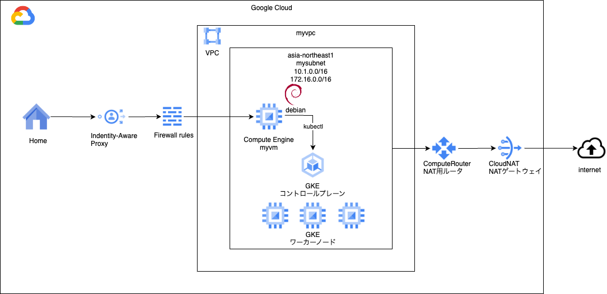

# kubernetes 2

### 1. 前提条件
18_kubernetesが完了していること。

### 2. 今回の構成図
06_gkeと同じ構成とします。


### 3. 準備
下記のように、NW、インスタンス、GKEのモジュールを実行します。
```


```


### 4. 各リソースの設定方法
ここからは各リソースの設定方法を見ていきます。基本的にはどれも定義文をapplyするだけなので、定義をつらつら書いていきます。<br>
今回は必要最低限の項目しか指定しませんが、今後演習を重ねる中で少しずつアップグレードさせていきます。<br>
もし余裕があれば以前作成したネットワーク、インスタンス、GKEモジュールを実行して、VMからkubectlを実行して確認してみてください。<br>
```
# まずはkubectlの基本操作方法
# 適用
kubectl apply -f [ファイル名]

# 取り下げ
kubectl delete -f [ファイル名]

# リスト参照
kubectl get [リソース種類] -n [名前空間]

# 個別詳細を参照
kubectl describe [リソース種類] [リソース名] -n [名前空間]

# 個別詳細をyaml/json形式で参照
kubectl get [リソース種類] [リソース名] -n [名前空間] -o yaml/json
```
リソース毎の定義の書き方例です。-（ハイフン）を3つ繋げると、1つのファイルに複数リソース繋げて書けます。<br>
オペレーションの単位でまとめると操作が簡単になってスムーズです。<br>
また、実際のクラウド上で利用するときは、そのクラウド毎に決められたmetadata.annotationsを指定する形になります。<br>
今回は簡単のため外していますが、例えば、IngressにプライベートLBを設定しますというアノテーションをつけたり、Service AccountにこのIAMロールを紐づけます、という指定をしたりします。
```
# 1. Namespace
apiVersion: v1
kind: Namespace
metadata:
  name: app
---
# 2. Ingress
apiVersion: networking.k8s.io/v1
kind: Ingress
metadata:
  name: minimal-ingress
  annotations:
    nginx.ingress.kubernetes.io/rewrite-target: /
spec:
  ingressClassName: nginx-example
  rules:
  - http:
      paths:
      - path: /testpath
        pathType: Prefix
        backend:
          service:
            name: test
            port:
              number: 80
---
# 3. Service
apiVersion: v1
kind: Service
metadata:
  name: myservice
  namespace: app
spec:
  type: NodePort
  selector:
    app: demoapp
  ports:
  - protocol: TCP
    port: 80
    targetPort: 80
---
# 6. Deployment
# (5. ReplicaSet)
# (4. Pod)
apiVersion: apps/v1
kind: Deployment
metadata:
  name: demoapp
  namespace: app
  labels:
    app: demoapp
spec:
  replicas: 1
  selector:
    matchLabels:
      app: demoapp
  template:
    metadata:
      labels:
        app: demoapp
    spec:
      serviceAccountName: mypodsa
      containers:
      - name: demoapp
        image: asia-northeast1-docker.pkg.dev/YOUR_PROJECT_ID/myreg/demoapp:version
        ports:
        - containerPort: 80
---
# 7. HorizontalPodAutoscaler
apiVersion: autoscaling/v2beta2
kind: HorizontalPodAutoscaler
metadata:
  name: php-apache
spec:
  scaleTargetRef:
    apiVersion: apps/v1
    kind: Deployment
    name: php-apache
  minReplicas: 1
  maxReplicas: 10
  metrics:
  - type: Resource
    resource:
      name: cpu
      target:
        type: Utilization
        averageUtilization: 50
status:
  observedGeneration: 1
  lastScaleTime: <some-time>
  currentReplicas: 1
  desiredReplicas: 1
  currentMetrics:
  - type: Resource
    resource:
      name: cpu
      current:
        averageUtilization: 0
        averageValue: 0
---
# 8. NetworkPolicy
apiVersion: networking.k8s.io/v1
kind: NetworkPolicy
metadata:
  name: test-network-policy
  namespace: default
spec:
  podSelector:
    matchLabels:
      role: db
  policyTypes:
  - Ingress
  - Egress
  ingress:
  - from:
    - ipBlock:
        cidr: 172.17.0.0/16
        except:
        - 172.17.1.0/24
    - namespaceSelector:
        matchLabels:
          project: myproject
    - podSelector:
        matchLabels:
          role: frontend
    ports:
    - protocol: TCP
      port: 6379
  egress:
  - to:
    - ipBlock:
        cidr: 10.0.0.0/24
    ports:
    - protocol: TCP
      port: 5978
---
# 9. Service Account
apiVersion: v1
kind: ServiceAccount
metadata:
  name: mypodsa
  namespace: app
```
### 5. 次回予告
次回は、これまでに作ってきたGKEモジュールやCICDモジュールとFastAPIを組み合わせて動作を確認します。