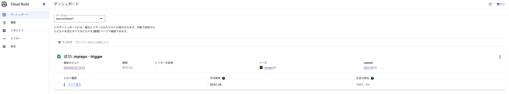

# kubernetes 3

### 1. 前提条件
19_kubernetes_2が完了していること。

### 2. 今回の構成図
07_cicdと同じ構成とします。


### 3. 準備
下記のように実行します。
```
module "network" {

  source = "./modules/network"

  region = var.region
  zone = var.zone
  vm_tags = var.vm_tags

}

module "instance" {

  source = "./modules/instance"

  region = var.region
  zone = var.zone
  vm_tags = var.vm_tags
  project_id = var.project_id
  mysubnet_self_link = module.network.mysubnet_selflink
}

module "gke" {

  source = "./modules/gke"

  region = var.region
  zone = var.zone
  myvpc_self_link = module.network.myvpc_selflink
  project_id = var.project_id
  mysubnet_self_link = module.network.mysubnet_selflink
}

module "cicd" {

  source = "./modules/cicd"

  region = var.region
  project_id = var.project_id
}

```
完了したら、06_gkeの4. 動作確認と同じく、VMからGKEに接続できるところまで確認をお願いします。<br>
[06_gkeの4.動作確認](https://github.com/ryarai-pbgit/myterraform/tree/main/docs/06_gke#4-%E5%8B%95%E4%BD%9C%E7%A2%BA%E8%AA%8D)

（apt版でコマンドだけ記載しておきます。）
```
$ grep -rhE ^deb /etc/apt/sources.list* | grep "cloud-sdk"
$ sudo apt-get update
$ sudo apt-get install -y kubectl
$ kubectl version --client
$ apt-get install google-cloud-sdk-gke-gcloud-auth-plugin
$ gke-gcloud-auth-plugin --version
$ gcloud container clusters get-credentials mygkecluster --region=asia-northeast1
$ kubectl get namespaces
```

### 4. 自作APIをCICDパイプラインに載せる
アプリケーションは、19_kubernetes_2のままで良いです。<br>
CICDの定義文であるcloudbuild.yamlを修正しますが、08_cicd_appから特に大きく変更する箇所はありません。<br>
logsBucket: の部分だけ毎回ランダムな名称で立ち上げているので、合わせておきます。（下記は全文記載）
```
steps:

  # Docker Build
  - name: 'gcr.io/cloud-builders/docker'
    args: ['build', '-t',
           'asia-northeast1-docker.pkg.dev/YOUR_PROJECT_ID/myreg/demoapp:$SHORT_SHA',
           '.']

  # Docker Push
  - name: 'gcr.io/cloud-builders/docker'
    args: ['push',
           'asia-northeast1-docker.pkg.dev/YOUR_PROJECT_ID/myreg/demoapp:$SHORT_SHA']

  # set :version to :$SHORT_SHA in deployment.yaml
  - name: 'bash'
    script: |
      #!/usr/bin/env bash
      sed -i s/:version/:$SHORT_SHA/g deployment.yaml

  # check deployment.yaml
  - name: 'bash'
    script: |
      #!/usr/bin/env bash
      cat deployment.yaml

  # deploy container image to GKE
  - name: "gcr.io/cloud-builders/gke-deploy"
    args:
    - run
    - --filename=deployment.yaml
    - --location=asia-northeast1
    - --cluster=mygkecluster

logsBucket: 'gs://cloudbuildlogtcgk3dlaed7opxn0'

options:
  logging: GCS_ONLY
  automapSubstitutions: true
  pool:
    name: 'projects/YOUR_PROJECT_ID/locations/asia-northeast1/workerPools/mybuildpool'

```
次にkubernetesリソースを定義するdeployment.yamlを作成します。<br>
19_kubernetes_2で作成したものとあまり変わりませんが、イメージの名称をcloudbuild.yamlと合わせているので、バージョン番号を「version」としています。<br>
これはcloudbuild.yaml内で、置換文字列として機能し、$SHORT_SHAの値（gitのコミットハッシュの先頭７文字）で置換します。
```
apiVersion: v1
kind: Namespace
metadata:
  name: app
---
apiVersion: v1
kind: ServiceAccount
metadata:
  name: mypodsa
  namespace: app
---
apiVersion: v1
kind: Service
metadata:
  name: myservice
  namespace: app
spec:
  type: NodePort
  selector:
    app: demoapp
  ports:
  - protocol: TCP
    port: 80
    targetPort: 80
---
apiVersion: apps/v1
kind: Deployment
metadata:
  name: demoapp
  namespace: app
  labels:
    app: demoapp
spec:
  replicas: 1
  selector:
    matchLabels:
      app: demoapp
  template:
    metadata:
      labels:
        app: demoapp
    spec:
      serviceAccountName: mypodsa
      containers:
      - name: demoapp
        image: asia-northeast1-docker.pkg.dev/YOUR_PROJECT_ID/myreg/demoapp:version
        ports:
        - containerPort: 80
```
この段階でmyrepoの構造は下記のようになっているかと思いますので、その状態でpushします。
```
myrepo/
  app/
    __init__.py
    main.py
  cloudbuild.yaml
  deployment.yaml
  Dockerfile
  requirements.txt
```
push後は、CloudBuildの画面をご確認いただければと思いますが、挙動を見ている限り、初回はトリガーが発火しないかもしれません。<br>
（こちらで見ている限りはそんな感じです）<br>
その場合、中身変えずにテキトーに改行するとかして、再度プッシュをお願いします。<br>
Cloud Buildのダッシュボードで、今回のプッシュによって発火したトリガーが「成功」となっていればOKです。



前回と同じくVMから疎通確認を行います。前回と同じ内容なので解説は挟みません。適宜前回資料をご確認ください。
```
myvm:~$ kubectl get pods -n app
No resources found in app namespace.
myvm:~$ kubectl get pods -n app
NAME                       READY   STATUS    RESTARTS   AGE
demoapp-56468f6968-hrvgq   1/1     Running   0          10m
myvm:~$ kubectl get nodes -o wide
NAME                                           STATUS   ROLES    AGE     VERSION                INTERNAL-IP   EXTERNAL-IP      OS-IMAGE                             KERNEL-VERSION   CONTAINER-RUNTIME
gke-mygkecluster-mygkenodepool-512e6721-37zn   Ready    <none>   7h43m   v1.27.11-gke.1062003   10.1.0.9      34.84.162.87     Container-Optimized OS from Google   5.15.146+        containerd://1.7.10
gke-mygkecluster-mygkenodepool-92231d68-vsvp   Ready    <none>   7h43m   v1.27.11-gke.1062003   10.1.0.8      35.194.119.151   Container-Optimized OS from Google   5.15.146+        containerd://1.7.10
gke-mygkecluster-mygkenodepool-ca3e605d-dw92   Ready    <none>   7h43m   v1.27.11-gke.1062003   10.1.0.7      34.84.75.110     Container-Optimized OS from Google   5.15.146+        containerd://1.7.10
myvm:~$ kubectl get svc -n app
NAME        TYPE       CLUSTER-IP       EXTERNAL-IP   PORT(S)        AGE
myservice   NodePort   10.183.238.203   <none>        80:31675/TCP   168m
myvm:~$ curl http://10.1.0.7:31675/
{"Hello":"World"}
```

お疲れした。

### 5. 次回予告
次回は、CKADの解説回にします。
