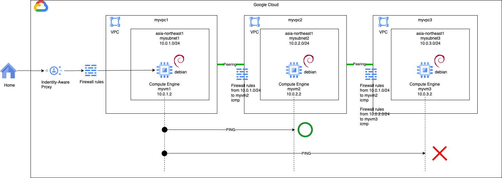
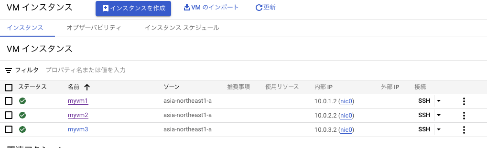

# network basis 1

### 1. 前提条件
21_kubernetes_4が完了していること。

### 2. 今回の構成図
ネットワーク区分の資格取得に向けて基本事項を実践します。<br>
今回は、GKEをプライベートクラスタにすると出くわす２段階のピアリングについてです。<br>
今回の構成図は下記の通りです。<br>


### 3. 今回のコード
下記のようなnetworkモジュールを作成します。今回からvariables.tfはドキュメントには記載しません。内容を読み取って各自で作成してみてください。<br>
サンプルソースはsample/network_basisの下に置いておきます。
```
[modules/network/main.tf]

# VPCを3つ作る（1つのVPCにサブネットが3つではない、VPCが3つでそれぞれにサブネット１つ）
resource "google_compute_network" "myvpc1" {
  name                    = "myvpc1"
  auto_create_subnetworks = false
}

resource "google_compute_network" "myvpc2" {
  name                    = "myvpc2"
  auto_create_subnetworks = false
}

resource "google_compute_network" "myvpc3" {
  name                    = "myvpc3"
  auto_create_subnetworks = false
}

# それぞれのVPCにサブネットを1つずつ作る
# アドレスとかもわかりやすい感じにしておく
resource "google_compute_subnetwork" "mysubnet1" {
  name          = "mysubnet1"
  ip_cidr_range = "10.0.1.0/24"
  region        = var.region
  network       = google_compute_network.myvpc1.id
}

resource "google_compute_subnetwork" "mysubnet2" {
  name          = "mysubnet2"
  ip_cidr_range = "10.0.2.0/24"
  region        = var.region
  network       = google_compute_network.myvpc2.id
}

resource "google_compute_subnetwork" "mysubnet3" {
  name          = "mysubnet3"
  ip_cidr_range = "10.0.3.0/24"
  region        = var.region
  network       = google_compute_network.myvpc3.id
}

# VM1はIAP経由で接続できる状態にする
# IAP用のファイアウォールルールを作成する
# ソースIPアドレスは、GoogleのIAPのIPアドレス範囲を指定する。
# ターゲットは、VMに付与するタグを指定する。
resource "google_compute_firewall" "myvmfirewall" {
  name    = "myvmfirewall"
  network = google_compute_network.myvpc1.self_link

  allow {
    protocol = "tcp"
    ports    = ["22"]

  }
  # source ranges for Identity-Aware Proxy
  source_ranges = ["35.235.240.0/20"]
  target_tags = [var.vm_tags]

  depends_on = [ google_compute_network.myvpc1 ]
}

# VPC1からVPC2への間の通信を許可するファイアウォールルールを作成する
# （VPC2のインバウンドルール）
resource "google_compute_firewall" "fromvpc1tovpc2" {
  name    = "fromvpc1tovpc2"
  network = google_compute_network.myvpc2.self_link

  allow {
    protocol = "icmp"

  }
  # from var.vm_tags to vm2tag
  source_ranges = ["10.0.1.0/24"]
  target_tags = ["vm2tag"]

  depends_on = [ google_compute_network.myvpc2 ]
}

# VPC1からVPC3への間の通信を許可するファイアウォールルールを作成する
# （VPC3のインバウンドルール）
resource "google_compute_firewall" "fromvpc1tovpc3" {
  name    = "fromvpc1tovpc3"
  network = google_compute_network.myvpc3.self_link

  allow {
    protocol = "icmp"

  }
  # from var.vm_tags to vm3tag
  source_ranges = ["10.0.1.0/24"]
  target_tags = ["vm3tag"]

  depends_on = [ google_compute_network.myvpc3 ]
}

# VPC2からVPC3への間の通信を許可するファイアウォールルールを作成する
# （VPC3のインバウンドルール）
resource "google_compute_firewall" "fromvpc2tovpc3" {
  name    = "fromvpc2tovpc3"
  network = google_compute_network.myvpc3.self_link

  allow {
    protocol = "icmp"

  }

  # from vm2tag to vm3tag
  source_ranges = ["10.0.2.0/24"]
  target_tags = ["vm3tag"]

  depends_on = [ google_compute_network.myvpc3 ]
}

# VPCのピアリング（1と2)
resource "google_compute_network_peering" "peering12" {
  name         = "peering12"
  network      = google_compute_network.myvpc1.self_link
  peer_network = google_compute_network.myvpc2.self_link
  export_custom_routes = false
  import_custom_routes = false
}

# VPCのピアリング（2と1)
resource "google_compute_network_peering" "peering21" {
  name         = "peering21"
  network      = google_compute_network.myvpc2.self_link
  peer_network = google_compute_network.myvpc1.self_link
  export_custom_routes = false
  import_custom_routes = false
}

# VPCのピアリング（2と3)
resource "google_compute_network_peering" "peering23" {
  name         = "peering23"
  network      = google_compute_network.myvpc2.self_link
  peer_network = google_compute_network.myvpc3.self_link
  export_custom_routes = false
  import_custom_routes = false
}

# VPCのピアリング（3と2)
resource "google_compute_network_peering" "peering32" {
  name         = "peering32"
  network      = google_compute_network.myvpc3.self_link
  peer_network = google_compute_network.myvpc2.self_link
  export_custom_routes = false
  import_custom_routes = false
}
```
踏み台となるVMを作るインスタンスモジュールは下記のようにします。
```
[modules/instance/main.tf]
# VM用のサービスアカウントを作成する
resource "google_service_account" "myvmsa" {
  account_id   = var.account_id
  display_name = "Custom SA for VM Instance"
}

# 作成したサービスアカウントにIAMロールを付与する。
resource "google_project_iam_member" "myvmsa_roles" {
  count   = "${length(var.myvmsa_roles)}"
  project = var.project_id
  role    = "${element(var.myvmsa_roles, count.index)}"
  member  = "serviceAccount:${google_service_account.myvmsa.email}"
  depends_on = [google_service_account.myvmsa]
}

# VM本体を作成する
resource "google_compute_instance" "myvm" {
  name         = var.vmname
  machine_type = var.machine_type
  zone         = var.zone
  tags         = [var.vm_tags]

  boot_disk {
    mode = "READ_WRITE"
    initialize_params {
      image = var.boot_disk_image
      size  = var.boot_disk_size
      type  = var.boot_disk_type
    }
  }

  network_interface {
    subnetwork = var.mysubnet_self_link
  }

  service_account {
    # Google recommends custom service accounts that have cloud-platform scope and permissions granted via IAM Roles.
    email  = google_service_account.myvmsa.email
    scopes = ["https://www.googleapis.com/auth/cloud-platform"]
  }

  lifecycle {
    ignore_changes = [
      metadata
    ]
  }

}
```
最後にこれらのモジュールを実行するmain.tfは下記の通りです。
```
module "network" {

  source = "./modules/network"

  region = var.region
  zone = var.zone
  vm_tags = var.vm_tags

}

module "instance1" {

  source = "./modules/instance"

  region = var.region
  zone = var.zone
  vm_tags = var.vm_tags
  project_id = var.project_id
  account_id = "myvmsa1"
  vmname = "myvm1"
  mysubnet_self_link = module.network.mysubnet1_selflink
}

module "instance2" {

  source = "./modules/instance"

  region = var.region
  zone = var.zone
  vm_tags = "vm2tag"
  project_id = var.project_id
  account_id = "myvmsa2"
  vmname = "myvm2"
  mysubnet_self_link = module.network.mysubnet2_selflink
}

module "instance3" {

  source = "./modules/instance"

  region = var.region
  zone = var.zone
  vm_tags = "vm3tag"
  project_id = var.project_id
  account_id = "myvmsa3"
  vmname = "myvm3"
  mysubnet_self_link = module.network.mysubnet3_selflink
}
```
エラーなく実行できることを確認してください。

### 4. PING疎通
VM1からVM2にはPINGが通りますが、VM3には通らないことを確認します。<br>
それぞれのIPアドレスは下記の通りです。

```
myvm1:~$ ping 10.0.2.2
PING 10.0.2.2 (10.0.2.2) 56(84) bytes of data.
64 bytes from 10.0.2.2: icmp_seq=148 ttl=64 time=1.44 ms
64 bytes from 10.0.2.2: icmp_seq=149 ttl=64 time=0.274 ms
64 bytes from 10.0.2.2: icmp_seq=150 ttl=64 time=0.339 ms
64 bytes from 10.0.2.2: icmp_seq=151 ttl=64 time=0.228 ms
64 bytes from 10.0.2.2: icmp_seq=152 ttl=64 time=0.274 ms
^C
--- 10.0.2.2 ping statistics ---
152 packets transmitted, 5 received, 96.7105% packet loss, time 154576ms
rtt min/avg/max/mdev = 0.228/0.511/1.442/0.466 ms

myvm1:~$ ping 10.0.3.2
PING 10.0.3.2 (10.0.3.2) 56(84) bytes of data.
^C
--- 10.0.3.2 ping statistics ---
7 packets transmitted, 0 received, 100% packet loss, time 6132ms
```

### 5. 次回予告
VM1からVM3へPING疎通できるようにNW構成を変更していきます。