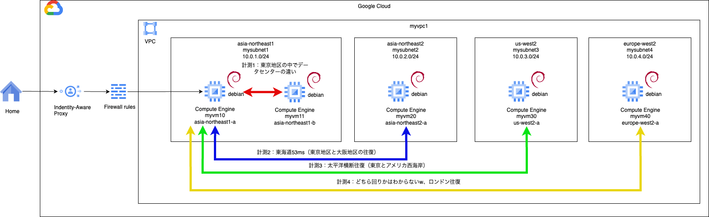
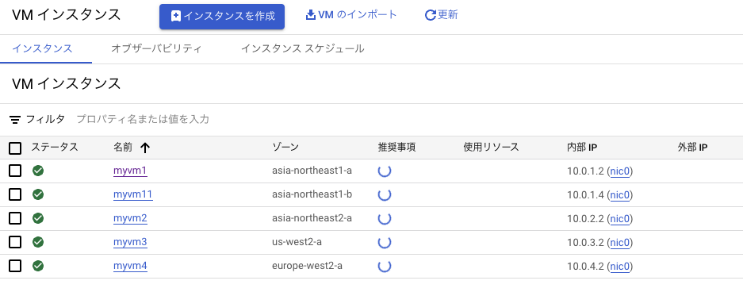

# network basis 3

### 1. 前提条件
23_network_basis2が完了していること。

### 2. 今回の構成図
宝暦より続く東海道53msの他、リージョン間のレイテンシも計測する（ややネタ回、結果だけ確認でも良い）<br>
同一のVPCでサブネットを東京、大阪、ロサンゼルス、ロンドンに作成<br>
VMを、東京A、東京B、大阪、ロサンゼルス、ロンドンに立ち上げて、東京Aを起点にPINGでレイテンシを計測する。<br>


### 3. 今回のコード
ネタ回であるため、１ファイルに全部書きました。<br>
ネットワーク資格の勉強をしていると、FWの制御は、タグよりサービスアカウントでやっているケースを多くみたので実装してみました。<br>
1VMにつき１サービスアカウント（タグは１：Nになる）の性質を利用して制御したい場合に使うようです。
```
# VPCは1つ
resource "google_compute_network" "myvpc1" {
  name                    = "myvpc1"
  auto_create_subnetworks = false
}

# 東京、大阪、ロサンゼルス、ロンドン
# 東京
resource "google_compute_subnetwork" "mysubnet1" {
  name          = "mysubnet1"
  ip_cidr_range = "10.0.1.0/24"
  region        = "asia-northeast1"
  network       = google_compute_network.myvpc1.id
}
# 大阪
resource "google_compute_subnetwork" "mysubnet2" {
  name          = "mysubnet2"
  ip_cidr_range = "10.0.2.0/24"
  region        = "asia-northeast2"
  network       = google_compute_network.myvpc1.id
}
# ロサンゼルス
resource "google_compute_subnetwork" "mysubnet3" {
  name          = "mysubnet3"
  ip_cidr_range = "10.0.3.0/24"
  region        = "us-west2"
  network       = google_compute_network.myvpc1.id
}
# ロンドン
resource "google_compute_subnetwork" "mysubnet4" {
  name          = "mysubnet4"
  ip_cidr_range = "10.0.4.0/24"
  region        = "europe-west2"
  network       = google_compute_network.myvpc1.id
}


# VM1はIAP経由で接続できる状態にする
# IAP用のファイアウォールルールを作成する
# ソースIPアドレスは、GoogleのIAPのIPアドレス範囲を指定する。
# ターゲットは、VMに付与するタグを指定する。
resource "google_compute_firewall" "myvmfirewall" {
  name    = "myvmfirewall"
  network = google_compute_network.myvpc1.self_link

  allow {
    protocol = "tcp"
    ports    = ["22"]

  }
  # source ranges for Identity-Aware Proxy
  # NWの問題をやっていると、タグよりもサービスアカウントで制御することを学ぶ
  source_ranges = ["35.235.240.0/20"]
  target_service_accounts = [google_service_account.myvmsa1.email]

  depends_on = [ google_compute_network.myvpc1, google_service_account.myvmsa1 ]
}

# 踏み台から各国のVMへのPINGを許可するルール
resource "google_compute_firewall" "fromvpctovpc" {
  name    = "fromvpctovpc"
  network = google_compute_network.myvpc1.self_link

  allow {
    protocol = "icmp"
  }

  # from var.vm_tags to vm2tag
  # NWの問題をやっていると、タグよりもサービスアカウントで制御することを学ぶ
  source_service_accounts = [google_service_account.myvmsa1.email]
  target_service_accounts = [google_service_account.myvmsa2.email]

  depends_on = [ google_compute_network.myvpc1, google_service_account.myvmsa2 ]
}

# VM用のサービスアカウントを作成する（東京）
resource "google_service_account" "myvmsa1" {
  account_id   = "myvmsa1"
  display_name = "Custom SA for VM Instance"
}

# VM本体を作成する 東京A
resource "google_compute_instance" "myvm1" {
  name         = "myvm1"
  machine_type = "e2-medium"
  zone         = "asia-northeast1-a"
  tags         = ["operation"]

  boot_disk {
    mode = "READ_WRITE"
    initialize_params {
      image = "projects/debian-cloud/global/images/debian-12-bookworm-v20240312"
      size  = 10
      type  = "pd-balanced"
    }
  }

  network_interface {
    subnetwork = google_compute_subnetwork.mysubnet1.self_link
  }

  service_account {
    # Google recommends custom service accounts that have cloud-platform scope and permissions granted via IAM Roles.
    email  = google_service_account.myvmsa1.email
    scopes = ["https://www.googleapis.com/auth/cloud-platform"]
  }

}

# VM用のサービスアカウントを作成する（東京A以外）
resource "google_service_account" "myvmsa2" {
  account_id   = "myvmsa2"
  display_name = "Custom SA for VM Instance Not Tokyo"
}


# VM本体を作成する 東京B
resource "google_compute_instance" "myvm11" {
  name         = "myvm11"
  machine_type = "e2-medium"
  zone         = "asia-northeast1-b"
  tags         = ["myvm"]

  boot_disk {
    mode = "READ_WRITE"
    initialize_params {
      image = "projects/debian-cloud/global/images/debian-12-bookworm-v20240312"
      size  = 10
      type  = "pd-balanced"
    }
  }

  network_interface {
    subnetwork = google_compute_subnetwork.mysubnet1.self_link
  }

  service_account {
    # Google recommends custom service accounts that have cloud-platform scope and permissions granted via IAM Roles.
    email  = google_service_account.myvmsa2.email
    scopes = ["https://www.googleapis.com/auth/cloud-platform"]
  }

}

# VM本体を作成する 大阪
resource "google_compute_instance" "myvm2" {
  name         = "myvm2"
  machine_type = "e2-medium"
  zone         = "asia-northeast2-a"
  tags         = ["myvm"]

  boot_disk {
    mode = "READ_WRITE"
    initialize_params {
      image = "projects/debian-cloud/global/images/debian-12-bookworm-v20240312"
      size  = 10
      type  = "pd-balanced"
    }
  }

  network_interface {
    subnetwork = google_compute_subnetwork.mysubnet2.self_link
  }

  service_account {
    # Google recommends custom service accounts that have cloud-platform scope and permissions granted via IAM Roles.
    email  = google_service_account.myvmsa2.email
    scopes = ["https://www.googleapis.com/auth/cloud-platform"]
  }

}

# VM本体を作成する ロサンゼルス
resource "google_compute_instance" "myvm3" {
  name         = "myvm3"
  machine_type = "e2-medium"
  zone         = "us-west2-a"
  tags         = ["myvm"]

  boot_disk {
    mode = "READ_WRITE"
    initialize_params {
      image = "projects/debian-cloud/global/images/debian-12-bookworm-v20240312"
      size  = 10
      type  = "pd-balanced"
    }
  }

  network_interface {
    subnetwork = google_compute_subnetwork.mysubnet3.self_link
  }

  service_account {
    # Google recommends custom service accounts that have cloud-platform scope and permissions granted via IAM Roles.
    email  = google_service_account.myvmsa2.email
    scopes = ["https://www.googleapis.com/auth/cloud-platform"]
  }

}

# VM本体を作成する ロンドn
resource "google_compute_instance" "myvm4" {
  name         = "myvm4"
  machine_type = "e2-medium"
  zone         = "europe-west2-a"
  tags         = ["myvm"]

  boot_disk {
    mode = "READ_WRITE"
    initialize_params {
      image = "projects/debian-cloud/global/images/debian-12-bookworm-v20240312"
      size  = 10
      type  = "pd-balanced"
    }
  }

  network_interface {
    subnetwork = google_compute_subnetwork.mysubnet4.self_link
  }

  service_account {
    # Google recommends custom service accounts that have cloud-platform scope and permissions granted via IAM Roles.
    email  = google_service_account.myvmsa2.email
    scopes = ["https://www.googleapis.com/auth/cloud-platform"]
  }

}
```
画面で下記ようになっていればOKです。<br>


### 4. 計測結果
<b>東京Aと東京B（同じリージョンのDC違い）</b><br>
```
$ ping 10.0.1.4
PING 10.0.1.4 (10.0.1.4) 56(84) bytes of data.
64 bytes from 10.0.1.4: icmp_seq=1 ttl=64 time=1.70 ms
64 bytes from 10.0.1.4: icmp_seq=2 ttl=64 time=0.351 ms
64 bytes from 10.0.1.4: icmp_seq=3 ttl=64 time=0.256 ms
64 bytes from 10.0.1.4: icmp_seq=4 ttl=64 time=0.275 ms
64 bytes from 10.0.1.4: icmp_seq=5 ttl=64 time=0.280 ms
64 bytes from 10.0.1.4: icmp_seq=6 ttl=64 time=0.260 ms
64 bytes from 10.0.1.4: icmp_seq=7 ttl=64 time=0.255 ms
64 bytes from 10.0.1.4: icmp_seq=8 ttl=64 time=0.284 ms
64 bytes from 10.0.1.4: icmp_seq=9 ttl=64 time=0.296 ms
64 bytes from 10.0.1.4: icmp_seq=10 ttl=64 time=0.301 ms
64 bytes from 10.0.1.4: icmp_seq=11 ttl=64 time=0.262 ms
64 bytes from 10.0.1.4: icmp_seq=12 ttl=64 time=0.272 ms
64 bytes from 10.0.1.4: icmp_seq=13 ttl=64 time=0.292 ms
^C
--- 10.0.1.4 ping statistics ---
13 packets transmitted, 13 received, 0% packet loss, time 12251ms
rtt min/avg/max/mdev = 0.255/0.390/1.698/0.378 ms
```
最初の1回の値が大きいので、値を見る限りは平均で0.3ms<br>
<b>東京と大阪</b><br>
```
$ ping 10.0.2.2
PING 10.0.2.2 (10.0.2.2) 56(84) bytes of data.
64 bytes from 10.0.2.2: icmp_seq=1 ttl=64 time=10.4 ms
64 bytes from 10.0.2.2: icmp_seq=2 ttl=64 time=8.61 ms
64 bytes from 10.0.2.2: icmp_seq=3 ttl=64 time=8.63 ms
64 bytes from 10.0.2.2: icmp_seq=4 ttl=64 time=8.67 ms
64 bytes from 10.0.2.2: icmp_seq=5 ttl=64 time=8.67 ms
64 bytes from 10.0.2.2: icmp_seq=6 ttl=64 time=8.61 ms
64 bytes from 10.0.2.2: icmp_seq=7 ttl=64 time=8.63 ms
64 bytes from 10.0.2.2: icmp_seq=8 ttl=64 time=8.66 ms
64 bytes from 10.0.2.2: icmp_seq=9 ttl=64 time=8.62 ms
64 bytes from 10.0.2.2: icmp_seq=10 ttl=64 time=8.60 ms
64 bytes from 10.0.2.2: icmp_seq=11 ttl=64 time=8.66 ms
64 bytes from 10.0.2.2: icmp_seq=12 ttl=64 time=8.62 ms
64 bytes from 10.0.2.2: icmp_seq=13 ttl=64 time=8.63 ms
64 bytes from 10.0.2.2: icmp_seq=14 ttl=64 time=8.63 ms
64 bytes from 10.0.2.2: icmp_seq=15 ttl=64 time=8.58 ms
^C
--- 10.0.2.2 ping statistics ---
15 packets transmitted, 15 received, 0% packet loss, time 14025ms
rtt min/avg/max/mdev = 8.576/8.747/10.382/0.437 ms
```
平均で8.6ms<br>
東海道5.3msの方が良いかもしれない。<br>

<b>東京とロサンゼルス</b><br>
```
$ ping 10.0.3.2
PING 10.0.3.2 (10.0.3.2) 56(84) bytes of data.
64 bytes from 10.0.3.2: icmp_seq=1 ttl=64 time=101 ms
64 bytes from 10.0.3.2: icmp_seq=2 ttl=64 time=99.5 ms
64 bytes from 10.0.3.2: icmp_seq=3 ttl=64 time=99.4 ms
64 bytes from 10.0.3.2: icmp_seq=4 ttl=64 time=99.4 ms
64 bytes from 10.0.3.2: icmp_seq=5 ttl=64 time=99.5 ms
64 bytes from 10.0.3.2: icmp_seq=6 ttl=64 time=99.6 ms
64 bytes from 10.0.3.2: icmp_seq=7 ttl=64 time=99.5 ms
64 bytes from 10.0.3.2: icmp_seq=8 ttl=64 time=99.4 ms
64 bytes from 10.0.3.2: icmp_seq=9 ttl=64 time=99.3 ms
64 bytes from 10.0.3.2: icmp_seq=10 ttl=64 time=99.3 ms
64 bytes from 10.0.3.2: icmp_seq=11 ttl=64 time=99.3 ms
64 bytes from 10.0.3.2: icmp_seq=12 ttl=64 time=99.4 ms
64 bytes from 10.0.3.2: icmp_seq=13 ttl=64 time=99.3 ms
64 bytes from 10.0.3.2: icmp_seq=14 ttl=64 time=99.4 ms
64 bytes from 10.0.3.2: icmp_seq=15 ttl=64 time=99.3 ms
64 bytes from 10.0.3.2: icmp_seq=16 ttl=64 time=99.4 ms
^C
--- 10.0.3.2 ping statistics ---
16 packets transmitted, 16 received, 0% packet loss, time 15022ms
rtt min/avg/max/mdev = 99.302/99.510/101.019/0.396 ms
```
平均で99.3, 99.4ms<br>
<b>東京とロンドン</b><br>
```
$ ping 10.0.4.2
PING 10.0.4.2 (10.0.4.2) 56(84) bytes of data.
64 bytes from 10.0.4.2: icmp_seq=1 ttl=64 time=216 ms
64 bytes from 10.0.4.2: icmp_seq=2 ttl=64 time=213 ms
64 bytes from 10.0.4.2: icmp_seq=3 ttl=64 time=213 ms
64 bytes from 10.0.4.2: icmp_seq=4 ttl=64 time=213 ms
64 bytes from 10.0.4.2: icmp_seq=5 ttl=64 time=213 ms
64 bytes from 10.0.4.2: icmp_seq=6 ttl=64 time=213 ms
64 bytes from 10.0.4.2: icmp_seq=7 ttl=64 time=213 ms
64 bytes from 10.0.4.2: icmp_seq=8 ttl=64 time=213 ms
64 bytes from 10.0.4.2: icmp_seq=9 ttl=64 time=213 ms
64 bytes from 10.0.4.2: icmp_seq=10 ttl=64 time=213 ms
64 bytes from 10.0.4.2: icmp_seq=11 ttl=64 time=213 ms
64 bytes from 10.0.4.2: icmp_seq=12 ttl=64 time=213 ms
64 bytes from 10.0.4.2: icmp_seq=13 ttl=64 time=213 ms
64 bytes from 10.0.4.2: icmp_seq=14 ttl=64 time=213 ms
64 bytes from 10.0.4.2: icmp_seq=15 ttl=64 time=213 ms
^C
--- 10.0.4.2 ping statistics ---
15 packets transmitted, 15 received, 0% packet loss, time 14007ms
rtt min/avg/max/mdev = 212.622/212.925/216.156/0.866 ms
```
平均で213ms<br>

### 5. まとめ
|区間|レイテンシ|コメント|
|--|--|--|
|東京A：東京B|0.3ms|同じリージョンのセンター間だと1ms以内|
|東京：大阪|8.6ms|東阪だと10ms以内|
|東京：ロサンゼルス|99.3ms|東京とアメリカだと100ms程度|
|東京：ロンドン|213ms|東京と欧州だと200ms程度|

### 6. 次回予告
プライベート通信の基本であるプライベートサービスコネクト、プライベートサービスアクセスを実装できるようになることを目指します。
