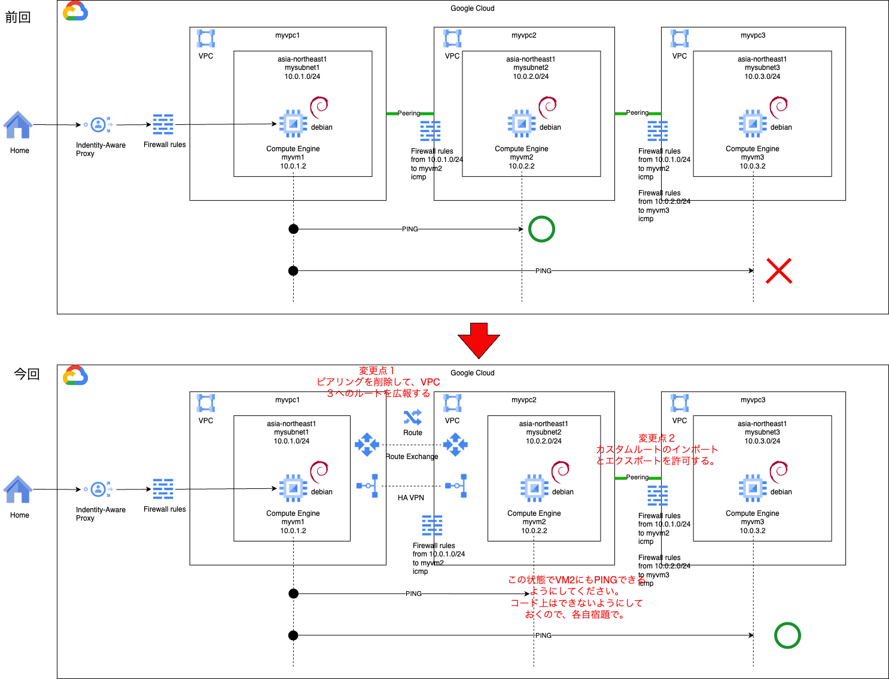

# network basis 2

### 1. 前提条件
22_network_basis1が完了していること。

### 2. 今回の構成図
ネットワーク区分の資格取得に向けて基本事項を実践します。<br>
今回は、GKEをプライベートクラスタにすると出くわす２段階のピアリングについてです。<br>
今回の構成図は下記の通りです。<br>


### 3. 今回のコード
VM1がVM3にPINGできないのは、VM3が接続するネットワークへのルート（10.0.3.0/24）をVM1が知らないからです。<br>
下記の通り、VM1が接続するVPC1のルートに、VPC3（10.0.3.0/24）へのルートがありません。<br>


これを解消すべく前回のコード、構成を変更していきます。<br>

まず、ネットワークモジュールで、VPC１と２の間のピアリングを削除します。<br>
また、この後、VPC2を経由して、VPC1にVPC3のルート交換を行いますが、VPC2で受けたルートをVPC3にも流すために、<br>
VPC2とVPC3のピアリング属性を変更して、カスタムルートのインポートとエクスポートを有効にします。
```
[modules/network/main.tf]（変更箇所のみ）

/* 23_network_basis2では消す。
# VPCのピアリング（1と2)
resource "google_compute_network_peering" "peering12" {
  name         = "peering12"
  network      = google_compute_network.myvpc1.self_link
  peer_network = google_compute_network.myvpc2.self_link
  export_custom_routes = false
  import_custom_routes = false
}

# VPCのピアリング（2と1)
resource "google_compute_network_peering" "peering21" {
  name         = "peering21"
  network      = google_compute_network.myvpc2.self_link
  peer_network = google_compute_network.myvpc1.self_link
  export_custom_routes = false
  import_custom_routes = false
}
*/

# VPCのピアリング（2と3)
resource "google_compute_network_peering" "peering23" {
  name         = "peering23"
  network      = google_compute_network.myvpc2.self_link
  peer_network = google_compute_network.myvpc3.self_link
/* 23_network_basis2ではtrueにする
  export_custom_routes = false
  import_custom_routes = false
*/
  export_custom_routes = true
  import_custom_routes = true

}

# VPCのピアリング（3と2)
resource "google_compute_network_peering" "peering32" {
  name         = "peering32"
  network      = google_compute_network.myvpc3.self_link
  peer_network = google_compute_network.myvpc2.self_link
/* 23_network_basis2ではtrueにする
  export_custom_routes = false
  import_custom_routes = false
*/
  export_custom_routes = true
  import_custom_routes = true

}
```
次に、VPNゲートウェイとルータを作成して、Cloud VPNを使用してBGPを用いたルート交換を実装します。<br>
ただし、HAではないVPNは非推奨となっているようなので、HA版での実装になります。<br>
まず構成を図示します。<br>


HA VPN用の新しいモジュールを作成します。
```
[modules/ha-vpn/main.tf]
# VPNゲートウェイを作成します。
# HA VPN Gateway 1
resource "google_compute_ha_vpn_gateway" "ha_gateway1" {
  name    = "ha-vpn-1"
  region  = var.region
  network = var.vpc1_network_id
}
# HA VPN Gateway 2
resource "google_compute_ha_vpn_gateway" "ha_gateway2" {
  name    = "ha-vpn-2"
  region  = var.region
  network = var.vpc2_network_id
}

# ルーターを作成します。
# Router 1
resource "google_compute_router" "router1" {
  name    = "ha-vpn-router1"
  region  = var.region
  network = var.vpc1_network_name
  bgp {
    asn = 64514
    advertise_mode    = "CUSTOM"
    advertised_ip_ranges {
      range = var.vpc1_network_cidr
    }
  }
}
# Router 2
resource "google_compute_router" "router2" {
  name    = "ha-vpn-router2"
  region  = var.region
  network = var.vpc2_network_name
  bgp {
    asn = 64515
    advertise_mode    = "CUSTOM"
    advertised_ip_ranges {
      range = var.vpc3_network_cidr
    }
    // TODO Homework
  }
}

# VPNトンネルを作成します。
# HAなので、2つのインターフェースに、それぞれ双方向のトンネルを作成します。（なので合計4つ作る）
# VPN Tunnel 12 interface 0
resource "google_compute_vpn_tunnel" "tunnel_120" {
  name                  = "ha-vpn-tunnel-120"
  region                = var.region
  vpn_gateway           = google_compute_ha_vpn_gateway.ha_gateway1.id
  peer_gcp_gateway      = google_compute_ha_vpn_gateway.ha_gateway2.id
  shared_secret         = "a secret message"
  router                = google_compute_router.router1.id
  vpn_gateway_interface = 0
}

# VPN Tunnel 12 interface 1
resource "google_compute_vpn_tunnel" "tunnel_121" {
  name                  = "ha-vpn-tunnel-121"
  region                = var.region
  vpn_gateway           = google_compute_ha_vpn_gateway.ha_gateway1.id
  peer_gcp_gateway      = google_compute_ha_vpn_gateway.ha_gateway2.id
  shared_secret         = "a secret message"
  router                = google_compute_router.router1.id
  vpn_gateway_interface = 1
}

# VPN Tunnel 21 interface 0
resource "google_compute_vpn_tunnel" "tunnel_210" {
  name                  = "ha-vpn-tunnel-210"
  region                = var.region
  vpn_gateway           = google_compute_ha_vpn_gateway.ha_gateway2.id
  peer_gcp_gateway      = google_compute_ha_vpn_gateway.ha_gateway1.id
  shared_secret         = "a secret message"
  router                = google_compute_router.router2.id
  vpn_gateway_interface = 0
}

# VPN Tunnel 21 interface 1
resource "google_compute_vpn_tunnel" "tunnel_211" {
  name                  = "ha-vpn-tunnel-211"
  region                = var.region
  vpn_gateway           = google_compute_ha_vpn_gateway.ha_gateway2.id
  peer_gcp_gateway      = google_compute_ha_vpn_gateway.ha_gateway1.id
  shared_secret         = "a secret message"
  router                = google_compute_router.router2.id
  vpn_gateway_interface = 1
}

# ここからはルータの設定を行います。ルータも自分と対抗の2つがあり、それぞれのインターフェースが2つあります。
#（なので4つ設定を定義します）
# また、それぞれInterface（接続する端子）の設定とPeer（BGP接続するための情報）の設定を行います。

# Router 1 : VPC1側のルータの設定
# Router 1 Interface 1
resource "google_compute_router_interface" "router1_interface1" {
  name       = "router1-interface1"
  router     = google_compute_router.router1.name
  region     = var.region
  ip_range   = "169.254.0.1/30"
  vpn_tunnel = google_compute_vpn_tunnel.tunnel_120.name
}

# Router 1 Peer 1
resource "google_compute_router_peer" "router1_peer1" {
  name                      = "router1-peer1"
  router                    = google_compute_router.router1.name
  region                    = var.region
  peer_ip_address           = "169.254.0.2"
  peer_asn                  = 64515
  advertised_route_priority = 100
  interface                 = google_compute_router_interface.router1_interface1.name
}

# Router 1 Interface 2
resource "google_compute_router_interface" "router1_interface2" {
  name       = "router1-interface2"
  router     = google_compute_router.router1.name
  region     = var.region
  ip_range   = "169.254.1.2/30"
  vpn_tunnel = google_compute_vpn_tunnel.tunnel_121.name
}

# Router 1 Peer 2
resource "google_compute_router_peer" "router1_peer2" {
  name                      = "router1-peer2"
  router                    = google_compute_router.router1.name
  region                    = var.region
  peer_ip_address           = "169.254.1.1"
  peer_asn                  = 64515
  advertised_route_priority = 100
  interface                 = google_compute_router_interface.router1_interface2.name
}

# Router 2 : VPC2側のルータの設定
# Router 2 Interface 1
resource "google_compute_router_interface" "router2_interface1" {
  name       = "router2-interface1"
  router     = google_compute_router.router2.name
  region     = var.region
  ip_range   = "169.254.0.2/30"
  vpn_tunnel = google_compute_vpn_tunnel.tunnel_210.name
}

# Router 2 Peer 1
resource "google_compute_router_peer" "router2_peer1" {
  name                      = "router2-peer1"
  router                    = google_compute_router.router2.name
  region                    = var.region
  peer_ip_address           = "169.254.0.1"
  peer_asn                  = 64514
  advertised_route_priority = 100
  interface                 = google_compute_router_interface.router2_interface1.name
}

# Router 2 : VPC2側のルータの設定
# Router 2 Interface 2
resource "google_compute_router_interface" "router2_interface2" {
  name       = "router2-interface2"
  router     = google_compute_router.router2.name
  region     = var.region
  ip_range   = "169.254.1.1/30"
  vpn_tunnel = google_compute_vpn_tunnel.tunnel_211.name
}
# Router 2 Peer 2
resource "google_compute_router_peer" "router2_peer2" {
  name                      = "router2-peer2"
  router                    = google_compute_router.router2.name
  region                    = var.region
  peer_ip_address           = "169.254.1.2"
  peer_asn                  = 64514
  advertised_route_priority = 100
  interface                 = google_compute_router_interface.router2_interface2.name
}
```
最後にこれらのモジュールを実行するmain.tfは下記の通りです。
```
module "network" {

  source = "./modules/network"

  region = var.region
  zone = var.zone
  vm_tags = var.vm_tags

}

module "instance1" {

  source = "./modules/instance"

  region = var.region
  zone = var.zone
  vm_tags = var.vm_tags
  project_id = var.project_id
  account_id = "myvmsa1"
  vmname = "myvm1"
  mysubnet_self_link = module.network.mysubnet1_selflink
}

module "instance2" {

  source = "./modules/instance"

  region = var.region
  zone = var.zone
  vm_tags = "vm2tag"
  project_id = var.project_id
  account_id = "myvmsa2"
  vmname = "myvm2"
  mysubnet_self_link = module.network.mysubnet2_selflink
}

module "instance3" {

  source = "./modules/instance"

  region = var.region
  zone = var.zone
  vm_tags = "vm3tag"
  project_id = var.project_id
  account_id = "myvmsa3"
  vmname = "myvm3"
  mysubnet_self_link = module.network.mysubnet3_selflink
}

module "ha-vpn" {

  source = "./modules/ha-vpn"

  region = var.region
  vpc1_network_id = module.network.myvpc1_selflink
  vpc2_network_id = module.network.myvpc2_selflink
  vpc1_network_name = module.network.myvpc1_name
  vpc2_network_name = module.network.myvpc2_name
  vpc1_network_cidr = module.network.mysubnet1_cidr
  vpc2_network_cidr = module.network.mysubnet2_cidr
  vpc3_network_cidr = module.network.mysubnet3_cidr
}
```
エラーなく実行できることを確認してください。

### 4. PING疎通
この状態では、VM1からVM3にはPINGが通るはずですので、確認してみてください。<br>
うまくいかない時は、ルートの確認画面で、正しくルートが伝播されているかを確認します。<br>
下記のようになっていればOKです。


### 5. 宿題w
逆にVM1からVM2に接続できなくなっていると思いますので、解消してみてください。

### 6. 次回予告
NW関連の基礎事項として、宝暦の頃から東海道53msと言われますが、ゾーンやリージョンによるレイテンシの違いなどをみていきたいと思います。<br>
