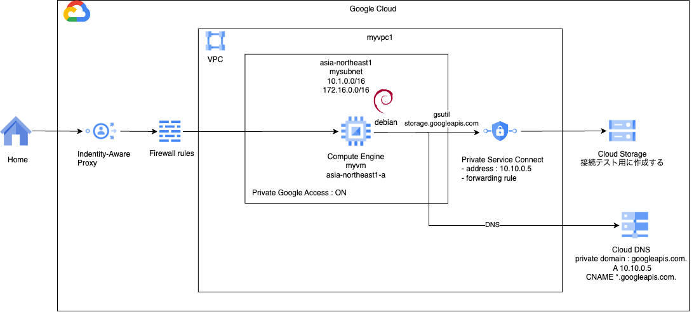
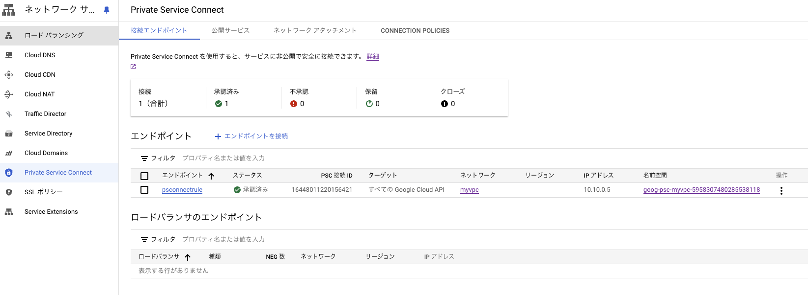

# network basis 4

### 1. 前提条件
23_network_basis2が完了していること。

### 2. 今回の構成図
今回はPrivate Service Connectを実装していきます。<br>
参考：https://cloud.google.com/vpc/docs/private-service-connect?hl=ja<br>
AWSでいうVPCエンドポイントやPrivateLinkのような感じで、GoogleのAPIやマネージドサービスとプライベート接続を行う方法です。<br>
実務上もほぼ100％使うことになるので、この機会に基本のキを身につける機会になればと思います。<br>
今回はGoogle APIs向けに実装していきます。<br>
この先GKEクラスタをプライベート化すると、コントロールプレーンとワーカノードの通信は、Private Service ConnectのプロデューサVPC型になります。<br>


### 3. 今回のコード
少し間が開いたので、main.tfだけ全部載せていきます。<br>
networkモジュールについては、Egressのインターネットへの経路は不要なのでNATGW（とルータ）を削除しています。<br>
また、サブネットでプライベートGoogleアクセスをONにしています。<br>
```
[modules/network/main.tf]
resource "google_compute_network" "myvpc" {
  name                    = "myvpc"
  auto_create_subnetworks = false
}

resource "google_compute_subnetwork" "mysubnet" {
  name          = "mysubnet"
  ip_cidr_range = var.ip_cidr_range
  region        = var.region
  network       = google_compute_network.myvpc.id
  
  private_ip_google_access = true

  secondary_ip_range {
    range_name    = var.range_name
    ip_cidr_range = var.ip_cidr_range_secondary
  }

  depends_on = [ google_compute_network.myvpc ]

  lifecycle {
    ignore_changes = [ secondary_ip_range ]
  }

}

# IAP用のファイアウォールルールを作成する
# ソースIPアドレスは、GoogleのIAPのIPアドレス範囲を指定する。
# ターゲットは、VMに付与するタグを指定する。
resource "google_compute_firewall" "myvmfirewall" {
  name    = "myvmfirewall"
  network = google_compute_network.myvpc.self_link

  allow {
    protocol = "tcp"
    ports    = ["22"]

  }
  # source ranges for Identity-Aware Proxy
  source_ranges = ["35.235.240.0/20"]
  target_tags = [var.vm_tags]

  depends_on = [ google_compute_network.myvpc ]
}
```
instanceモジュールは全く変更がないので割愛します。<br>
gkeとcicdのモジュールは今回不要です。代わりにpscモジュールを新設します。<br>
Private Service ConnectのIPアドレスとForwardingルールを作成します。<br>
また、接続確認に使うストレージも合わせて作成します。<br>
```
[modules/psc/main.tf]
#### Private Service Connectの設定を行う
# Global Address
resource "google_compute_global_address" "psconnect-ip" {
  project      = var.project_id
  name         = "global-psconnect-ip"
  address_type = "INTERNAL"
  purpose      = "PRIVATE_SERVICE_CONNECT"
  network      = var.vpc_id
  address      = "10.10.0.5"
}

# Global Forwarding Rule
resource "google_compute_global_forwarding_rule" "psconnect-rule" {
  project               = var.project_id
  name                  = "psconnectrule"
  target                = "all-apis"
  network               = var.vpc_id
  ip_address            = google_compute_global_address.psconnect-ip.id
  load_balancing_scheme = ""
}

#### テスト用のストレージバケットを作成する
# create bucket name for test
resource "random_string" "bucketname" {
  length = 16
  lower  = true
  upper = false
  special = false
}

# create bucket for test
resource "google_storage_bucket" "psc_test_bucket" {
  name          = "psctestbucket${random_string.bucketname.result}"
  location      = var.region
  force_destroy = true

  public_access_prevention = "enforced"
}
```
ストレージには、オブジェクトが入っている方がわかりやすかったりするので、空ファイルか何か登録しておいてください。<br>
結果、ネットワークサービス＞Private Service Connect＞接続エンドポイントが下記のようになっていればOKです。


### 4. 動作確認
VMにログインして、storage.google.comにcurlします。204レスポンスを返してくれるgenerate_204/に向けてcurlを実行します。
```
$ curl -v storage.googleapis.com/generate_204
*   Trying 142.250.207.59:80...
* Connected to storage.googleapis.com (142.250.207.59) port 80 (#0)
> GET /generate_204 HTTP/1.1
> Host: storage.googleapis.com
> User-Agent: curl/7.88.1
> Accept: */*
> 
< HTTP/1.1 204 No Content
< Content-Length: 0
< Cross-Origin-Resource-Policy: cross-origin
< Date: Tue, 28 May 2024 07:55:50 GMT
< 
* Connection #0 to host storage.googleapis.com left intact
```
設定した10.10.0.5ではなく、142.250.207.59というグローバルアドレスに解決されていることがわかります。<br>
次に、pscのドメインである、storage-psconnectrule.p.googleapis.comにcurlしてみます。<br>
命名規則的には、[サービス名]-[pscのforwarding rule名].[privateのp(おそらく）].googleapis.com.です。<br>
```
$ curl -v storage-psconnectrule.p.googleapis.com/generate_204
*   Trying 10.10.0.5:80...
* Connected to storage-psconnectrule.p.googleapis.com (10.10.0.5) port 80 (#0)
> GET /generate_204 HTTP/1.1
> Host: storage-psconnectrule.p.googleapis.com
> User-Agent: curl/7.88.1
> Accept: */*
> 
< HTTP/1.1 204 No Content
< Content-Length: 0
< Cross-Origin-Resource-Policy: cross-origin
< Date: Tue, 28 May 2024 07:54:32 GMT
< 
* Connection #0 to host storage-psconnectrule.p.googleapis.com left intact
```
こちらは、10.10.0.5に解決されることがわかります。<br>
つまり、Cloud StorageのAPIを呼ぶときに、storage.googleapis.comの代わりに、<br>
storage-psconnectrule.p.googleapis.comを呼ぶことでプライベート通信ができます。<br>
が、アプリケーションの接続先をコントロールできる場合は、これで良いですが、変更できない場合もあります。<br>
その場合は、Cloud DNSを設定して対応する必要があります。次回、それを見ていきます。

### 5. 次回予告
Cloud DNSの設定を行います。