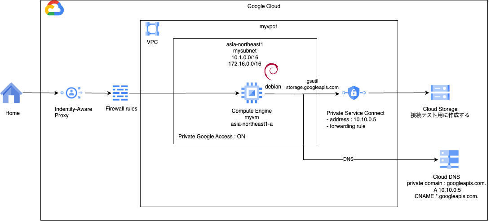
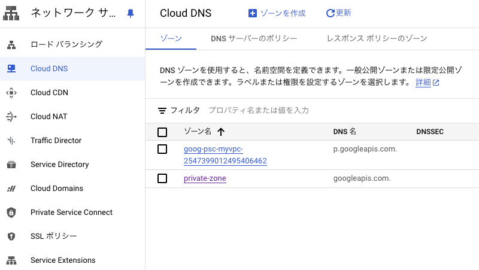
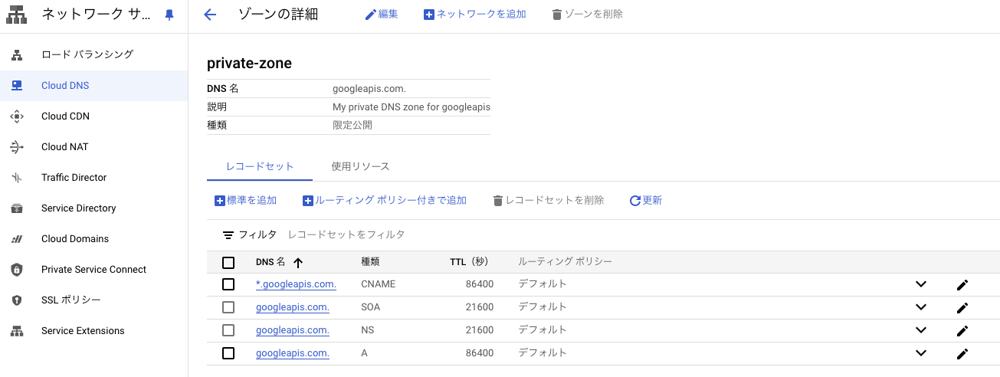

# network basis 5

### 1. 前提条件
25_network_basis4が完了していること。

### 2. 今回の構成図
今回は、前回の構成にCloud DNSの設定を追加します。構成図的には変わりません。DNSの基本事項復習にお役立てください。<br>


### 3. 今回のコード
networkモジュールにCloud DNSの設定を追加します。<br>
googleapis.comのプライベートDNSゾーン、Aレコード、*.googleapis.comをgoogleapis.comに振り向けるCNAMEの3つを作ります。<br>
同じ値を参照する部分は、変数を参照する形として、極力手打ちを避けるようにしましょう。<br>
```
[modules/network/main.tfに下記の内容を追加する]
#### DNSの設定を行う
resource "google_dns_managed_zone" "private_zone" {
  name        = "private-zone"
  dns_name    = "googleapis.com."
  description = "My private DNS zone for googleapis"

  visibility = "private"

  private_visibility_config {
    networks {
      network_url = var.vpc_id
    }
  }
}

resource "google_dns_record_set" "a_record" {
  managed_zone = google_dns_managed_zone.private_zone.name
  name         = google_dns_managed_zone.private_zone.dns_name
  type         = "A"
  rrdatas      = ["10.10.0.5"]
  ttl          = 86400
}

resource "google_dns_record_set" "cname_record" {
  managed_zone = google_dns_managed_zone.private_zone.name
  name         = format("*.%s",google_dns_managed_zone.private_zone.dns_name)
  type         = "CNAME"
  rrdatas      = [google_dns_managed_zone.private_zone.dns_name]
  ttl          = 86400
}

```
実行後、ネットワークサービス＞CloudDNSで下記ような形になっていることを確認してください。<br>
<br>
private-zoneのリンク押下後の画面<br>


### 4. 動作確認
前回同様、VMにログインして、storage.google.comにcurlします。204レスポンスを返してくれるgenerate_204/に向けてcurlを実行します。
```
$ curl -v storage.googleapis.com/generate_204
*   Trying 10.10.0.5:80...
* Connected to storage.googleapis.com (10.10.0.5) port 80 (#0)
> GET /generate_204 HTTP/1.1
> Host: storage.googleapis.com
> User-Agent: curl/7.88.1
> Accept: */*
> 
< HTTP/1.1 204 No Content
< Content-Length: 0
< Cross-Origin-Resource-Policy: cross-origin
< Date: Tue, 28 May 2024 08:16:59 GMT
< 
* Connection #0 to host storage.googleapis.com left intact
```
前回は、グローバルIPに解決されたstorage.googleapis.comドメインが、こちらで設定した10.10.0.5に解決されることがわかりました。<br>
この状態になれば、普通にデフォルトのドメインでAPIアクセスすればプライベート通信できることになるので、gsutilなどのツールもそのまま利用することができます。<br>
gsutil -D ls gs://[テスト用に作ったバケット名]、など実行してみてください。（Dオプションをつけるとverbose的な挙動になり、詳細が見えます。途中のconnect:というところにドメインが表示されていますが、デフォルトのstorage.googleapis.comになっていることを確認しておいてください。）
```
$ gsutil -D ls gs://psctestbucketbpdrbzjob91tje2t
(冒頭の注意書きにもあるとおり、認証トークンを含むため、出力結果は載せません)
```
（gsutilコマンドで、「今の通信がプライベートになってまぁーす」と答えてくれると素敵ですが、この2つの挙動を合わせて解釈しましょう。。）

### 5. 次回予告
ここまでPSCによりGoogle APIへ接続する方法を見てきましたが、次回は、CloudSQLを例に、プロデューサ側のVPC内にインスタンスが立ち上がる例について見ていきます。<br>
今回取り上げたPrivate Service Connectという方式でもCloudSQLには接続できるみたいですが、もう1つ似たような名前の方式でPrivate Service Accessというのがあります。<br>
次回はそれを取り上げます。（GKEのプライベートクラスタにおけるコントロールプレーンもPrivate Service Accessの形です。）