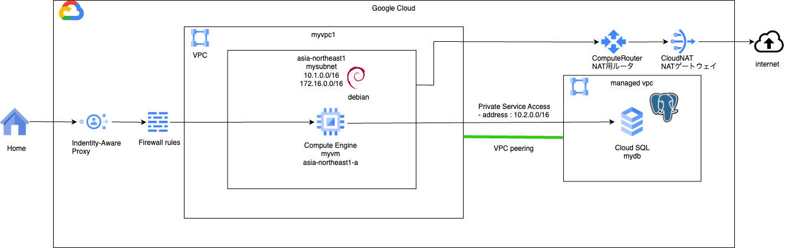
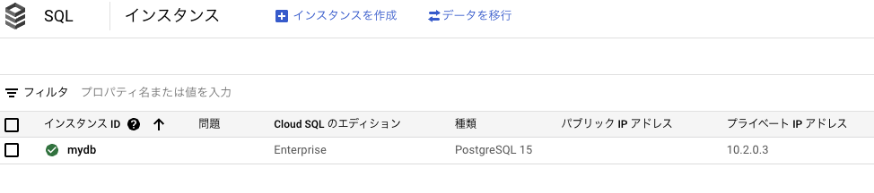
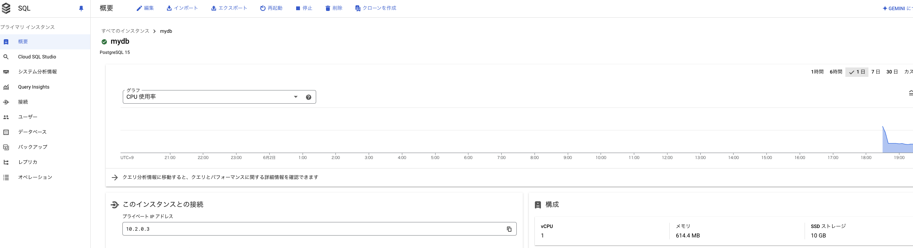
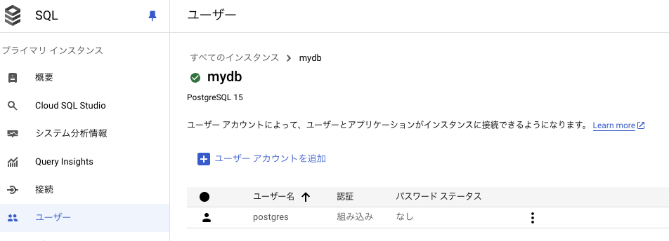
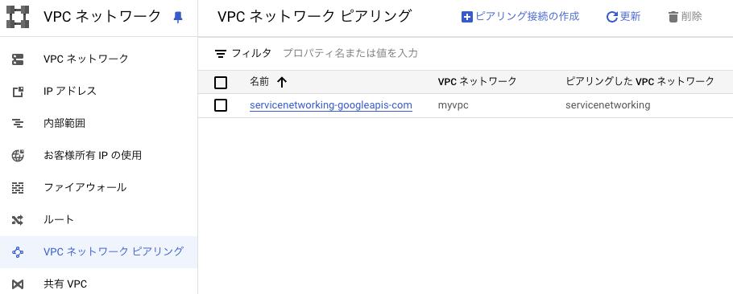

# network basis 6

### 1. 前提条件
26_network_basis5が完了していること。

### 2. 今回の構成図
今回は、プライベートサービスアクセスを実装して、CloudSQLへプライベート接続するための方法を学びます。<br>
https://cloud.google.com/sql/docs/mysql/configure-private-ip?hl=ja<br>


### 3. 今回のコード
プライベートサービスアクセスの実装とCloud SQLインスタンスの立ち上げをsqlモジュールとして作成します。<br>
プライベートサービスアクセスは、対象のVPC全体で有効になるので、将来的にはプライベートサービスアクセスの実装は、networkモジュールに移すか、分離して独立させることになると思います。
```
[modules/sql/main.tfに下記の内容を追加する]
# 参考：https://cloud.google.com/sql/docs/mysql/configure-private-ip?hl=ja

resource "google_compute_global_address" "private_ip_address" {
  name          = "private-ip-address"
  purpose       = "VPC_PEERING"
  address_type  = "INTERNAL"
  address       = "10.2.0.0"
  prefix_length = 16
  network       = var.vpc_id
}

resource "google_service_networking_connection" "psc" {
  network                 = var.vpc_id
  service                 = "servicenetworking.googleapis.com"
  reserved_peering_ranges = [google_compute_global_address.private_ip_address.name]
}

resource "google_sql_database_instance" "instance" {
  name             = "mydb"
  region           = var.region
  database_version = "POSTGRES_15"

  depends_on = [google_service_networking_connection.psc]

  settings {
    tier = "db-f1-micro"
    ip_configuration {
      ipv4_enabled    = "false"
      private_network = var.vpc_id      
    }
    availability_type = "ZONAL"
  }
  # set `deletion_protection` to true, will ensure that one cannot accidentally delete this instance by
  # use of Terraform whereas `deletion_protection_enabled` flag protects this instance at the GCP level.
  deletion_protection = false
}

resource "google_compute_network_peering_routes_config" "peering_routes" {
  peering              = google_service_networking_connection.psc.peering
  network              = var.vpc_name
  import_custom_routes = true
  export_custom_routes = true
}

```
実行すると、現在のCloudSQLの設定だと時間がかかるかもしれません。（手元では25分ほどかかりました）<br>
他のインスタンスとCPUを共有する一番非力なインスタンスタイプを指定していることが原因かもしれません。<br>
検証用では仕方ないかと思います。Enterpriseエディションでは、Cloud SQL自体は専有コアで96コア、640GBメモリぐらいまで増やせます。<br>
Enterprise Plus エディションだと、128コア、864GBメモリぐらいまでいけるようです。<br>
参考：https://cloud.google.com/sql/docs/mysql/instance-settings?hl=ja

### 4. 実行後の確認
まず実行後の状態を確認していきます。<br>
CloudSQLのトップページで、インスタンスができていること、正常マークついていること、パブリックIPがないこと、プライベートIPが割り当てられていることを確認します。<br>
<br>
上記のインスタンスID（mydb）のところを押下すると、より詳細が見えます。コードを変更していなければ下記のようになっているはずです。<br>
<br>
初期状態では管理ユーザのパスワードが未設定のため、接続ができません。<br>
「ユーザ」の画面からユーザの縦に点が3つ並んでいる箇所を押すとパスワードを設定することができます。<br>
<br>
また、VPCピアリングが下記のようになっていることを確認します。<br>
<br>
その他、指定したアドレス帯へのルートが取り込まれているかなども、適宜確認しておいてください。

### 5. DB接続確認
VMにログインして、psqlを利用して接続確認を行います。<br>
```
    $  sudo apt update
    $  sudo apt install postgresql
    $  psql --version
    $  psql -h <上記で確認したCloudSQLのプラベートIPアドレス> -p 5432 -U postgres
ここで先ほど設定したパスワードを聞かれますので、入力します。
その後、postgresのプロンプトに切り替われば接続完了です。
```
これでこのVM上にアプリケーションを配置すればDBに接続してデータ操作が可能になります。（GKEのPodであっても同じです。）<br>
実際には、CloudSQL接続を暗号化したり、IPアドレスではなく名前接続したり、とやることはありますが、これで原型はできたかと思います。<br>
Redis（Memorystore）でもインスタンスが入れ替わるだけで同じ原理でプライベートアクセスが可能です。<br>
GKEのプライベートクラスタでは、コントロールプレーンがこの形で提供されます。推移的ルートが禁止されてセキュア（なので、CloudBuildから指示出そうとするとプロキシ配置するか、CloudVPNでBGP交換を、という流れです。CloudBuildからCloudSQL見ようとしても同じことがおきます。）

### 6. 次回予告
プライベートサービスアクセスではなく、前回取り上げたプライベートサービスコネクトでも接続ができるようですので試していきます。
