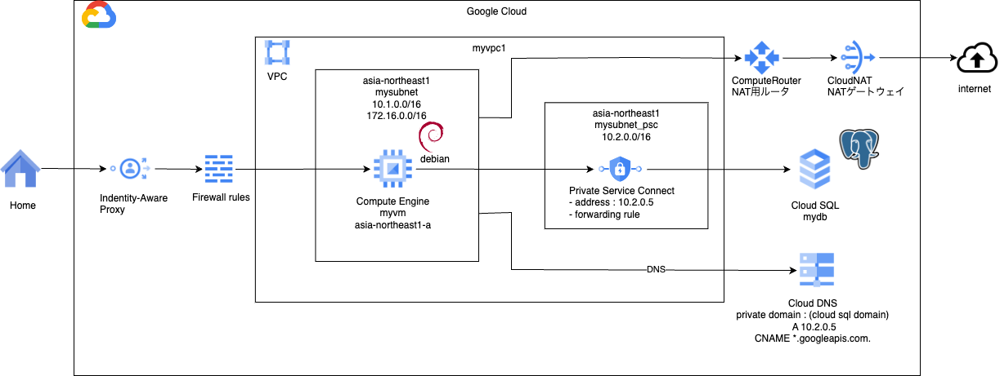

# network basis 7

### 1. 前提条件
27_network_basis6が完了していること。

### 2. 今回の構成図
今回は、プライベートサービスコネクトを利用して、CloudSQLへプライベート接続するための方法を学びます。<br>
https://cloud.google.com/sql/docs/mysql/about-private-service-connect?hl=ja<br>
プライベートサービスアクセスとは異なり、接続したいVPCに対してプライベートIPアドレスを払い出す方式です。<br>
実装してみると、こちらのお手軽感がありますが、散らばる感もあります。インフラの規模や運用要件によって使い分けるべきかと思います。<br>
<br>

### 3. 今回のコード
まずnetworkモジュールを整備します。PSC用のアドレスを持つサブネットの作成と、VMのいるサブネットからのみNATするように設定を追加、変更します。<br>
練習のため追加したvaribales.tfの取り扱いについては言及しないので、動作するように対応してみてください。<br>
```
[modules/network/main.tfに下記の内容を追加する]
# PSC用のサブネットを作成する
resource "google_compute_subnetwork" "mysubnet_psc" {
  name          = "mysubnetpsc"
  ip_cidr_range = var.ip_cidr_range_psc
  region        = var.region
  network       = google_compute_network.myvpc.id
  
  depends_on = [ google_compute_network.myvpc ]

  lifecycle {
    ignore_changes = [ secondary_ip_range ]
  }

}

[modules/network/main.tfに下記の内容を修正する]
resource "google_compute_router_nat" "mynat" {
  name                               = "mynat"
  router                             = google_compute_router.myrouter.name
  region                             = google_compute_router.myrouter.region
  nat_ip_allocate_option             = "AUTO_ONLY"
#####
  source_subnetwork_ip_ranges_to_nat = "LIST_OF_SUBNETWORKS"
  subnetwork {
    name                    = google_compute_subnetwork.mysubnet.id
    source_ip_ranges_to_nat = ["ALL_IP_RANGES"]
  }
#####
  log_config {
    enable = true
    filter = "ERRORS_ONLY"
  }

  depends_on = [ google_compute_router.myrouter ]

}
```
sqlモジュールの方は下記のような内容にします。SQLの作成、PSCの作成（アドレス、ルール）、DNSの作成（ゾーン、Aレコード、CNAMEレコード）を行なっています。
```
[modules/sql/main.tf]
# 参考：https://cloud.google.com/sql/docs/mysql/configure-private-ip?hl=ja

# Cloud SQLの設定を行う
resource "google_sql_database_instance" "instance" {
  name             = "mydb"
  region           = var.region
  database_version = "POSTGRES_15"
  settings {
    tier              = "db-f1-micro"
    availability_type = "REGIONAL"
    # backup_configuration {
    #   enabled            = true
    #   binary_log_enabled = true
    # }
    ip_configuration {
      psc_config {
        psc_enabled               = true
        allowed_consumer_projects = [var.project_id]
      }
      ipv4_enabled = false
    }
  }
  deletion_protection = false # Set to "true" to prevent destruction of the resource
}

# Cloud SQLのサービスアタッチメントを作成する
resource "google_compute_address" "address" {
  name         = "psc-compute-address-${google_sql_database_instance.instance.name}"
  region       = var.region
  address_type = "INTERNAL"
  subnetwork   = var.subnet_name         # Replace value with the name of the subnet here.
  address      = var.psc_ip_address # Replace value with the IP address to reserve.
}

resource "google_compute_forwarding_rule" "forwarding_rule" {
  name                  = "psc-forwarding-rule-${google_sql_database_instance.instance.name}"
  region                = var.region
  network               = var.vpc_id
  subnetwork            = var.subnet_name
  ip_address            = google_compute_address.address.self_link
  load_balancing_scheme = ""
  target                = google_sql_database_instance.instance.psc_service_attachment_link
}

#### DNSの設定を行う
resource "google_dns_managed_zone" "private_zone" {
  name        = "private-zone"
  dns_name    = google_sql_database_instance.instance.dns_name
  description = "My private DNS zone for googleapis"

  visibility = "private"

  private_visibility_config {
    networks {
      network_url = var.vpc_id
    }
  }
}

resource "google_dns_record_set" "a_record" {
  managed_zone = google_dns_managed_zone.private_zone.name
  name         = google_dns_managed_zone.private_zone.dns_name
  type         = "A"
  rrdatas      = [var.psc_ip_address]
  ttl          = 86400
}

resource "google_dns_record_set" "cname_record" {
  managed_zone = google_dns_managed_zone.private_zone.name
  name         = format("*.%s",google_dns_managed_zone.private_zone.dns_name)
  type         = "CNAME"
  rrdatas      = [google_dns_managed_zone.private_zone.dns_name]
  ttl          = 86400
}
```
エラーなく実行できることを確認します。

### 4. 実行後の確認
実行後は下記の確認を行なってください。<br>
ここからは練習のため画面キャプチャを載せません。筆者の手元で確認した内容を言葉にして書きますので、各自やってみてください。<br>
・Cloud SQLインスタンスが正常に起動していること（緑チェックであることを確認する）<br>
・前回の手順を参考にDBのrootユーザのパスワードを初期化する。<br>
・ネットワークサービス＞Private Service Connectへ進み、今回作成したエンドポイントが承認済みになっていることを確認する。<br>
(ここで接続できるかどうかが決まります。)<br>
・ネットワークサービス＞Cloud DNSへ進み、ゾーンの中のドメイン名をコピーしておく。<br>

### 5. DB接続確認
VMにログインして、psqlを利用して接続確認を行います。<br>
```
    $  sudo apt update
    $  sudo apt install postgresql
    $  psql --version
    $  psql -h <上記で確認したCloudSQLのプラベートDNS名> -p 5432 -U postgres
ここで先ほど設定したパスワードを聞かれますので、入力します。
その後、postgresのプロンプトに切り替われば接続完了です。
```

### destroy時にエラーが発生したら

### 6. 次回予告
次回からはGoogle Cloudの特徴でもあるロードバランサ、そして、デモなど作る上ではまず出てくるCloud Armorについて実装していきます。<br>
（NWの基本用語などは一切説明省きますのでw、不明点などはAIなどに聞きながら進めてください。）
