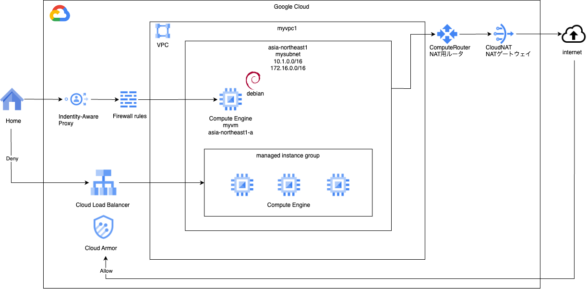

# lb basis 1

### 1. 前提条件
28_network_basis7が完了していること。

### 2. 今回の構成図
今回から、ロードバランサ編になります。初回は、バックエンドになるマネージドインスタンスグループ（MIG）を作成します。<br>
バックエンドはGKEでもCloudRunでもGCSでも良いですが、基本形ということで初回はMIGとしています。<br>
<br>

### 3. 今回のコード
MIG用のモジュールを作成します。<br>
MIGで作成するインスタンスには、疎通確認するときのために、metadata.startup-scriptのところで、起動時にnginxをインストールして起動するコマンドを書いています。<br>
```
[modules/mig/main.tfに下記の内容を追加する]
# VM用のサービスアカウントを作成する
resource "google_service_account" "mymigvmsa" {
  account_id   = "mymigvmsa"
  display_name = "Custom SA for MIG VM Instance"
}

# 作成したサービスアカウントにIAMロールを付与する。
# 必要になったら追加する（基礎編ではおそらく不要）

resource "google_compute_instance_template" "mytemplate" {
  name = "mytemplate"
  disk {
    auto_delete  = true
    boot         = true
    device_name  = "persistent-disk-0"
    mode         = "READ_WRITE"
    source_image = var.boot_disk_image
    type         = "PERSISTENT"
  }
  labels = {
    managed-by-cnrm = "true"
  }
  machine_type = "e2-medium"
  metadata = {
    startup-script = "#! /bin/bash\n     sudo apt update\n     sudo apt install -y nginx \n     sudo /etc/init.d/nginx start\n"
  }
  network_interface {
    access_config {
      network_tier = "PREMIUM"
    }
    subnetwork = var.mysubnet_self_link
  }
  region = var.region
  scheduling {
    automatic_restart   = true
    on_host_maintenance = "MIGRATE"
    provisioning_model  = "STANDARD"
  }
  service_account {
    # Google recommends custom service accounts that have cloud-platform scope and permissions granted via IAM Roles.
    email  = google_service_account.mymigvmsa.email
    scopes = ["https://www.googleapis.com/auth/cloud-platform"]
  }
  tags = ["allow-health-check"]
}

resource "google_compute_instance_group_manager" "mymig" {

  name               = "mymig"
  base_instance_name = "mymiginstance"
  target_size        = 2
  zone               = "asia-northeast1-a"

  version {
    instance_template = google_compute_instance_template.mytemplate.id
    name              = "primary"
  }
}
```
ネットワークのモジュールも再掲しておきます。VMからMIGへの疎通確認をするためのFirewallルールを追加しています。<br>
```
[modules/network/main.tf]
resource "google_compute_network" "myvpc" {
  name                    = "myvpc"
  auto_create_subnetworks = false
}

resource "google_compute_subnetwork" "mysubnet" {
  name          = "mysubnet"
  ip_cidr_range = var.ip_cidr_range
  region        = var.region
  network       = google_compute_network.myvpc.id
  
  private_ip_google_access = true

  secondary_ip_range {
    range_name    = var.range_name
    ip_cidr_range = var.ip_cidr_range_secondary
  }

  depends_on = [ google_compute_network.myvpc ]

  lifecycle {
    ignore_changes = [ secondary_ip_range ]
  }

}

# IAP用のファイアウォールルールを作成する
# ソースIPアドレスは、GoogleのIAPのIPアドレス範囲を指定する。
# ターゲットは、VMに付与するタグを指定する。
resource "google_compute_firewall" "myvmfirewall" {
  name    = "myvmfirewall"
  network = google_compute_network.myvpc.self_link

  allow {
    protocol = "tcp"
    ports    = ["22"]

  }
  # source ranges for Identity-Aware Proxy
  source_ranges = ["35.235.240.0/20"]
  target_tags = [var.vm_tags]

  depends_on = [ google_compute_network.myvpc ]
}

# VMからMIG疎通用のファイアウォールルールを作成する
# ソースタグは、var.vm_tags
# ターゲットタグは、MIGのインスタンスにつけるallow-health-checkとする。
resource "google_compute_firewall" "mymigvmfirewall" {
  name    = "mymigvmfirewall"
  network = google_compute_network.myvpc.self_link

  allow {
    protocol = "tcp"
    ports    = ["80"]

  }

  source_tags = [var.vm_tags]
  target_tags = ["allow-health-check"]

  depends_on = [ google_compute_network.myvpc ]
}


resource "google_compute_router" "myrouter" {
  name    = "myrouter"
  region  = var.region
  network = google_compute_network.myvpc.id

  bgp {
    asn = 64516
  }

  depends_on = [ google_compute_network.myvpc ]

}

resource "google_compute_router_nat" "mynat" {
  name                               = "mynat"
  router                             = google_compute_router.myrouter.name
  region                             = google_compute_router.myrouter.region
  nat_ip_allocate_option             = "AUTO_ONLY"
  source_subnetwork_ip_ranges_to_nat = "LIST_OF_SUBNETWORKS"
  subnetwork {
    name                    = google_compute_subnetwork.mysubnet.id
    source_ip_ranges_to_nat = ["ALL_IP_RANGES"]
  }

  log_config {
    enable = true
    filter = "ERRORS_ONLY"
  }

  depends_on = [ google_compute_router.myrouter ]

}

```
エラーなく実行できることを確認します。

### 4. 実行後の確認
実行後は下記の確認を行なってください。<br>
ここからは練習のため画面キャプチャを載せません。筆者の手元で確認した内容を言葉にして書きますので、各自やってみてください。<br>
・Compute Engine > インスタンステンプレートに進み、今回作成したテンプレートができていること。<br>
・Compute Engine > インスタンス グループに進み、今回作成したMIGができていること、緑色OKになっていること。<br>
・作成したmigを押した先に進み、下段にVMインスタンスが2つできていること、ステータス緑であること。<br>

### 5. 動作確認
VM（myvm）にログインして、curlでMIGのインスタンスにリクエストして、nginxのトップページが応答されることを確認します。<br>
プライベートIPアドレスは、GCEの画面から確認してください。<br>
（普通にやると、myvmが末尾2、migのインスタンスが末尾3,4のIPアドレスになるかと思います）<br>
下記のようにnginxのデフォルトページが応答されればOKです。
```
$ curl 10.1.0.3
<!DOCTYPE html>
<html>
<head>
<title>Welcome to nginx!</title>
<style>
html { color-scheme: light dark; }
body { width: 35em; margin: 0 auto;
font-family: Tahoma, Verdana, Arial, sans-serif; }
</style>
</head>
<body>
<h1>Welcome to nginx!</h1>
<p>If you see this page, the nginx web server is successfully installed and
working. Further configuration is required.</p>

<p>For online documentation and support please refer to
<a href="http://nginx.org/">nginx.org</a>.<br/>
Commercial support is available at
<a href="http://nginx.com/">nginx.com</a>.</p>

<p><em>Thank you for using nginx.</em></p>
</body>
</html>
```

### 6. 次回予告
次回は、今回作ったMIGにLBを設定していきます。