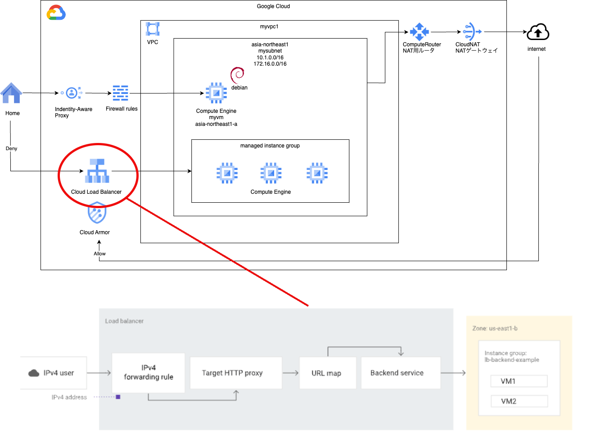

# lb basis 2

### 1. 前提条件
29_lb_basis2が完了していること。

### 2. 今回の構成図
LBは非常に多くのバリエーションがありますが、今回は「外部グローバルHTTPプロキシLB」を作ります。<br>
何か画面を作ってインターネットに公開するときは、このパターンに近いかと思います。（場合によっては、グローバルがリージョン、HTTPがHTTPSになるのかもしれません。）<br>
ただし、LBといっても単一のリソースではなく、下記図の通り、複数のリソースの集合体になります。今回はこれらを作成していきます。<br>
（AWSやAzureでもリソースの単位が違うかもしれませんが、設定する内容は似ています。分量的には同じだけ設定が必要です）<br>
この絵に描かれているものの他では、ヘルスチェック（バックエンドが正常に稼働しているかのチェックを行うリソース）が主なリソースになります。<br>
<br>

### 3. 今回のコード
まずMIG用のモジュールにnamed_portを追加します。<br>
```
[modules/mig/main.tfに下記の内容を追加する]
resource "google_compute_instance_group_manager" "mymig" {

  name               = "mymig"
  base_instance_name = "mymiginstance"
  target_size        = 2
  zone               = "asia-northeast1-a"

  ############# add ################
  named_port {
    name = "http"
    port = 80
  }
  ############# add ################

  version {
    instance_template = google_compute_instance_template.mytemplate.id
    name              = "primary"
  }
}
```
LB用のモジュールを作成します。<br>
```
[modules/lb/main.tf]
# これは Google Cloud ヘルスチェック システム（130.211.0.0/22 と 35.191.0.0/16）からのトラフィックを許可する上り（内向き）ルールです。
# この例では、ターゲットタグ allow-health-check を使用して VM が識別されます。
resource "google_compute_firewall" "myhealthcheckrule" {
  name          = "fw-allow-health-check"
  direction     = "INGRESS"
  network       = var.vpc_self_link
  priority      = 1000
  source_ranges = ["130.211.0.0/22", "35.191.0.0/16"]
  target_tags   = ["allow-health-check"]
  allow {
    ports    = ["80"]
    protocol = "tcp"
  }
}

# ロードバランサにユーザーが接続する際に使用するグローバル静的外部 IP アドレスを設定します。
resource "google_compute_global_address" "myaddress" {
  name       = "lb-ipv4-1"
  ip_version = "IPV4"
}

# ヘルスチェックを設定します。
resource "google_compute_health_check" "myhealthcheck" {
  name               = "http-basic-check"
  check_interval_sec = 5
  healthy_threshold  = 2
  http_health_check {
    port               = 80
    port_specification = "USE_FIXED_PORT"
    proxy_header       = "NONE"
    request_path       = "/"
  }
  timeout_sec         = 5
  unhealthy_threshold = 2
}

# バックエンド サービスを作成するには、google_compute_backend_service リソースを使用します。
# この例では、高度なトラフィック管理能力を使用してグローバル外部アプリケーション ロードバランサを設定する 
# load_balancing_scheme="EXTERNAL_MANAGED" を使用します。
resource "google_compute_backend_service" "mybackend" {
  name                            = "web-backend-service"
  connection_draining_timeout_sec = 0
  health_checks                   = [google_compute_health_check.myhealthcheck.id]
  load_balancing_scheme           = "EXTERNAL_MANAGED"
  port_name                       = "http"
  protocol                        = "HTTP"
  session_affinity                = "NONE"
  timeout_sec                     = 30
  backend {
    group           = var.mymig
    balancing_mode  = "UTILIZATION"
    capacity_scaler = 1.0
  }
}

# URL マップを作成するには、google_compute_url_map リソースを使用します。
resource "google_compute_url_map" "myurlmap" {
  name            = "web-map-http"
  default_service = google_compute_backend_service.mybackend.id
}

# ターゲット HTTP プロキシを作成するには、google_compute_target_http_proxy リソースを使用します。
resource "google_compute_target_http_proxy" "mytargethttpproxy" {
  name    = "http-lb-proxy"
  url_map = google_compute_url_map.myurlmap.id
}

# 転送ルールを作成するには、google_compute_global_forwarding_rule リソースを使用します。
# この例では、高度なトラフィック管理能力を使用してグローバル外部アプリケーション ロードバランサを設定する load_balancing_scheme="EXTERNAL_MANAGED" を使用します。
resource "google_compute_global_forwarding_rule" "default" {
  name                  = "http-content-rule"
  ip_protocol           = "TCP"
  load_balancing_scheme = "EXTERNAL_MANAGED"
  port_range            = "80-80"
  target                = google_compute_target_http_proxy.mytargethttpproxy.id
  ip_address            = google_compute_global_address.myaddress.id
}
```
エラーなく実行できることを確認します。

### 4. 実行後の確認
実行後は下記の確認を行なってください。<br>
ここからは練習のため画面キャプチャを載せません。筆者の手元で確認した内容を言葉にして書きますので、各自やってみてください。<br>
・ネットワークサービス＞ロードバランシングにて、上段のタブを移動して、ロードバランサ、バックエンド、フロントエンドができていることを確認する。<br>
・ネットワークサービス＞ロードバランシングにて、ロードバランサのバックエンドが緑マークになっていることを確認する。<br>
(念の為)・Compute Engine > インスタンス グループに進み、今回作成したMIGができていること、緑色OKになっていること。<br>

### 5. 動作確認
VM（myvm）にログインして、curlでLBのエンドポイントにリクエストを送ります。nginxのトップページが応答されることを確認します。<br>
LBは外部にサービスを公開することを想定しているため、今回は、VMからNAT経由でインターネットを介してグローバルIPアドレスでLBに接続します。<br>
LBのグローバルIPは、ネットワークサービス＞ロードバランシングでロードバランサのタブからリソースを選択すると、次の画面に表示されています。<br>
グローバルIPなので、10.0.0.0/8、172.16.0.0/12、192.168.0.0/16以外の範囲で割り当てられているはずです。<br>
```
$ curl 34.49.168.137/
<!DOCTYPE html>
<html>
<head>
<title>Welcome to nginx!</title>
<style>
html { color-scheme: light dark; }
body { width: 35em; margin: 0 auto;
font-family: Tahoma, Verdana, Arial, sans-serif; }
</style>
</head>
<body>
<h1>Welcome to nginx!</h1>
<p>If you see this page, the nginx web server is successfully installed and
working. Further configuration is required.</p>

<p>For online documentation and support please refer to
<a href="http://nginx.org/">nginx.org</a>.<br/>
Commercial support is available at
<a href="http://nginx.com/">nginx.com</a>.</p>

<p><em>Thank you for using nginx.</em></p>
</body>
</html>
```
お疲れ様でした。

### 6. 次回予告
LBとVMの構成を作ることができました。サーバレスやコンテナなど、特に方式にこだわりなければ、これで世に公開するWebサービスは、ほぼ何でも作ることができます。<br>
ただし、このままではノーガードで脆弱なので、次回は、Cloud Armorを使ってエンドポイントを保護していきます。