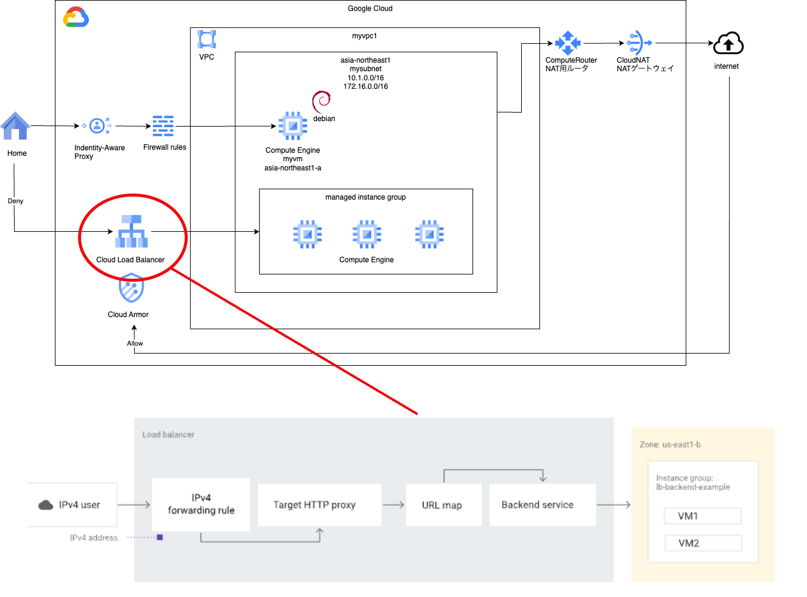

# lb basis 3

### 1. 前提条件
30_lb_basis2が完了していること。

### 2. 今回の構成図
今回は構成図でCloud Load Balancerの下に書いてあるCloud Armorのポリシーを作成していきます。<br>
目的は、前回の演習でフルオープンになっているLBの入り口を保護することになります。<br>
踏み台VMからNATGWを経由した場合にのみ接続ができるように設定していきます。<br>
<br>

### 3. 今回のコード
まず、NATの設定を変更します。固定IPを取得してNATのIPアドレスに割り当てます。<br>
また、Cloud Armorのポリシー作成時に読み込むことができるように、アウトプットしておきます。<br>
```
[modules/network/main.tfに下記の内容を追加する]
### 固定IPの取得
resource "google_compute_address" "mynatip" {
  name         = "mynatip"
  address_type = "EXTERNAL"
  region       = var.region
}

resource "google_compute_router_nat" "mynat" {
  name                               = "mynat"
  router                             = google_compute_router.myrouter.name
  region                             = google_compute_router.myrouter.region

  ### allocate optionをMANUAL_ONLYに修正、nat_ipsに上記の固定IPを指定する
  nat_ip_allocate_option = "MANUAL_ONLY"
  nat_ips                = [google_compute_address.mynatip.self_link]
  ###
  
  source_subnetwork_ip_ranges_to_nat = "LIST_OF_SUBNETWORKS"
  subnetwork {
    name                    = google_compute_subnetwork.mysubnet.id
    source_ip_ranges_to_nat = ["ALL_IP_RANGES"]
  }

  log_config {
    enable = true
    filter = "ERRORS_ONLY"
  }

  depends_on = [ google_compute_router.myrouter ]

}

[modules/network/output.tfに下記の内容を追加する]
output "mynatip_address" {
    value = google_compute_address.mynatip.address
    description = "value of mynatip name"
}
```
次に、LB用のモジュールに、Cloud Armorのポリシーを追加していきます。<br>
ポリシー定義の作成と作成したポリシーをバックエンドサービスに紐付けることをします。<br>
```
[modules/lb/main.tf]
# ポリシー定義の作成
# Cloud Armor Rule
resource "google_compute_security_policy" "mypolicy" {
  name = "my-security-policy"
  project = var.project_id
  # OWASP TOP10 Risk ※割り当てが５つまでなので分割しています。
  rule {
    action      = "deny(403)"
    description = "OWASP TOP10 Risk (1)"
    preview     = false
    priority    = 1000

    match {
      expr {
        expression = <<-EOT
                        evaluatePreconfiguredExpr("sqli-v33-stable")
                        || evaluatePreconfiguredExpr("xss-v33-stable")
                        || evaluatePreconfiguredExpr("lfi-v33-stable")
                        || evaluatePreconfiguredExpr("rfi-v33-stable")
                        || evaluatePreconfiguredExpr("rce-v33-stable")
        EOT
      }
    }
  }

  rule {
    action      = "deny(403)"
    description = "OWASP TOP10 Risk (2)"
    preview     = false
    priority    = 1100

    match {
      expr {
        expression = <<-EOT
                        evaluatePreconfiguredExpr("methodenforcement-v33-stable")
                        || evaluatePreconfiguredExpr("scannerdetection-v33-stable")
                        || evaluatePreconfiguredExpr("protocolattack-v33-stable")
                        || evaluatePreconfiguredExpr("php-v33-stable")
                        || evaluatePreconfiguredExpr("sessionfixation-v33-stable")
        EOT
      }
    }
  }

  # Allow Cloud NAT
  rule {
    action      = "allow"
    description = "allow cloud nat rule"
    preview     = false
    priority    = 2000

    match {
      versioned_expr = "SRC_IPS_V1"
      config {
        src_ip_ranges = [var.mynatip_address]
      }
    }
  }

  # Default
  rule {
    action      = "deny(403)"
    description = "default rule"
    preview     = false
    priority    = 2147483647

    match {
      versioned_expr = "SRC_IPS_V1"
      config {
        src_ip_ranges = ["*"]
      }
    }
  }
}

[modules/lb/main.tf]
# 作成したポリシーをバックエンドサービスに紐付ける

resource "google_compute_backend_service" "mybackend" {
  name                            = "web-backend-service"
  connection_draining_timeout_sec = 0
  health_checks                   = [google_compute_health_check.myhealthcheck.id]
  load_balancing_scheme           = "EXTERNAL_MANAGED"
  port_name                       = "http"
  protocol                        = "HTTP"
  session_affinity                = "NONE"
  timeout_sec                     = 30

  ##### 追加：ポリシーとバックエンドサービスを紐付ける #####
  security_policy = google_compute_security_policy.mypolicy.id

  backend {
    group           = var.mymig
    balancing_mode  = "UTILIZATION"
    capacity_scaler = 1.0
  }

  ##### 追加 ：　先にポリシーができていないと困るため　#####
  depends_on = [ google_compute_security_policy.mypolicy ]

}
```
主要な変更点は上記の通りになりますので、行間は埋めて実行してみてください。エラーなく実行できることを確認してください。

### 4. 実行後の確認
実行後は下記の確認を行なってください。<br>
・ネットワークセキュリティ＞Cloud Armorポリシーにて、今回作成したバックエンドセキュリティポリシーが作成されていること。<br>
・作成されたポリシーを選択して、作成した4個のルールが設定されていること。<br>
・許可ルールのIPアドレスの値と、VPCネットワーク＞IPアドレスに表示されているNATのIPアドレス（mynatip）のアドレス値が一致していること。<br>

### 5. 動作確認
VM（myvm）にログインして、curlでLBのエンドポイントにリクエストを送ります。nginxのトップページが応答されることを確認します。<br>
また、家など踏み台VM以外からインターネット経由でアクセスした場合には、403 Forbiddenが応答されることを確認します。<br>

### 6. 次回予告
簡単なルールのみではありますが、Cloud Armorを使ってエンドポイントを保護することができました。<br>
次回は別の保護の形として、IAPを設定して接続時に認証が必要なようにしてみます。<br>