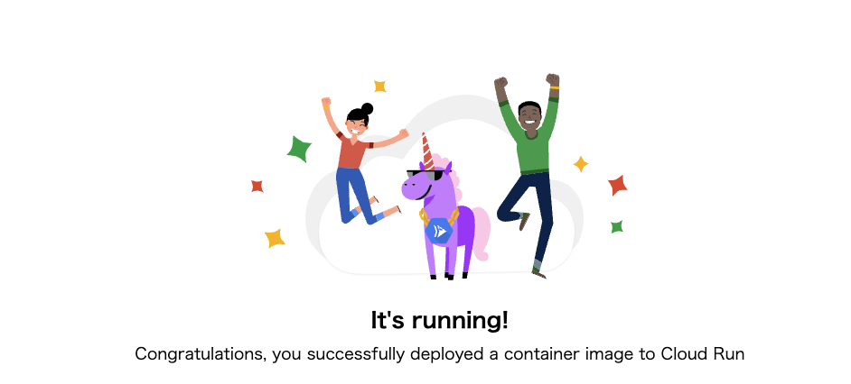

# serverless basis 1

### 1. 前提条件
31_lb_basis3が完了していること。

### 2. 今回の構成図
Cloud Runを起動します。（構成図はありません）

### 3. 今回のコード
簡単なコードですが、形だけモジュール化しておきます。
```
resource "google_cloud_run_v2_service" "default" {
  name     = "cloudrun-service"
  location = "asia-northeast1"
  ingress = "INGRESS_TRAFFIC_ALL"

  template {
    containers {
      image = "us-docker.pkg.dev/cloudrun/container/hello"
      resources {
        limits = {
          cpu    = "2"
          memory = "1024Mi"
        }
      }
    }
  }
}

resource "google_cloud_run_service_iam_binding" "default" {
  location = google_cloud_run_v2_service.default.location
  service  = google_cloud_run_v2_service.default.name
  role     = "roles/run.invoker"
  members = [
    "allUsers"
  ]
}
```
主要な変更点は上記の通りになりますので、行間は埋めて実行してみてください。エラーなく実行できることを確認してください。

### 4. 実行後の確認
実行後は下記の確認を行なってください。<br>
・Cloud Runにサービスが1つ作成されていること。<br>

### 5. 動作確認
Cloud Runのサービスを選択すると、URLが表示されているのでアクセスしてみてください。<br>
下記のようなページが表示されればOKです。<br>
<br>

### 6. 次回予告
次回はCloud Functionsを動かしてみましょう。