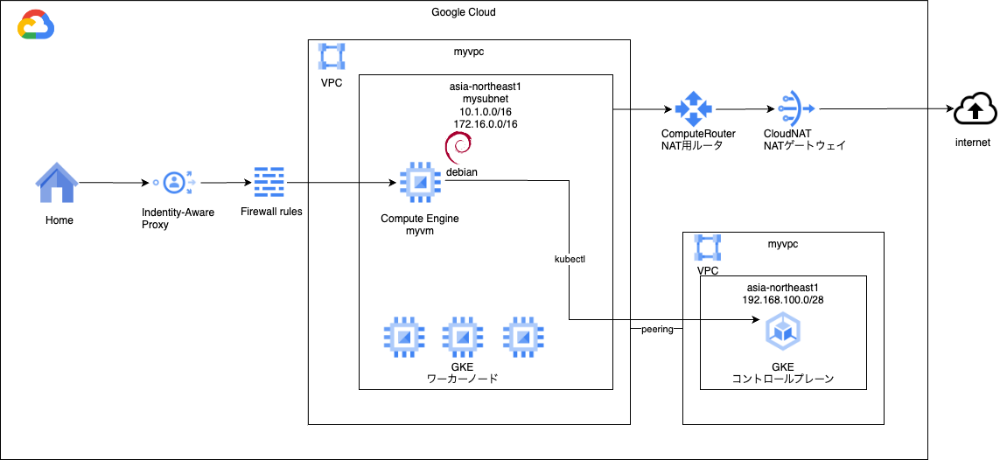

# gke private

### 1. 前提条件
33_serverless_basis2が完了していること。

### 2. 今回の構成図
GKEのプライベートクラスタを作成します。<br>
<br>

### 3. 今回のコード
gkeモジュールを下記のように作成します。<br>
コード中にヒントだけ書いておきますので、varibales.tfなどは各自で作成してみください。<br>
```
[modules/gke/main.tf]
# Service account for GKE Cluster node
resource "google_service_account" "mysagke" {
  account_id   = "mysagke" 
  display_name = "GKE service account"
}

# add roles
#     "roles/secretmanager.viewer",
#     "roles/logging.logWriter",
#     "roles/monitoring.metricWriter",
#     "roles/monitoring.viewer",
#     "roles/stackdriver.resourceMetadata.writer",
#     "roles/artifactregistry.reader",
#     "roles/storage.objectViewer",
#     "roles/iam.serviceAccountTokenCreator"
resource "google_project_iam_member" "mysagkeroles" {
  count   = "${length(var.mysagkeroles)}"
  project = var.project_id
  role    = "${element(var.mysagkeroles, count.index)}"
  member  = "serviceAccount:${google_service_account.mysagke.email}"
  depends_on = [google_service_account.mysagke]
}

# GKE cluster(Standard)
resource "google_container_cluster" "mygke-cluster" {
  name     = "mygkecluster"
  location = var.region

  remove_default_node_pool = true
  initial_node_count       = 1

  network    = var.myvpc_self_link
  subnetwork = var.mysubnet_self_link

  release_channel {
    channel = "STABLE"
  }

  private_cluster_config {
    enable_private_nodes = true
    enable_private_endpoint = true
    # master_ipv4_cidr_block = "192.168.100.0/28"
    master_ipv4_cidr_block = var.master_ipv4_cidr_block
  
    master_global_access_config {
      enabled = false
    }
  }

  master_authorized_networks_config {
    cidr_blocks {
      # network moduleからoutputしてサブネットのCIDRを設定してください。
      cidr_block = var.mysubnet_cidr
    } 
  }

  deletion_protection = false

  workload_identity_config {
    workload_pool = "${var.project_id}.svc.id.goog"
  }

  addons_config {
    config_connector_config {
      enabled = false
    }
  }

}

# GKE nodepool
resource "google_container_node_pool" "mygke-node-pool" {
  name       = "mygkenodepool"
  location   = var.region
  cluster    = google_container_cluster.mygke-cluster.name
  node_count = 1

  autoscaling {
    min_node_count = 1
    max_node_count = 1
  }

  upgrade_settings {
    max_surge       = 1
    max_unavailable = 0
  }

  management {
    auto_repair  = true
    auto_upgrade = true
  }

  node_config {
    # machine_type = "e2-medium"
    machine_type = var.machine_type
    service_account = google_service_account.mysagke.email
    oauth_scopes    = [
      "https://www.googleapis.com/auth/cloud-platform"
    ]
  }
  depends_on = [google_container_cluster.mygke-cluster]
}
```
また、networkとinstanceのモジュールも載せておきます。<br>
networkのモジュールは以下のように想定しています。<br>
```
[modules/network/main.tf]
resource "google_compute_network" "myvpc" {
  name                    = "myvpc"
  auto_create_subnetworks = false
}

resource "google_compute_subnetwork" "mysubnet" {
  name          = "mysubnet"
  ip_cidr_range = var.ip_cidr_range
  region        = var.region
  network       = google_compute_network.myvpc.id
  
  private_ip_google_access = true

  secondary_ip_range {
    range_name    = var.range_name
    ip_cidr_range = var.ip_cidr_range_secondary
  }

  depends_on = [ google_compute_network.myvpc ]

  lifecycle {
    ignore_changes = [ secondary_ip_range ]
  }

}

# IAP用のファイアウォールルールを作成する
# ソースIPアドレスは、GoogleのIAPのIPアドレス範囲を指定する。
# ターゲットは、VMに付与するタグを指定する。
resource "google_compute_firewall" "myvmfirewall" {
  name    = "myvmfirewall"
  network = google_compute_network.myvpc.self_link

  allow {
    protocol = "tcp"
    ports    = ["22"]

  }
  # source ranges for Identity-Aware Proxy
  source_ranges = ["35.235.240.0/20"]
  target_tags = [var.vm_tags]

  depends_on = [ google_compute_network.myvpc ]
}

# VMからMIG疎通用のファイアウォールルールを作成する
# ソースタグは、var.vm_tags
# ターゲットタグは、MIGのインスタンスにつけるallow-health-checkとする。
resource "google_compute_firewall" "mymigvmfirewall" {
  name    = "mymigvmfirewall"
  network = google_compute_network.myvpc.self_link

  allow {
    protocol = "tcp"
    ports    = ["80"]

  }

  source_tags = [var.vm_tags]
  target_tags = ["allow-health-check"]

  depends_on = [ google_compute_network.myvpc ]
}

resource "google_compute_router" "myrouter" {
  name    = "myrouter"
  region  = var.region
  network = google_compute_network.myvpc.id

  bgp {
    asn = 64516
  }

  depends_on = [ google_compute_network.myvpc ]

}

# 32 add
resource "google_compute_address" "mynatip" {
  name         = "mynatip"
  address_type = "EXTERNAL"
  region       = var.region
}

resource "google_compute_router_nat" "mynat" {
  name                               = "mynat"
  router                             = google_compute_router.myrouter.name
  region                             = google_compute_router.myrouter.region

# 32 mod
#  nat_ip_allocate_option             = "AUTO_ONLY"
  nat_ip_allocate_option = "MANUAL_ONLY"
  nat_ips                = [google_compute_address.mynatip.self_link]

  source_subnetwork_ip_ranges_to_nat = "LIST_OF_SUBNETWORKS"
  subnetwork {
    name                    = google_compute_subnetwork.mysubnet.id
    source_ip_ranges_to_nat = ["ALL_IP_RANGES"]
  }

  log_config {
    enable = true
    filter = "ERRORS_ONLY"
  }

  depends_on = [ google_compute_router.myrouter ]

}
```
instanceモジュールは下記のように想定しています。<br>
```
[modules/instance/main.tf]
# VM用のサービスアカウントを作成する
resource "google_service_account" "myvmsa" {
  account_id   = "myvmsa"
  display_name = "Custom SA for VM Instance"
}

# 作成したサービスアカウントにIAMロールを付与する。
#     "roles/container.admin",
#      "roles/storage.admin",
resource "google_project_iam_member" "myvmsa_roles" {
  count   = "${length(var.myvmsa_roles)}"
  project = var.project_id
  role    = "${element(var.myvmsa_roles, count.index)}"
  member  = "serviceAccount:${google_service_account.myvmsa.email}"
  depends_on = [google_service_account.myvmsa]
}

# VM本体を作成する
resource "google_compute_instance" "myvm" {
  name         = "myvm"
  machine_type = var.machine_type
  zone         = var.zone
  tags         = [var.vm_tags]

  boot_disk {
    mode = "READ_WRITE"
    initialize_params {
      image = var.boot_disk_image
      size  = var.boot_disk_size
      type  = var.boot_disk_type
    }
  }

  network_interface {
    subnetwork = var.mysubnet_self_link
  }

  service_account {
    # Google recommends custom service accounts that have cloud-platform scope and permissions granted via IAM Roles.
    email  = google_service_account.myvmsa.email
    scopes = ["https://www.googleapis.com/auth/cloud-platform"]
  }

  lifecycle {
    ignore_changes = [
      metadata
    ]
  }

}
```
行間は埋めて実行してみてください。エラーなく実行できることを確認してください。

### 4. 実行後の確認
実行後は下記の確認を行なってください。<br>
・Kubernetes Engineの画面からクラスタが作成できていること。<br>
・詳細タブで、外部エンドポイントが無効、内部エンドポイントが192.168.100.X（第4オクテットは変動するかも、通常は2）となっていること。<br>
・ノードタブでノードプール１台、ノードが３台できていること。ステータスが正常であること。（ノードプールがOK、ノードがReady）<br>

### 5. 動作確認
動作確認は、06_gkeと同じ手順になります。<br>
完了後は、myvmにIAPで接続します。<br>
その後、下記の手順に沿って、kubectlをインストールします。<br>
https://cloud.google.com/kubernetes-engine/docs/how-to/cluster-access-for-kubectl?hl=ja#apt<br>
下記のコマンドでクラスタの認証をします。<br>
```
myvm:~$ gcloud container clusters get-credentials mygkecluster \
    --region=asia-northeast1
```
その後、kubectlコマンドで今回作ったクラスタの情報を参照してみます。<br>
```
myvm:~$ kubectl get nodes
NAME                                           STATUS   ROLES    AGE   VERSION
gke-mygkecluster-mygkenodepool-63c2c88e-wk4z   Ready    <none>   27m   v1.27.11-gke.1062001
gke-mygkecluster-mygkenodepool-b64973d4-z83h   Ready    <none>   27m   v1.27.11-gke.1062001
gke-mygkecluster-mygkenodepool-c866f6e1-5rfg   Ready    <none>   27m   v1.27.11-gke.1062001

myvm:~$ kubectl get pods
No resources found in default namespace.
```
エラーなく上記が確認できればOKです。

### 6. 次回予告
次回は権限制御のため、Workload Identityの設定を行います。<br>
Podに割り当てるKubernetes Service AccountとGoogle CloudのIAMを連動させる機能です。<br>
各社Kubernetesサービスでもお馴染みの機能ですので、実装していきます。<br>

