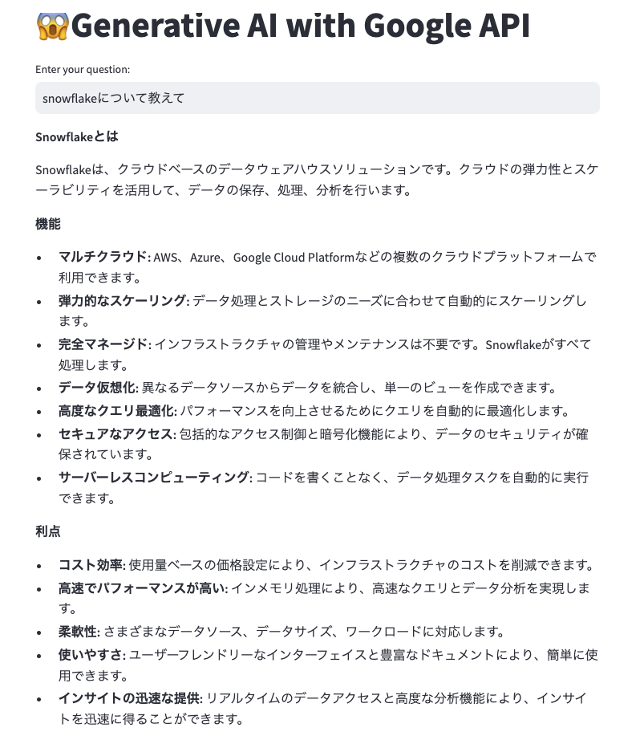

# myapp

### 1. 前提条件
35_workload_identityが完了していること。

### 2. 今回の構成図
今回はローカルでアプリケーションを開発します。<br>
こちらを参考に、StreamlitでGeminiAPIに問い合わせするアプリにしています。<br>
参考：https://note.com/masayuki_abe/n/n98a97decf441<br>
見た目はこんな感じです。Streamlitなのでお好みで改変いただければと思います。<br>
<br>

### 3. アプリケーションの開発
まずDocker環境の準備をまだであれば、お願いします。<br>
また、下記のリンクからGemini APIのAPIキーの取得をお願いします。<br>
APIキー作成ボタンを押して道なりに進むだけなので迷わないかと思います。プロジェクトはGoogle Cloudのプロジェクトを利用しています。<br>
https://aistudio.google.com/app/apikey<br>
発行されたAPIキーは控えておきます。<br>
<br>
Dockerfileを作成します。
```
FROM python:3.9-slim

WORKDIR /app

RUN apt-get update && apt-get install -y \
    build-essential \
    curl \
    software-properties-common \
    git \
    && rm -rf /var/lib/apt/lists/*

COPY requirements.txt .
COPY streamlit_app.py .

RUN pip3 install -r requirements.txt

EXPOSE 8501

HEALTHCHECK CMD curl --fail http://localhost:8501/_stcore/health

ENTRYPOINT ["streamlit", "run", "streamlit_app.py", "--server.port=8501", "--server.address=0.0.0.0"]
```
requirements.txtを作成します。
```
altair
pandas
streamlit
google.generativeai
```
streamlit_app.pyを作成します。YOUR_API_KEYを先に取得したAPIキーで置き換えます。<br>
<span style="color: red;">ただし、このAPIキーは、不特定多数の人が見れるgitなどに絶対にアップロードしないでください。</span> <br>
GKEにデプロイするときは、環境変数としてk8sのsecretなどに格納する予定です。<br>
```
import streamlit as st
import google.generativeai as genai

# APIキーの設定
genai.configure(api_key="[YOUR_API_KEY]")

# Streamlitのインターフェース設定
st.title('😱Generative AI with Google API')
user_input = st.text_input("Enter your question:")

if user_input:
    # モデルの設定
    model = genai.GenerativeModel('gemini-pro')

    # ユーザーの入力をモデルに渡す
    response = model.generate_content(user_input)

    # 結果を表示
    st.write(response.text)
```
Dockerfile, requirements.txt, streamlit_app.pyを同じ階層に配置してビルドしてください。<br>
（練習のため具体的な手順、コマンドは省きます）

### 4. 動作確認
ビルドしたコンテナを実行して、http://localhost:8501/ にアクセスします。<br>
先頭にあるような画面が表示され、Geminiに問い合わせができて回答が表示されていればOKです。<br>
動作確認後はAPIキーを削除しておいてください。面倒ですが、安全のためこの演習では毎回ぽちぽち作成する運用にします。<br>

### 5. 次回予告
前回作成したGKEクラスタにデプロイして動作確認をします。<br>
