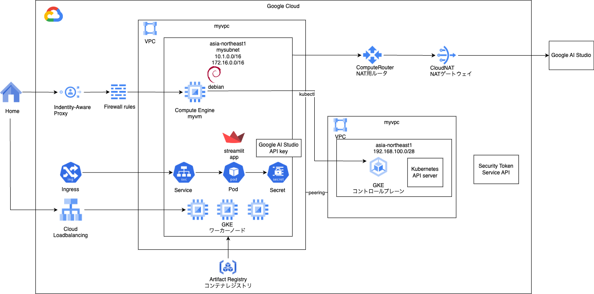

# gke private myapp

### 1. 前提条件
36_myappが完了していること。

### 2. 今回の構成図
今回は前回ローカルで実行したアプリケーションをGKE上で稼働させます。<br>
APIキーをsecretに登録してアプリケーション内に埋め込まないようにします。<br>
実務上は、このsecretと各クラウドのSecretManagerを同期をとる仕組みを入れることになると思います。<br>
アプリケーションから見るとkubernetes secretとやりとりする事には変わりないので、簡単のため今回は同期をとる部分は省きます。<br>
<br>

### 3. 今回のコード
GKEモジュールを下記のように作成します。変更点は# 37 add のようなコメントを入れてあります。<br>
練習のため枝葉の補足は各自でお願いします。<br>
```
[modules/gke/main.tf]
# Service account for GKE Cluster node
resource "google_service_account" "mysagke" {
  account_id   = "mysagke" 
  display_name = "GKE service account"
}

# add roles
### hint: role ###
    "roles/secretmanager.viewer",
    "roles/logging.logWriter",
    "roles/monitoring.metricWriter",
    "roles/monitoring.viewer",
    "roles/stackdriver.resourceMetadata.writer",
    "roles/artifactregistry.reader",
    "roles/storage.objectViewer",
    "roles/iam.serviceAccountTokenCreator"
### hint: role ###
resource "google_project_iam_member" "mysagkeroles" {
  count   = "${length(var.mysagkeroles)}"
  project = var.project_id
  role    = "${element(var.mysagkeroles, count.index)}"
  member  = "serviceAccount:${google_service_account.mysagke.email}"
  depends_on = [google_service_account.mysagke]
}

# GKE cluster(Standard)
resource "google_container_cluster" "mygke-cluster" {

  name     = "mygkecluster"
  location = var.region

  remove_default_node_pool = true
  initial_node_count       = 1

  network    = var.myvpc_self_link
  subnetwork = var.mysubnet_self_link

  # 37 mod
  # versionを1.29以上にしたいので、release_channelをREGULARに変更しておく
  # channel = "STABLE" -> "REGULAR"
  release_channel {
    channel = "REGULAR"
  }

  private_cluster_config {
    enable_private_nodes = true
    enable_private_endpoint = true
    master_ipv4_cidr_block = var.master_ipv4_cidr_block
  
    master_global_access_config {
      enabled = false
    }
  }

  master_authorized_networks_config {
    cidr_blocks {
      cidr_block = var.mysubnet_cidr
    } 
  }

  deletion_protection = false

  workload_identity_config {
    workload_pool = "${var.project_id}.svc.id.goog"
  }

  addons_config {
    config_connector_config {
      enabled = false
    }
  }

}

# GKE nodepool
resource "google_container_node_pool" "mygke-node-pool" {
  name       = "mygkenodepool"
  location   = var.region
  cluster    = google_container_cluster.mygke-cluster.name
  node_count = 1

  autoscaling {
    min_node_count = 1
    max_node_count = 1
  }

  upgrade_settings {
    max_surge       = 1
    max_unavailable = 0
  }

  management {
    auto_repair  = true
    auto_upgrade = true
  }

  node_config {
    machine_type = var.machine_type
    service_account = google_service_account.mysagke.email
    oauth_scopes    = [
      "https://www.googleapis.com/auth/cloud-platform"
    ]
  }
  depends_on = [google_container_cluster.mygke-cluster]
}

# 37 add
# create artifact registry repository
resource "google_artifact_registry_repository" "myreg" {
  location      = var.region
  repository_id = "myreg"
  description   = "my docker repository"
  format        = "DOCKER"
}

```
エラーなく実行できることを確認します。

### 4. Terraform実行後の作業

#### 4-1. アプリケーションの修正、ビルド、レジストリ登録
streamlit_app.pyでAPIキーを指定している箇所を、環境変数GENAI_API_KEYを参照する形に修正します。<br>
```
import os

# APIキーの設定
genai.configure(api_key=os.environ['GENAI_API_KEY'])
```
前回のアプリケーションをローカルでビルドして、今回作成したアーティファクトレジストリに登録します。<br>
[YOUR_PROJECT_ID]の箇所は、自身のプロジェクトIDで書き換えをお願いします。<br>
（platformオプションはM* macの場合は指定するようにしてください。デプロイ後にexec format errorが出た場合はプラットフォーム違いが原因になります。）
```
$ docker build --platform linux/amd64 . -t asia-northeast1-docker.pkg.dev/[YOUR_PROJECT_ID]/myreg/demoapp:v001
$ docker push asia-northeast1-docker.pkg.dev/[YOUR_PROJECT_ID]/myreg/demoapp:v001
```

#### 4-2. kubernetesの名前空間とサービスアカウントを作成します。
以下のようなYAMLを作成して、踏み台VMから実行します。今後CICDを合流させたら自動で流れるようになります。<br>
踏み台の初回設定は下記を参考にしてください。<br>
https://cloud.google.com/kubernetes-engine/docs/how-to/cluster-access-for-kubectl?hl=ja#apt<br>
名前空間を作成するために、myns.yamlというファイルを作成してapplyします。<br>
```
kind: Namespace
apiVersion: v1
metadata:
  name: myns
```
k8sサービスアカウントを作成するために、myksa.yamlというファイルを作成してapplyします。<br>
```
apiVersion: v1
kind: ServiceAccount
metadata:
  name: myksa
  namespace: myns
```
#### 4-3. secretを作成してAPIキーを登録します。
mysecret.yamlというファイルを作成します。APIキーについては、base64にして登録をお願いします。下記のコマンドで取得できます。<br>
```
echo -n '[YOUR_API_KEY]' | base64
```
ファイルの内容はこちら。<br>
```
apiVersion: v1
kind: Secret
metadata:
  name: mysecret
  namespace: myns
data:
  genai_api_key: [(base64)YOUR_API_KEY]
```

#### 4-4. deploymentを作成します。
下記のようにmydeployment.yamlを作成してapplyします。<br>
```
apiVersion: apps/v1
kind: Deployment
metadata:
  name: demoapp
  namespace: myns
  labels:
    app: demoapp
spec:
  replicas: 1
  selector:
    matchLabels:
      app: demoapp
  template:
    metadata:
      labels:
        app: demoapp
    spec:
      serviceAccountName: myksa
      containers:
      - name: demoapp
        image: asia-northeast1-docker.pkg.dev/[YOUR_PROJECT_ID]/myreg/demoapp:v001
        imagePullPolicy: Always
        ports:
        - containerPort: 8501
        resources:
          requests:
            cpu: 200m
          limits:
            cpu: 200m
        env:
        - name: GENAI_API_KEY
          valueFrom:
            secretKeyRef:
              name: mysecret
              key: genai_api_key
```
Podが立ち上がることを確認します。（練習のため手順は省きます。）<br>

#### 4-5. serviceとingressを作成します。
myservice.yamlというファイルを作成して、serviceを作成します。<br>
```
apiVersion: v1
kind: Service
metadata:
  name: myservice
  namespace: myns
spec:
  type: NodePort
  selector:
    app: demoapp
  ports:
  - protocol: TCP
    port: 8501
    targetPort: 8501
```
myingress.yamlというファイルを作成して、ingressを作成します。<br>
```
apiVersion: networking.k8s.io/v1
kind: Ingress
metadata:
  name: myingress
  namespace: myns
spec:
  rules:
  - http:
      paths:
      - path: /
        pathType: Prefix
        backend:
          service:
            name: myservice
            port:
              number: 8501
```
applyしたらCloudLBが立ち上がりますので、数分待ちます。<br>
下記のコマンドを実行しながら待っていると約3分ほどでIPアドレスが表示されます。<br>
```
myvm:~$ kubectl get ingress -n myns
NAME        CLASS    HOSTS   ADDRESS          PORTS   AGE
myingress   <none>   *       34.110.204.247   80      14m
```
GKEの画面やロードバランサの画面も確認して、緑色マークで正常にIngress、ロードバランサが立ち上がっていればOKです。<br>

### 4. 動作確認
上記のアドレスに接続します。Ingressはまだドメイン取得、HTTPS化していないので、今回は下記のようにブラウザから接続します。<br>
http://34.110.204.247/<br>
で接続します。<br>
アプリの画面が表示され、生成AIへの問い合わせができればOKです。<br>

### 5. 次回予告
今回は確認のため、Ingressを簡単に作っているので、次回Ingress周りを整備していきます。<br>
次々会はCICDを合流させて、基礎編は完了の予定です。<br>
