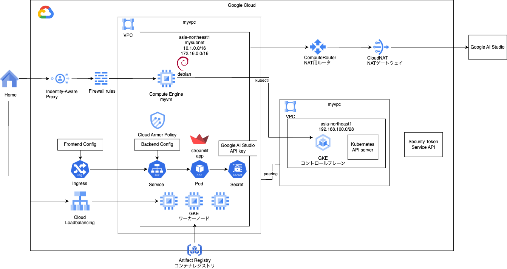

# gke private ingress

### 1. 前提条件
37_gke_private_myappが完了していること。

### 2. 今回の構成図
前回は動作確認のため立ち上げただけのIngressに必要な設定を入れ込んでいきます。<br>
<br>

### 3. 設定内容の検討
公式の下記のページを参考に設定していきます。<br>
https://cloud.google.com/kubernetes-engine/docs/how-to/ingress-configuration?hl=ja<br>
以下、個々の項目について実施要否を検討して、最後に実施内容をまとめます。

#### 3-1. FrontendConfig パラメータによる Ingress 機能の構成
SSLポリシーとHTTPからHTTPSへのリダイレクトが記載されていますが、ドメインをとってHTTPSの証明書を取得して、という流れになります。<br>
実務では確実に実施する事になりますが、有料であったり、個人情報を開示しないといけなかったり、と個人でやるには難易度が高いので実施しません。<br>
また、調べるとフリードメインや証明書の情報も出てきますが、見送ることにします。<br>
数分程度の動作確認のみですので、HTTPで受けて、発信元のIPアドレスを自宅のIPアドレス等に制御する形にします。<br>

#### 3-2. BackendConfig パラメータによる Ingress 機能の構成
- バックエンド サービスのタイムアウト<br>
バックエンドが何秒応答しなかったらタイムアウトさせるか、という値で、デフォルトは30秒です。<br>
生成AIはレスポンスに時間がかかることもあるので、60秒に少し拡張しておきます。<br>
```
apiVersion: cloud.google.com/v1
kind: BackendConfig
metadata:
  name: my-backendconfig
spec:
  timeoutSec: 60
```
- Cloud CDN <br>
こちらは、コンテンツキャッシュが必要なほどリッチなUIではないので、見送ります。<br>

- コネクション ドレインのタイムアウト<br>
コネクション ドレインのタイムアウトは、接続がドレインするまで待機する時間（秒）です。<br>
指定されたタイムアウト期間の間、除外されたバックエンドに対する既存のリクエストに、完了するまでの時間が与えられます。<br>
ロードバランサは、削除されたバックエンドに新しいリクエストを送信しません。<br>
タイムアウト時間に達すると、バックエンドに対する残りの接続がすべて閉じます。<br>
タイムアウト時間は 0～3,600 秒に設定できます。デフォルト値は 0 で、この場合、コネクション ドレインも無効になります。<br>
とのことなので、タイムアウトと同じ60秒の猶予を設定しようと思います。<br>
```
apiVersion: cloud.google.com/v1
kind: BackendConfig
metadata:
  name: my-backendconfig
spec:
  connectionDraining:
    drainingTimeoutSec: 60
```

- カスタム ヘルスチェックの構成<br>
実務上はカスタムのヘルスチェック用のエンドポイントを設けて、それを設定すると思います。<br>
今回は、ルートしかパスがない簡易アプリのため、設定を見送ります。<br>

- Google Cloud Armor の Ingress セキュリティ ポリシー<br>
以前の演習で作成したポリシーと同様のポリシーを作成して適用します。<br>
許可する発信元のIPアドレスは、自宅など普段アクセスするIPアドレスにします。実装は後ほど。<br>

```
apiVersion: cloud.google.com/v1
kind: BackendConfig
metadata:
  namespace: cloud-armor-how-to
  name: my-backendconfig
spec:
  securityPolicy:
    name: "example-security-policy"
```

 - HTTP アクセス ロギング<br>
Ingress は、クライアントからのすべての HTTP リクエストを Cloud Logging に記録できます。<br>
アクセス ロギングを有効または無効にするには、BackendConfig とアクセス ロギングのサンプリング レートの設定を使用します。<br>
とのことで、有効にして、サンプリングレート1.0にします。<br>

```
apiVersion: cloud.google.com/v1
kind: BackendConfig
metadata:
  name: my-backendconfig
spec:
  logging:
    enable: true
    sampleRate: 0.5
```

- Identity-Aware Proxy<br>
設定したかったのですが、ドメインの取得を見送っているため、こちらも設定を見送ります。<br>

- セッション アフィニティ<br>
- ユーザー定義のリクエスト ヘッダー<br>
- カスタム レスポンス ヘッダー<br>
以上の3つは設定を見送ります。

### 4. 今回のコード
31_lb_basis3で作成したCloud Armorのポリシーをベースに、許可するIPアドレスを自宅などのIPアドレスにします。<br>
発信元のグローバルIPアドレスは、発信元から下記のcurlなどを実行することで確認できます。<br>
```
$ curl inet-ip.info
```
policyというモジュールを作成します。YOUR_IP_ADDRの箇所を書き換えていただければと思います。<br>
31_lb_basis3からの差分としては、1つ目のルールが入っているとうまく稼働しなかったため、コメントアウトしています。<br>
```
[modules/policy/main.tf]
# 31 add
# Cloud Armor Rule
resource "google_compute_security_policy" "mypolicy" {
  name = "my-security-policy"
  project = var.project_id
  # OWASP TOP10 Risk ※割り当てが５つまでなので分割しています。
#  rule {
#    action      = "deny(403)"
#    description = "OWASP TOP10 Risk (1)"
#    preview     = false
#    priority    = 1000

#    match {
#      expr {
#        expression = <<-EOT
#                        evaluatePreconfiguredExpr("sqli-v33-stable")
#                        || evaluatePreconfiguredExpr("xss-v33-stable")
#                        || evaluatePreconfiguredExpr("lfi-v33-stable")
#                        || evaluatePreconfiguredExpr("rfi-v33-stable")
#                        || evaluatePreconfiguredExpr("rce-v33-stable")
#        EOT
#      }
#    }
#  }

  rule {
    action      = "deny(403)"
    description = "OWASP TOP10 Risk (2)"
    preview     = false
    priority    = 1100

    match {
      expr {
        expression = <<-EOT
                        evaluatePreconfiguredExpr("methodenforcement-v33-stable")
                        || evaluatePreconfiguredExpr("scannerdetection-v33-stable")
                        || evaluatePreconfiguredExpr("protocolattack-v33-stable")
                        || evaluatePreconfiguredExpr("php-v33-stable")
                        || evaluatePreconfiguredExpr("sessionfixation-v33-stable")
        EOT
      }
    }
  }

  # Allow Cloud NAT
  rule {
    action      = "allow"
    description = "allow cloud nat rule"
    preview     = false
    priority    = 2000

    match {
      versioned_expr = "SRC_IPS_V1"
      config {
        src_ip_ranges = ["YOUR_IP_ADDR"]
      }
    }
  }

  # Default
  rule {
    action      = "deny(403)"
    description = "default rule"
    preview     = false
    priority    = 2147483647

    match {
      versioned_expr = "SRC_IPS_V1"
      config {
        src_ip_ranges = ["*"]
      }
    }
  }
}
```
次にバックエンドコンフィグを作成します。<br>
踏み台で下記のようなYAMLファイルを作成してapplyします。<br>
```
[mybackendconfig.yaml]
apiVersion: cloud.google.com/v1
kind: BackendConfig
metadata:
  name: my-backendconfig
spec:
  timeoutSec: 60
  connectionDraining:
    drainingTimeoutSec: 60
  securityPolicy:
    name: "my-security-policy"
  logging:
    enable: true
    sampleRate: 1.0
```
バックエンドコンフィグとサービスを関連づけるために、myservice.yamlを下記のように修正します。<br>
アノテーションの指定を追加しています。<br>
```
apiVersion: v1
kind: Service
metadata:
  name: myservice
  namespace: myns
  annotations:
    cloud.google.com/backend-config: '{"default": "my-backendconfig"}'
spec:
  type: NodePort
  selector:
    app: demoapp
  ports:
  - protocol: TCP
    port: 8051
    targetPort: 8051
```

### 5. 動作確認
前回と同じくIngressのエンドポイントにHTTPでブラウザから接続します。アプリが動作すればOKです。<br>
また、IP制限が効いていることを確認するために、curlで良いので踏み台からも接続してアクセスできないことを確認してください。403エラーになればOKです。<br>

また、この挙動が偶然ではなく、本当に今回設定したルールによって許可、拒否ができているかを確認することができます。<br>
Kubernetes Engine ＞ ネットワーキング ＞ Gateway, Service, Ingress へと進み、<br>
INGRESSタブ＞Ingressの詳細＞ログのタブ＞ACCESS LOGSへ進むと、アクセスログを確認することができます。<br>
アクセスが成功している行、失敗している行のエントリを見ると、下記のように見えてればOKです。<br>
許可の場合<br>
```
jsonPayload: {
・・・
enforcedSecurityPolicy: {
configuredAction: "ALLOW"
name: "my-security-policy"
outcome: "ACCEPT"
priority: 2000
}
remoteIp: "XXXXXXXXXX"
```
拒否の場合<br>
```
jsonPayload: {
・・・
enforcedSecurityPolicy: {
configuredAction: "DENY"
name: "my-security-policy"
outcome: "DENY"
priority: 2147483647
}
remoteIp: "XXXXXXXXX"
```

### 6. 次回予告
次回は、この仕組みをCICDに乗せて、コードをプッシュすればデプロイされるようにカスタムしていきます。