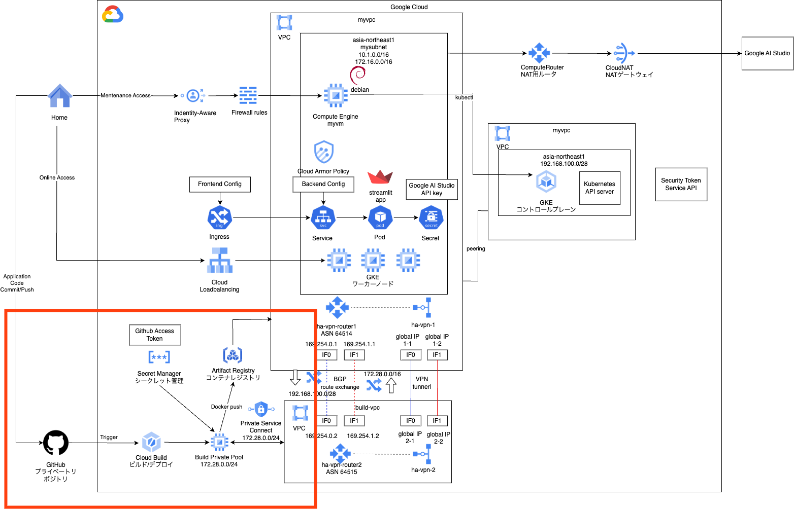

# gke private cicd 1

### 1. 前提条件
38_gke_private_ingressが完了していること。

### 2. 今回の構成図
元々CICDは1回で完結しようと思っていましたが、やってみると少し長くなりそうだったので、2回に分けます。<br>
1回目は、プライベートGithubリポジトリとCloud Buildを合流させることをやります。<br>
プライベートGithubリポジトリにソースコードをpushすると、Cloud Buildのトリガーが発火して、ビルドが実行されるところまでになります。<br>
<br>

### 3. 事前準備
CICDリソースを作成する前の準備について記載します。<br>

#### 3-1. プライベートGitリポジトリの作成
こちらは手動でGithubのサイトから実施してください。<br>
<span style="color: red;">必ずPrivateにしてください。（鍵マークが表示されます）</span> <br>

#### 3-2. Google Cloud Build アプリのインストール
下記のURLからインストールすることができます。<br>
基本的には一本道なので手順は割愛しますが、途中でリポジトリ選択する場面だけ上記で作成したリポジトリを選択するようにしてください。<br>
https://github.com/apps/google-cloud-build<br>
なお、インストール後は、リポジトリのSettings > Integrations > GitHub Appsからインストールしたアプリを確認できますので、一度Configureを開いて、URL末尾の数字（インストールID）を控えておきます。<br>

#### 3-3. Personal access tokens の発行
Cloud Buildと接続するときに使用するPATを作成します。<br>
Githubのサイトから、右上のプロフィール画像＞Settings＞Developer Settings、と進み、Personal access tokens (classic)を選択します。<br>
権限は、repo全部、read:org、read:userとします。<br>

### 4. 今回のコード
今回のメインのコードはCICDモジュールになります。<br>
1枚のmain.tfですが、Githubへ接続するためのコードが前半、プライベートGKEと接続するためのプライベートなワーカープールの作成が後半となっています。<br>
例によって変数定義などの枝葉は、ご自身で作成してみてください。<br>
まずプライベートワーカープールを配置するためのネットワークをネットワークモジュールに追加しています。<br>
```
[modules/network/main.tf]
# add 39
resource "google_compute_network" "mycicdvpc" {
  name                    = "mycicdvpc"
  auto_create_subnetworks = false
}
```
次にメインとなるCICDモジュールです。<br>
```
[modules/cicd/main.tf]
# create artifact registry
resource "google_artifact_registry_repository" "myreg" {
  location      = var.region
  repository_id = "myreg"
  description   = "my docker repository"
  format        = "DOCKER"
}

# Create a secret containing the personal access token and grant permissions to the Service Agent
resource "google_secret_manager_secret" "github_token_secret" {
    project =  var.project_id
    secret_id = "mygitpat"

    replication {
      auto {}
    }
}

resource "google_secret_manager_secret_version" "github_token_secret_version" {
    secret = google_secret_manager_secret.github_token_secret.id
    secret_data = var.github_pat
}

# Grant the Cloud Build service agent access to the secret
data "google_iam_policy" "serviceagent_secretAccessor" {
    binding {
      role = "roles/secretmanager.secretAccessor"
      members = [format("serviceAccount:service-%s@gcp-sa-cloudbuild.iam.gserviceaccount.com", var.project_number)]
    }
}

resource "google_secret_manager_secret_iam_policy" "policy" {
  project = google_secret_manager_secret.github_token_secret.project
  secret_id = google_secret_manager_secret.github_token_secret.secret_id
  policy_data = data.google_iam_policy.serviceagent_secretAccessor.policy_data
}

# Service account for cloudbuild
resource "google_service_account" "mycicdsa" {
  account_id   = "mycicdsa"
  display_name = "CloudBuild service account"
}

# add roles
#    "roles/cloudbuild.builds.builder",
#    "roles/container.developer",
#    "roles/secretmanager.secretAccessor",
resource "google_project_iam_member" "mycicdsauser" {
  count   = "${length(var.mycicdsaroles)}"
  project = var.project_id
  role    = "${element(var.mycicdsaroles, count.index)}"
  member  = "serviceAccount:${google_service_account.mycicdsa.email}"
  depends_on = [google_service_account.mycicdsa]
}

# service networking
resource "google_project_service" "servicenetworking" {
  service = "servicenetworking.googleapis.com"
  disable_on_destroy = false
}

# global address
resource "google_compute_global_address" "worker_range" {
  name          = "deploy-worker-pool-range"
  purpose       = "VPC_PEERING"
  address_type  = "INTERNAL"
  # "172.28.0.0"
  address       = var.worker_pool_network_address
  # "24"
  prefix_length = var.worker_pool_network_prefix_length
  # mycicdvpc
  network       = var.worker_pool_network_id
}

# service networking connection
resource "google_service_networking_connection" "worker_pool_conn" {
  # mycicdvpcのID
  network                 = var.worker_pool_network_id
  service                 = "servicenetworking.googleapis.com"
  reserved_peering_ranges = [google_compute_global_address.worker_range.name]
  depends_on              = [google_project_service.servicenetworking]
}

# network peering routes config
resource "google_compute_network_peering_routes_config" "service_networking_peering_config" {
  project = var.project_id
  peering = google_service_networking_connection.worker_pool_conn.peering
  # mycicdvpcのname
  network = var.worker_pool_network_name

  export_custom_routes = true
  import_custom_routes = true

  depends_on = [
    google_service_networking_connection.worker_pool_conn
  ]
}

# create bucket for cloudbuild
resource "google_storage_bucket" "cloudbuild_log_bucket" {
  # YOUR_BUCKET_NAMEには一意な名称、ログ用のバケットです。
  name          = "YOUR_BUCKET_NAME"
  location      = var.region
  force_destroy = true

  public_access_prevention = "enforced"
}

# Create the GitHub connection
resource "google_cloudbuildv2_connection" "myconnection" {
    project = var.project_id
    location = "asia-northeast1"
    name = "myconnection"

    github_config {
      # Github AppのインストールID（ページURLの末尾の数字）
        app_installation_id = var.github_app_installation_id
        authorizer_credential {
            oauth_token_secret_version = google_secret_manager_secret_version.github_token_secret_version.id
        }
    }
    depends_on = [google_secret_manager_secret_iam_policy.policy]
}


# create github repository
resource "google_cloudbuildv2_repository" "myrepository" {
  name             = "myrepository"
  parent_connection = google_cloudbuildv2_connection.myconnection.id
# https://github.com/(アカウントオーナー名)/(リポジトリ名).git"
  remote_uri       = var.remote_uri
}

# create cloudbuild trigger
resource "google_cloudbuild_trigger" "mytrigger" {
  name        = "mytrigger"
  location    = "asia-northeast1"
  description = "Trigger for GitHub repository"

  github {
    # githubのアカウントオーナー名
    owner = var.mygithubowner
    # githubのリポジトリ名
    name  = var.mygithubname
    push {
      branch = "^main$"
    }
  }
  service_account = google_service_account.mycicdsa.id
  filename = "cloudbuild.yaml"
}

# create cloudbuild worker pool
resource "google_cloudbuild_worker_pool" "mycicdpool" {
  name = "mycicdpool"
  location = "asia-northeast1"
  worker_config {
    disk_size_gb = 100
    machine_type = "e2-medium"
    no_external_ip = false
  }
  network_config {
    # mycicdvpcのID
    peered_network = var.worker_pool_network_id
    # "172.28.0.0/24"
    peered_network_ip_range = var.worker_pool_network_ip_range
  }
  depends_on = [google_service_networking_connection.worker_pool_conn]
}
```

### 5. 動作確認
 Githubのプライベートリポジトリに、ソースコードをアップロードして、ビルドが動くことを確認してみてください。<br>
 ビルドに使用するDockerfileは、36_myappのものやご自身で調達いただいたもので良いかと思いますので、任せます。<br>
 参考に、cloudbuild.yamlだけ提示しておきます。<br>
 YOUR_PROJECT_ID、YOUR_GCS_BUCKET_NAMEは書き換えて利用してください。<br>
 ```
[cloudbuild.yaml]
steps:

  # Docker Build
  - name: 'gcr.io/cloud-builders/docker'
    args: ['build', '-t',
           'asia-northeast1-docker.pkg.dev/YOUR_PROJECT_ID/myreg/demoapp:$SHORT_SHA',
           '.']

  # Docker Push
  - name: 'gcr.io/cloud-builders/docker'
    args: ['push',
           'asia-northeast1-docker.pkg.dev/YOUR_PROJECT_ID/myreg/demoapp:$SHORT_SHA']

logsBucket: 'gs://YOUR_BUCKET_NAME'

options:
  logging: GCS_ONLY
  automapSubstitutions: true
  pool:
    name: 'projects/YOUR_PROJECT_ID/locations/asia-northeast1/workerPools/mycicdpool'
 ```
プライベートリポジトリにpushして、トリガーが発火すること、ビルドが無事に完了すること、ビルドされたコンテナがレジストリにプッシュされていることを確認してください<br>
Cloud Buildの画面、Artifact Registryの画面などから各自でお願いします。

### 6. 次回予告
次回は、このパイプラインを利用して、プライベートなGKEクラスタにデプロイします。<br>
以前出てきたHA-VPNを作成して、Cloud BuildのワーカプールとGKEのコントロールプレーンを通信させるのがポイントになるかと思います。<br>