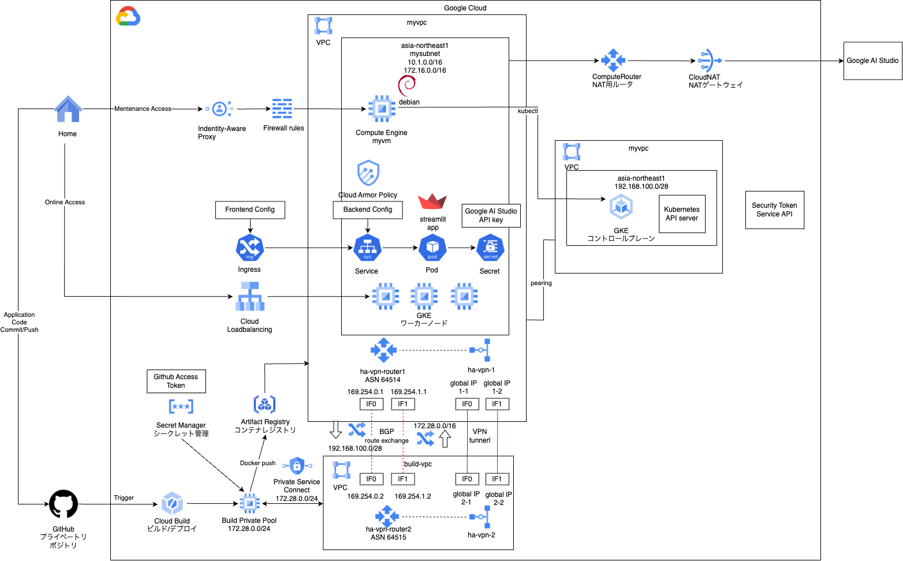

# gke private cicd 2

### 1. 前提条件
39_gke_private_cicd_1が完了していること。

### 2. 今回の構成図
前回の続きで、GKEにデプロイするところまで実施します。<br>
HA-VPNを作成して、Cloud BuildのワーカプールとGKEのコントロールプレーンを通信させてkubectlが通るようにしていきます。<br>
実践編１に向けては、最後の基礎編になるので、若干オールスターな感じです。<br>
<br>

### 3. 今回のコード
今回は、前回のGithub設定が完了していることが前提になります。<br>

#### 3-1. Terraformコード
HA-VPNモジュールを作成します。前回出てきた時からほとんど変更はありませんが、再掲します。<br>
なお、vpc1はGKEのVPC、vpc2はCloud BuildのVPCを想定しています。<br>
通信を成立させるために、それぞれのVPCにアドバタイズされるのは何のアドレスか、考えたり試行錯誤して進めてみてください。<br>
```
[modules/ha-vpn/main.tf]
# VPNゲートウェイを作成します。
# HA VPN Gateway 1
resource "google_compute_ha_vpn_gateway" "ha_gateway1" {
  name    = "ha-vpn-1"
  region  = var.region
  network = var.vpc1_network_id
}
# HA VPN Gateway 2
resource "google_compute_ha_vpn_gateway" "ha_gateway2" {
  name    = "ha-vpn-2"
  region  = var.region
  network = var.vpc2_network_id
}

# ルーターを作成します。
# Router 1
resource "google_compute_router" "router1" {
  name    = "ha-vpn-router1"
  region  = var.region
  network = var.vpc1_network_name
  bgp {
    asn = 64514
    advertise_mode    = "CUSTOM"
    advertised_ip_ranges {
      range = var.vpc1_network_cidr
    }
  }
}
# Router 2
resource "google_compute_router" "router2" {
  name    = "ha-vpn-router2"
  region  = var.region
  network = var.vpc2_network_name
  bgp {
    asn = 64515
    advertise_mode    = "CUSTOM"
    advertised_ip_ranges {
      range = var.vpc2_network_cidr
    }
  }
}

# VPNトンネルを作成します。
# HAなので、2つのインターフェースに、それぞれ双方向のトンネルを作成します。（なので合計4つ作る）
# VPN Tunnel 12 interface 0
resource "google_compute_vpn_tunnel" "tunnel_120" {
  name                  = "ha-vpn-tunnel-120"
  region                = var.region
  vpn_gateway           = google_compute_ha_vpn_gateway.ha_gateway1.id
  peer_gcp_gateway      = google_compute_ha_vpn_gateway.ha_gateway2.id
  shared_secret         = "a secret message"
  router                = google_compute_router.router1.id
  vpn_gateway_interface = 0
}

# VPN Tunnel 12 interface 1
resource "google_compute_vpn_tunnel" "tunnel_121" {
  name                  = "ha-vpn-tunnel-121"
  region                = var.region
  vpn_gateway           = google_compute_ha_vpn_gateway.ha_gateway1.id
  peer_gcp_gateway      = google_compute_ha_vpn_gateway.ha_gateway2.id
  shared_secret         = "a secret message"
  router                = google_compute_router.router1.id
  vpn_gateway_interface = 1
}

# VPN Tunnel 21 interface 0
resource "google_compute_vpn_tunnel" "tunnel_210" {
  name                  = "ha-vpn-tunnel-210"
  region                = var.region
  vpn_gateway           = google_compute_ha_vpn_gateway.ha_gateway2.id
  peer_gcp_gateway      = google_compute_ha_vpn_gateway.ha_gateway1.id
  shared_secret         = "a secret message"
  router                = google_compute_router.router2.id
  vpn_gateway_interface = 0
}

# VPN Tunnel 21 interface 1
resource "google_compute_vpn_tunnel" "tunnel_211" {
  name                  = "ha-vpn-tunnel-211"
  region                = var.region
  vpn_gateway           = google_compute_ha_vpn_gateway.ha_gateway2.id
  peer_gcp_gateway      = google_compute_ha_vpn_gateway.ha_gateway1.id
  shared_secret         = "a secret message"
  router                = google_compute_router.router2.id
  vpn_gateway_interface = 1
}

# ここからはルータの設定を行います。ルータも自分と対抗の2つがあり、それぞれのインターフェースが2つあります。
#（なので4つ設定を定義します）
# また、それぞれInterface（接続する端子）の設定とPeer（BGP接続するための情報）の設定を行います。

# Router 1 : VPC1側のルータの設定
# Router 1 Interface 1
resource "google_compute_router_interface" "router1_interface1" {
  name       = "router1-interface1"
  router     = google_compute_router.router1.name
  region     = var.region
  ip_range   = "169.254.0.1/30"
  vpn_tunnel = google_compute_vpn_tunnel.tunnel_120.name
}

# Router 1 Peer 1
resource "google_compute_router_peer" "router1_peer1" {
  name                      = "router1-peer1"
  router                    = google_compute_router.router1.name
  region                    = var.region
  peer_ip_address           = "169.254.0.2"
  peer_asn                  = 64515
  advertised_route_priority = 100
  interface                 = google_compute_router_interface.router1_interface1.name
}

# Router 1 Interface 2
resource "google_compute_router_interface" "router1_interface2" {
  name       = "router1-interface2"
  router     = google_compute_router.router1.name
  region     = var.region
  ip_range   = "169.254.1.2/30"
  vpn_tunnel = google_compute_vpn_tunnel.tunnel_121.name
}

# Router 1 Peer 2
resource "google_compute_router_peer" "router1_peer2" {
  name                      = "router1-peer2"
  router                    = google_compute_router.router1.name
  region                    = var.region
  peer_ip_address           = "169.254.1.1"
  peer_asn                  = 64515
  advertised_route_priority = 100
  interface                 = google_compute_router_interface.router1_interface2.name
}

# Router 2 : VPC2側のルータの設定
# Router 2 Interface 1
resource "google_compute_router_interface" "router2_interface1" {
  name       = "router2-interface1"
  router     = google_compute_router.router2.name
  region     = var.region
  ip_range   = "169.254.0.2/30"
  vpn_tunnel = google_compute_vpn_tunnel.tunnel_210.name
}

# Router 2 Peer 1
resource "google_compute_router_peer" "router2_peer1" {
  name                      = "router2-peer1"
  router                    = google_compute_router.router2.name
  region                    = var.region
  peer_ip_address           = "169.254.0.1"
  peer_asn                  = 64514
  advertised_route_priority = 100
  interface                 = google_compute_router_interface.router2_interface1.name
}

# Router 2 : VPC2側のルータの設定
# Router 2 Interface 2
resource "google_compute_router_interface" "router2_interface2" {
  name       = "router2-interface2"
  router     = google_compute_router.router2.name
  region     = var.region
  ip_range   = "169.254.1.1/30"
  vpn_tunnel = google_compute_vpn_tunnel.tunnel_211.name
}
# Router 2 Peer 2
resource "google_compute_router_peer" "router2_peer2" {
  name                      = "router2-peer2"
  router                    = google_compute_router.router2.name
  region                    = var.region
  peer_ip_address           = "169.254.1.2"
  peer_asn                  = 64514
  advertised_route_priority = 100
  interface                 = google_compute_router_interface.router2_interface2.name
}
```
あわせてGKEのモジュールにも変更が入ります。<br>
```
# GKE cluster(Standard)
resource "google_container_cluster" "mygke-cluster" {

（略）

  master_authorized_networks_config {
    cidr_blocks {
      cidr_block = var.mysubnet_cidr
    } 
    # コントロールプレーンに対して、Cloud Build WorkerからのCIDRからのアクセスを許可したい。
    cidr_blocks {
      cidr_block = var.mycicd_cidr
    } 
  }

（略）

}

```
今回Terraformとしては、network, instance, cicd, gke, ha-vpnのモジュールを実行させます。<br>

#### 3-2. kubernetes定義
名前空間、kubernetesサービスアカウント、シークレット、デプロイメントを作成します。<br>
下記の定義を実行します。ファイルは分けても連結して1つでも良いです。<br>
```
kind: Namespace
apiVersion: v1
metadata:
  name: myns
---
apiVersion: v1
kind: ServiceAccount
metadata:
  name: myksa
  namespace: myns
---
apiVersion: v1
kind: Secret
metadata:
  name: mysecret
  namespace: myns
data:
  genai_api_key: XXXX
# 本来はGoogle AI StudioのAPIキーですが、今回はCICDパイプラインが機能してGKEにデプロイするとこまでの確認なので、値は何でも良いです。
---
apiVersion: apps/v1
kind: Deployment
metadata:
  name: demoapp
  namespace: myns
  labels:
    app: demoapp
spec:
  replicas: 1
  selector:
    matchLabels:
      app: demoapp
  template:
    metadata:
      labels:
        app: demoapp
    spec:
      serviceAccountName: myksa
      containers:
      - name: demoapp
        image: asia-northeast1-docker.pkg.dev/YOUR_PROJECT_ID/myreg/demoapp:version
        imagePullPolicy: Always
        ports:
        - containerPort: 8501
        resources:
          requests:
            cpu: 200m
          limits:
            cpu: 200m
        env:
        - name: GENAI_API_KEY
          valueFrom:
            secretKeyRef:
              name: mysecret
              key: genai_api_key
```

#### 3-3. cloudbuild.yaml
ビルドの定義ファイルです。Dockerビルドの後で、上記のkubernetes定義をapplyしています。<br>
YOUR_PROJECT_ID, YOUR_GCS_BUCKET_NAMEは書き換えてください。<br>
```
steps:

  # Docker Build
  - name: 'gcr.io/cloud-builders/docker'
    args: ['build', '-t',
           'asia-northeast1-docker.pkg.dev/YOUR_PROJECT_ID/myreg/demoapp:$SHORT_SHA',
           '.']

  # Docker Push
  - name: 'gcr.io/cloud-builders/docker'
    args: ['push',
           'asia-northeast1-docker.pkg.dev/YOUR_PROJECT_ID/myreg/demoapp:$SHORT_SHA']

  # set :version to :$SHORT_SHA in mydeployment.yaml
  - name: 'bash'
    script: |
      #!/usr/bin/env bash
      sed -i s/:version/:$SHORT_SHA/g mydeployment.yaml

  # check mydeployment.yaml
  - name: 'bash'
    script: |
      #!/usr/bin/env bash
      cat mydeployment.yaml
      

  # make namespace
  - name: "gcr.io/cloud-builders/gke-deploy"
    args:
    - apply
    - --filename=myns.yaml
    - --location=asia-northeast1
    - --cluster=mygkecluster

  # make ksa 
  - name: "gcr.io/cloud-builders/gke-deploy"
    args:
    - apply
    - --filename=myksa.yaml
    - --location=asia-northeast1
    - --cluster=mygkecluster

  # make secret
  - name: "gcr.io/cloud-builders/gke-deploy"
    args:
    - apply
    - --filename=mysecret.yaml
    - --location=asia-northeast1
    - --cluster=mygkecluster

  # deploy container image to GKE
  - name: "gcr.io/cloud-builders/gke-deploy"
    args:
    - apply
    - --filename=mydeployment.yaml
    - --location=asia-northeast1
    - --cluster=mygkecluster

logsBucket: 'gs://YOUR_GCS_BUCKET_NAME'

options:
  logging: GCS_ONLY
  automapSubstitutions: true
  pool:
    name: 'projects/YOUR_PROJECT_ID/locations/asia-northeast1/workerPools/mycicdpool'
```

### 4. 動作確認
GithubにプッシュしてCloud Buildがトリガされて、GKEクラスタにPodがデプロイされれば成功です。<br>
GKEクラスタの画面からご確認ください。<br>

### 5. 次回予告
これで基礎編は終わりになります。<br>
次回から始まる実践編１は、これまでの総集編になります。<br>
全体アーキテクチャの定義から始めて、順次モジュールを最新化しながら進めていきます。<br>