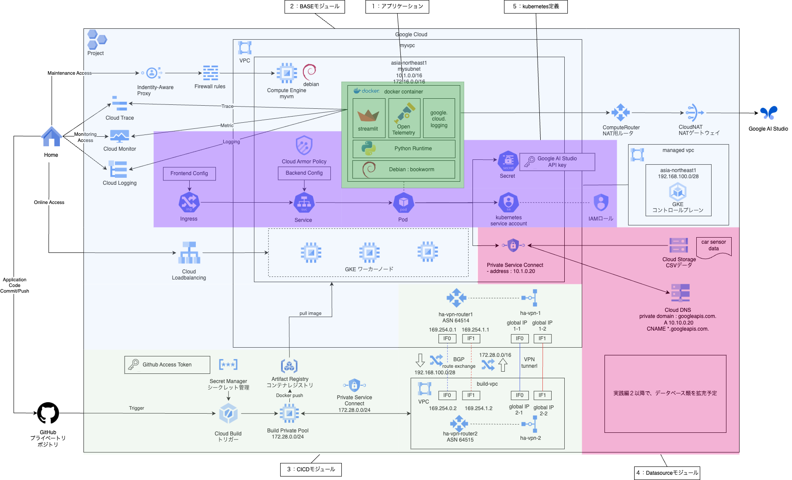

# 実践編1 : Webの基本形
## overall architecture

### 1. 前提条件
基礎編１ : Webの基本形が完了していること。

### 2. 今回の構成図
実践編1 : Webの基本形の全体構成は下記のようになります。
 

### 3. モジュールについて
図に記載の通り、下記のようなモジュールに分割して進めていきます。

#### 1. アプリケーション
下記の機能を持たせたStreamlitアプリケーションを想定します。 
- Google AI Studioへの問い合わせ
- Cloud StorageからのCSV読み込みと表示
Storageの部分は、この先実践編２で作るデータ処理パイプラインと合流できればと考えています。 
Cloud Storageの他、DBやDWHが追加になるかもしれません。 
また、OpenTelemetryによるCloud Traceへの連携、Cloud Loggingライブラリを利用して構造化ロギングを行います。 

#### 2. BASEモジュール
ネットワーク、NAT、踏み台VM、GKEクラスタをベースモジュールとしてまとめます。 
ここは基礎編から大きな変更はありません。 
なお、図ではCICDの領域に書かれていますが、Artifact Registryはこちらに含めようと思います。 

#### 3. CICDモジュール
Cloud Buildのトリガー、ワーカープール、GKEと接続するためのHA-VPNを構成します。 
ここも基礎編から大きな変化はありません。

#### 4. Datasourceモジュール
Private Service Connect、DNSとCloud Storageの構成とします。 
実践編２で処理した内容を合流させるポイントになるかと思います。 

#### 5. kubernetes定義
Ingress/Service/Deployment/Secretに加え、kubernetes service accountとWorkloadIdentityの設定を行います。 
Trace, LogginのWrite権限、Cloud StorageへのRead権限をKSAに与える形を想定しています。

### 4. 次回予告
上記の番号順に各回のボリューム次第では分割して進めていきます。 
構築後は、動作確認をしてクロージングとなります。