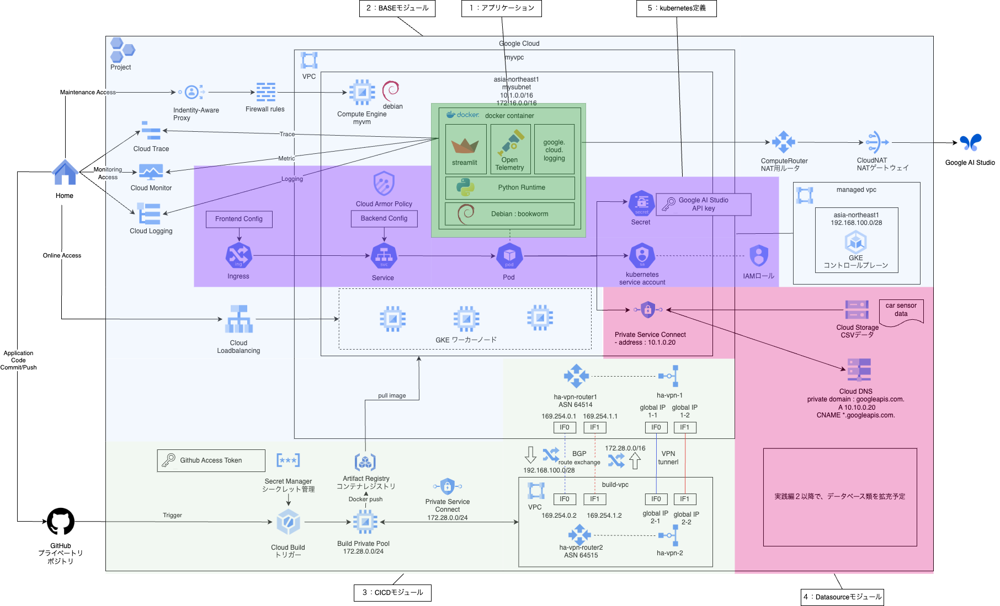
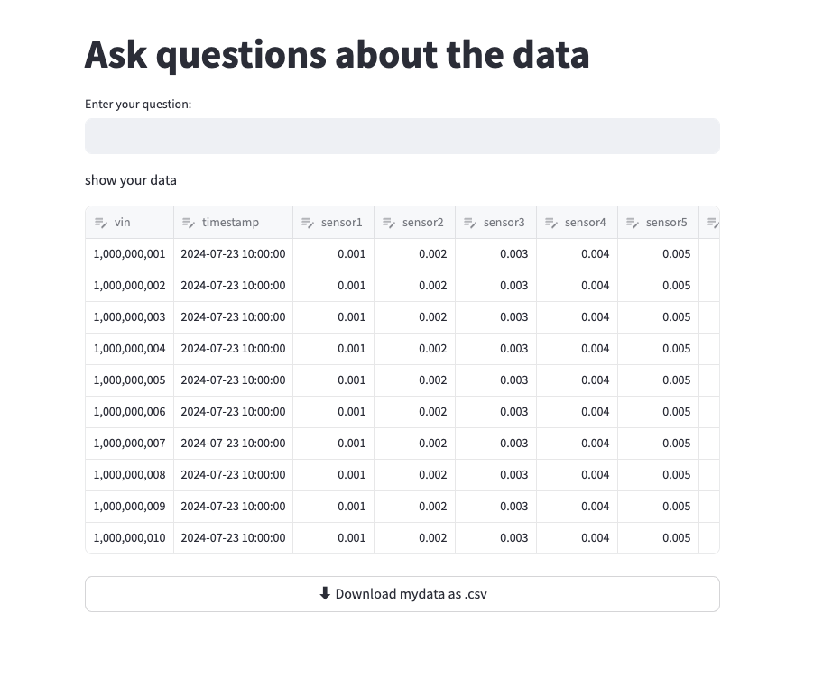
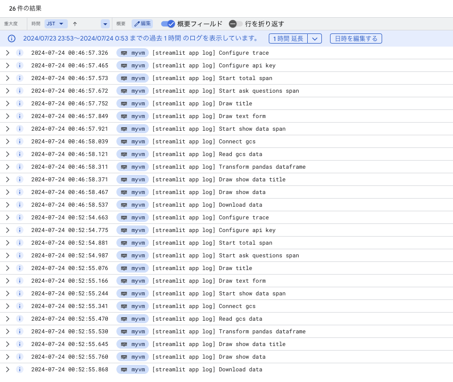
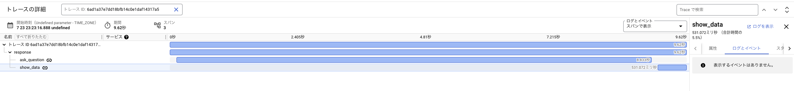

# 実践編1 : Webの基本形
## application

### 1. 前提条件
41_overall_architectureが完了していること。

### 2. 今回の構成図
１：アプリケーションの部分を実装していきます。コンテナ化するところまで進めます。<br>
<br>

### 3. 今回のコード
将来的には、RAGのようにしたいのですが、実践編１ではAIへ接続することと、外部のデータを取得することだけを実装しています。<br>
演習用の機能としては十分かと思いますが、アプリケーションとしては意味が無いものではあるので、こだわる場合は、各自でアレンジをお願いします。<br>
構成としては、streamlit_app.py、requirements.txt、Dockerfileの３ファイルになります。<br>
```
[streamlit_app.py]
# 基本的なライブラリをインポート
import os

# pandasのライブラリをインポート
import pandas as pd

# streamlitのライブラリをインポート
import streamlit as st
from st_files_connection import FilesConnection

# generativeaiのライブラリをインポート
import google.generativeai as genai

# OpenTelemetryのライブラリをインポート
from opentelemetry import trace
from opentelemetry.exporter.cloud_trace import CloudTraceSpanExporter
from opentelemetry.sdk.trace import TracerProvider
from opentelemetry.sdk.trace.export import BatchSpanProcessor
from opentelemetry.trace import Link

# Cloud Loggingのライブラリをインポート
import google.cloud.logging
from google.cloud.logging import Client
from google.cloud.logging.handlers import CloudLoggingHandler

# Cloud Loggingクライアントの初期化
client = Client()
logger = client.logger("mylogger")

# テキストログの書き方のサンプル
# logger.log_text("Goodbye, world!", severity="WARNING")
# 構造化ログの書き方のサンプル、messageは必須となり、Cloud Loggingのログビューアで見出し行として表示されます。
# それ以外のキーは任意です。各自で独自のロガーを設定していただければと思います。
# 以下の例では、メソッド化もせずmessageだけ記載して進めます。
# logger.log_struct(
#     {
#         "message": "King Arthur",
#         "quest": "Find the Holy Grail",
#         "favorite_color": "Blue",
#     },
#     severity="INFO",
# )

# スパンのエクスポーターの設定
logger.log_struct( { "message": "[streamlit app log] Configure trace" }, severity="INFO", )
tracer_provider = TracerProvider()
cloud_trace_exporter = CloudTraceSpanExporter()
tracer_provider.add_span_processor(
    BatchSpanProcessor(cloud_trace_exporter)
)
trace.set_tracer_provider(tracer_provider)
tracer = trace.get_tracer(__name__)

# APIキーの設定
logger.log_struct( { "message": "[streamlit app log] Configure api key" }, severity="INFO", )
genai.configure(api_key=os.environ['GENAI_API_KEY'])

# 全体スパンの開始
logger.log_struct( { "message": "[streamlit app log] Start total span" }, severity="INFO", )
with tracer.start_as_current_span("response") as link_target:

    # AIお問い合わせ部のスパンを開始    
    logger.log_struct( { "message": "[streamlit app log] Start ask questions span" }, severity="INFO", )
    with tracer.start_as_current_span("ask_question", links=[Link(link_target.context)]):

        # 画面タイトル
        logger.log_struct( { "message": "[streamlit app log] Draw title" }, severity="INFO", )
        st.title('Ask questions about the data')

        # お問い合わせフォーム
        logger.log_struct( { "message": "[streamlit app log] Draw text form" }, severity="INFO", )
        user_input = st.text_input("Enter your question:")        

        # ユーザーの入力がある場合
        if user_input:

            # モデルの設定
            logger.log_struct( { "message": "[streamlit app log] Configure model" }, severity="INFO", )
            model = genai.GenerativeModel('gemini-pro')
            
            # ユーザーの入力をモデルに渡す
            logger.log_struct( { "message": "[streamlit app log] Pass user input to model" }, severity="INFO", )
            response = model.generate_content(user_input)

            # 結果を表示
            logger.log_struct( { "message": "[streamlit app log] Write result" }, severity="INFO", )
            st.write(response.text)

    # データ表示部のスパンを開始
    logger.log_struct( { "message": "[streamlit app log] Start show data span" }, severity="INFO", )
    with tracer.start_as_current_span("show_data", links=[Link(link_target.context)]):

        # データ表示部のスパンを開始
        logger.log_struct( { "message": "[streamlit app log] Connect gcs" }, severity="INFO", )
        conn = st.connection('gcs', type=FilesConnection)

        # データの読み込み
        logger.log_struct( { "message": "[streamlit app log] Read gcs data" }, severity="INFO", )
        data = conn.read("[YOUR_BUCKET]/[YOUR_FILE_NAME].csv", input_format="csv", ttl=600)

        # Pandas Dataframeに変換
        logger.log_struct( { "message": "[streamlit app log] Transform pandas dataframe" }, severity="INFO", )
        df = pd.DataFrame(data)

        # データ表示部のタイトル
        logger.log_struct( { "message": "[streamlit app log] Draw show data title" }, severity="INFO", )
        """show your data"""

        # データの表示
        logger.log_struct( { "message": "[streamlit app log] Draw show data " }, severity="INFO", )
        mydata = st.data_editor(df, hide_index=True, use_container_width=True)

        # データのダウンロード
        logger.log_struct( { "message": "[streamlit app log] Download data " }, severity="INFO", )
        st.download_button(
            "⬇️ Download mydata as .csv", mydata.to_csv(), "mydata.csv", use_container_width=True
        )
```
上記の[YOUR_BUCKET]/[YOUR_FILE_NAME]は、それぞれGCSバケットと表示するCSVファイル名になります。<br>
動作確認用に、各自用意をお願いします。pandasのデータフレームにしてそのまま表示するだけなので、中身はテキトーで良いです。<br>
Dockerfile内には動作確認のために、[YOUR_API_KEY]の箇所でGoogle AI StudioのAPIキーを記載しています。<br>
動作確認後は外しておいてください。<br>
```
[Dockerfile]
# app/Dockerfile

FROM python:3.9-slim

WORKDIR /app

RUN apt-get update && apt-get install -y \
    build-essential \
    curl \
    software-properties-common \
    git \
    && rm -rf /var/lib/apt/lists/*

#RUN git clone https://github.com/streamlit/streamlit-example.git .

COPY requirements.txt .
COPY streamlit_app.py .

RUN pip3 install -r requirements.txt

EXPOSE 8501

HEALTHCHECK CMD curl --fail http://localhost:8501/_stcore/health

# ローカルで動作確認後は、Base64エンコードしてkubernetes secretに保存する
ENV GENAI_API_KEY="[YOUR_API_KEY]"

ENTRYPOINT ["streamlit", "run", "streamlit_app.py", "--server.port=8501", "--server.address=0.0.0.0"]
```
依存ライブラリは下記の通りです。適宜バージョンを指定したりしておいてください。<br>
```
[requirements.txt]
pandas
streamlit
st_files_connection
gcsfs
google.generativeai
opentelemetry-api
opentelemetry-sdk
opentelemetry-exporter-gcp-trace
google-cloud-logging
google-cloud-storage
```
### 4. 動作確認
動作確認に関しては、おまかせになりますが、こちらで実施した方法を箇条書きで手順を記載します。各自で進めてみてください。<br>
基本的にはGoogle Cloud内でIAM認証を利用してアクセスキーなどを発行せずに確認した方が良いです。<br>
- 基礎編のnetwork, instanceのモジュールなどを利用して、VMを立てる。<br>
- その際、VMのサービスアカウントには、下記のロール構成にしておく。<br>
```
    "roles/storage.admin",
    "roles/cloudtrace.agent",
    "roles/logging.logWriter",
```
- 下記などを参考にVMにDockerをインストールする。<br>
https://matsuand.github.io/docs.docker.jp.onthefly/engine/install/debian/<br>
- 資材を持ち込み、コンテナビルド、コンテナ実行を行う。<br>
- VMにパブリックIPを付与し、HTTPアクセスのファイアウォールを設定する（ポート番号はコンテナの公開ポートに合わせる）<br>
- ブラウザからアクセスして動作を確認する。<br>

確認してほしいポイントは下記に示します。<br>
- アプリケーションの正常動作確認<br>
こちらで準備した例では、下記のような画面が表示されればOKになります。<br>
（内容は自身でプログラムした内容で読み替えてください。）
<br>

- ログ出力
今回の例では、Cloud Loggingで下記のように表示されていればOKです。<br>
（内容は自身でプログラムした内容で読み替えてください。message以外にもキーを設定した場合は、明細を開いてペイロードを確認してください。）<br>
<br>

- トレース出力
今回の例では、Cloud Traceで下記のように表示されていればOKです。<br>
（内容は自身でプログラムした内容で読み替えてください。）
<br>

### 5. 次回予告
２：BASEモジュールの構築に進みます。